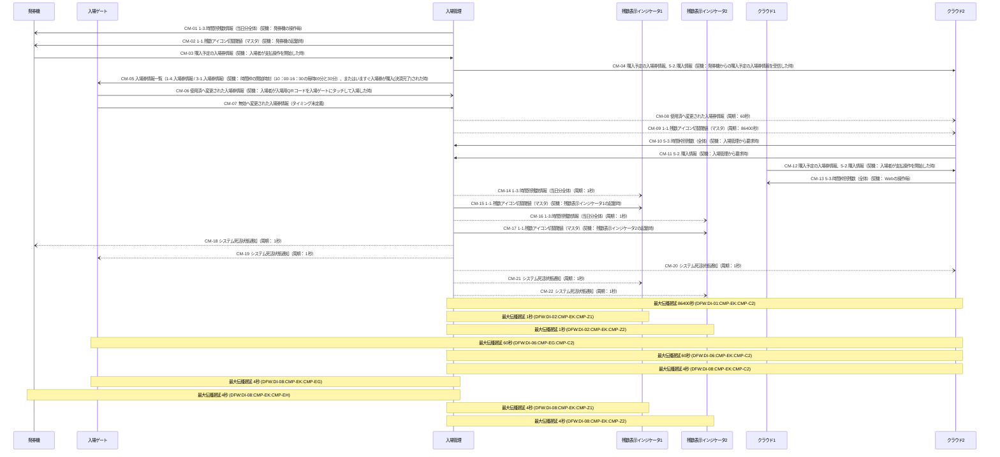

# データフロー・タイミング分析結果

- 対象: だんだん動物園入場システム V02構成（入場ゲートの判定処理を担う独立機器を持たない構成）のデータフロー・タイミング分析

## 1. 構成要素・データ項目

### 1.1 構成要素一覧

| 構成要素ID | 名称 | 種別 | 備考 |
| --- | --- | --- | --- |
| CMP-EH | 発券機 | device | 11号:1765 専用機（通信機能あり、OSありの組み込み機器） |
| CMP-EG | 入場ゲート | device | 11号:1766 専用機。V02構成ではQRコードの有効/無効判定を入場ゲート内で完結させる（11号:1110-1113） |
| CMP-EK | 入場管理 | service | 11号:1767-1768 オンプレミスのサーバ上に構築されたアプリ群。WebチケットシステムとはVPN経由で接続 |
| CMP-Z1 | 残数表示インジケータ1 | device | 11号:1769 専用機 |
| CMP-Z2 | 残数表示インジケータ2 | device | 11号:1770 専用機 |
| CMP-C1 | クラウド1 | cloud | 72号:247-289 Webチケットシステムの入場者向け側。④「クラウド１」「クラウド2」間データの一方 |
| CMP-C2 | クラウド2 | cloud | 72号:208-243 Webチケットシステムの予約管理DB・会員情報管理DB側 |

### 1.2 データ項目一覧

| データ項目ID | 名称 | 備考 |
| --- | --- | --- |
| DI-01 | 1-1.残数アイコン切替閾値（マスタ） | 72号:115-117 / 72号:211-213 / 72号:302-305 |
| DI-02 | 1-3.時間別残数情報（当日分全体） | 72号:104-109 / 72号:294-301 / 72号:313-320 |
| DI-03 | 5-3.時間枠別残数（全体） | 72号:234-236 / 72号:276-279 |
| DI-04 | 入場券情報一覧（1-4.入場券情報 / 3-1.入場券情報） | 72号:169-182 / 11号:1420-1440 |
| DI-05 | 5-2.購入情報 | 72号:110-113 / 72号:230-233 / 72号:286-289 |
| DI-06 | 使用済へ変更された入場券情報 | 72号:184-189 / 72号:214-217 |
| DI-07 | 無効へ変更された入場券情報 | 72号:203-204 時間枠の終了時刻が経過した入場券の状態変更 |
| DI-08 | システム死活状態通知 | 72号:335-346 / 11号:1445-1458 |
| DI-09 | 購入予定の入場券情報 | 72号:119-130 / 72号:248-260 |

## 2. 通信一覧

| 通信ID | 送信元 | 宛先 | 方向 | データ項目 | タイミング | 最大遅延(秒) | 最小遅延(秒) | ACK | タイムアウト(秒) | 根拠位置 |
| --- | --- | --- | --- | --- | --- | --- | --- | --- | --- | --- |
| CM-01 | 入場管理(CMP-EK) | 発券機(CMP-EH) | -) | 1-3.時間別残数情報（当日分全体）(DI-02) | 契機: 発券機の操作毎 | 0 | 0 | undeclared | - | 72_だんだん動物園入場システムデータ連携仕様書 / L103 / ①（入場管理→発券機）時間別残数情報 |
| CM-02 | 入場管理(CMP-EK) | 発券機(CMP-EH) | -) | 1-1.残数アイコン切替閾値（マスタ）(DI-01) | 契機: 発券機の起動時 | 0 | 0 | undeclared | - | 72_だんだん動物園入場システムデータ連携仕様書 / L114 / ①（入場管理→発券機）残数アイコン切替閾値（マスタ） |
| CM-03 | 発券機(CMP-EH) | 入場管理(CMP-EK) | ->> | 購入予定の入場券情報(DI-09) | 契機: 入場者が支払操作を開始した時 | 0 | 0 | application-ack | - | 72_だんだん動物園入場システムデータ連携仕様書 / L120 / ①（発券機→入場管理）購入予定の入場券情報 |
| CM-04 | 入場管理(CMP-EK) | クラウド2(CMP-C2) | ->> | 購入予定の入場券情報(DI-09)、5-2.購入情報(DI-05) | 契機: 発券機からの購入予定の入場券情報を受信した時 | 0 | 0 | application-ack | - | 72_だんだん動物園入場システムデータ連携仕様書 / L129 / ①（発券機→入場管理）購入情報の追加要求 |
| CM-05 | 入場管理(CMP-EK) | 入場ゲート(CMP-EG) | -) | 入場券情報一覧（1-4.入場券情報 / 3-1.入場券情報）(DI-04) | 契機: 時間枠の開始時刻（10:00-16:30の毎時00分と30分）、またはいますぐ入場券が購入(決済完了)された時 | 0 | 0 | undeclared | - | 72_だんだん動物園入場システムデータ連携仕様書 / L171 / ②（入場管理→入場ゲート）購入された入場券情報 |
| CM-06 | 入場ゲート(CMP-EG) | 入場管理(CMP-EK) | -) | 使用済へ変更された入場券情報(DI-06) | 契機: 入場者が入場用QRコードを入場ゲートにタッチして入場した時 | 0 | 0 | undeclared | - | 72_だんだん動物園入場システムデータ連携仕様書 / L185 / ②（入場ゲート→入場管理）使用済へ変更された分の情報 |
| CM-07 | 入場ゲート(CMP-EG) | 入場管理(CMP-EK) | -x | 無効へ変更された入場券情報(DI-07) | タイミング未定義 | - | - | undeclared | - | 72_だんだん動物園入場システムデータ連携仕様書 / L203 / ②補足 時間枠の終了時刻が経過した入場券の無効化の反映 |
| CM-08 | 入場管理(CMP-EK) | クラウド2(CMP-C2) | --) | 使用済へ変更された入場券情報(DI-06) | 周期: 60秒 | 60 | 0 | undeclared | - | 72_だんだん動物園入場システムデータ連携仕様書 / L214 / ③（入場管理→クラウド２）60秒毎 |
| CM-09 | 入場管理(CMP-EK) | クラウド2(CMP-C2) | --) | 1-1.残数アイコン切替閾値（マスタ）(DI-01) | 周期: 86400秒 | 86400 | 0 | undeclared | - | 72_だんだん動物園入場システムデータ連携仕様書 / L210 / ③（入場管理→クラウド２）毎日：05:00 |
| CM-10 | クラウド2(CMP-C2) | 入場管理(CMP-EK) | ->> | 5-3.時間枠別残数（全体）(DI-03) | 契機: 入場管理から要求時 | 0 | 0 | application-ack | - | 72_だんだん動物園入場システムデータ連携仕様書 / L230 / ③（クラウド2→入場管理）5-3.時間枠別残数（全体） |
| CM-11 | クラウド2(CMP-C2) | 入場管理(CMP-EK) | ->> | 5-2.購入情報(DI-05) | 契機: 入場管理から要求時 | 0 | 0 | application-ack | - | 72_だんだん動物園入場システムデータ連携仕様書 / L231 / ③（クラウド2→入場管理）5-2.購入情報 |
| CM-12 | クラウド1(CMP-C1) | クラウド2(CMP-C2) | ->> | 購入予定の入場券情報(DI-09)、5-2.購入情報(DI-05) | 契機: 入場者が支払操作を開始した時 | 0 | 0 | application-ack | - | 72_だんだん動物園入場システムデータ連携仕様書 / L249 / ④（クラウド1→クラウド2）購入予定の入場券情報 |
| CM-13 | クラウド2(CMP-C2) | クラウド1(CMP-C1) | -) | 5-3.時間枠別残数（全体）(DI-03) | 契機: Webの操作毎 | 0 | 0 | undeclared | - | 72_だんだん動物園入場システムデータ連携仕様書 / L275 / ④（クラウド2→クラウド1）5-3.時間枠別残数（全体） |
| CM-14 | 入場管理(CMP-EK) | 残数表示インジケータ1(CMP-Z1) | --) | 1-3.時間別残数情報（当日分全体）(DI-02) | 周期: 1秒 | 1 | 0 | undeclared | - | 72_だんだん動物園入場システムデータ連携仕様書 / L294 / ⑤（入場管理→残数表示インジケータ1）1秒毎 |
| CM-15 | 入場管理(CMP-EK) | 残数表示インジケータ1(CMP-Z1) | -) | 1-1.残数アイコン切替閾値（マスタ）(DI-01) | 契機: 残数表示インジケータ1の起動時 | 0 | 0 | undeclared | - | 72_だんだん動物園入場システムデータ連携仕様書 / L302 / ⑤（入場管理→残数表示インジケータ1）起動時 |
| CM-16 | 入場管理(CMP-EK) | 残数表示インジケータ2(CMP-Z2) | --) | 1-3.時間別残数情報（当日分全体）(DI-02) | 周期: 1秒 | 1 | 0 | undeclared | - | 72_だんだん動物園入場システムデータ連携仕様書 / L313 / ⑥（入場管理→残数表示インジケータ2）1秒毎 |
| CM-17 | 入場管理(CMP-EK) | 残数表示インジケータ2(CMP-Z2) | -) | 1-1.残数アイコン切替閾値（マスタ）(DI-01) | 契機: 残数表示インジケータ2の起動時 | 0 | 0 | undeclared | - | 72_だんだん動物園入場システムデータ連携仕様書 / L321 / ⑥（入場管理→残数表示インジケータ2）起動時 |
| CM-18 | 入場管理(CMP-EK) | 発券機(CMP-EH) | --) | システム死活状態通知(DI-08) | 周期: 1秒 | 4 | 0 | application-ack | 1 | 72_だんだん動物園入場システムデータ連携仕様書 / L338 / 生存確認（入場管理→発券機） |
| CM-19 | 入場管理(CMP-EK) | 入場ゲート(CMP-EG) | --) | システム死活状態通知(DI-08) | 周期: 1秒 | 4 | 0 | application-ack | 1 | 72_だんだん動物園入場システムデータ連携仕様書 / L339 / 生存確認（入場管理→入場ゲート） |
| CM-20 | 入場管理(CMP-EK) | クラウド2(CMP-C2) | --) | システム死活状態通知(DI-08) | 周期: 1秒 | 4 | 0 | application-ack | 1 | 72_だんだん動物園入場システムデータ連携仕様書 / L340 / 生存確認（入場管理→クラウド2） |
| CM-21 | 入場管理(CMP-EK) | 残数表示インジケータ1(CMP-Z1) | --) | システム死活状態通知(DI-08) | 周期: 1秒 | 4 | 0 | application-ack | 1 | 72_だんだん動物園入場システムデータ連携仕様書 / L341 / 生存確認（入場管理→残数表示インジケータ1） |
| CM-22 | 入場管理(CMP-EK) | 残数表示インジケータ2(CMP-Z2) | --) | システム死活状態通知(DI-08) | 周期: 1秒 | 4 | 0 | application-ack | 1 | 72_だんだん動物園入場システムデータ連携仕様書 / L342 / 生存確認（入場管理→残数表示インジケータ2） |

- 辺の最大遅延 = 送信待ち(周期系は intervalSeconds、event は0) + 伝送時間(transmissionLatencySeconds) + タイムアウト×再送回数。最小遅延 = 伝送時間。
- タイミングが確定しない通信は latency 不定として扱い、0秒で代替しない(`-` で表示)。

## 3. 伝播遅延の算出

### 3.1 最大伝播遅延（遅延窓）

| 遅延窓ID | データ項目 | 起点 | 終端 | 最大伝播遅延(秒) | 最小伝播遅延(秒) | クリティカル経路 | 状態 |
| --- | --- | --- | --- | --- | --- | --- | --- |
| DFW:DI-01:CMP-EK:CMP-C2 | 1-1.残数アイコン切替閾値（マスタ）(DI-01) | 入場管理(CMP-EK) | クラウド2(CMP-C2) | 86400 | 0 | CM-09 | 算出済 |
| DFW:DI-01:CMP-EK:CMP-EH | 1-1.残数アイコン切替閾値（マスタ）(DI-01) | 入場管理(CMP-EK) | 発券機(CMP-EH) | 0 | 0 | CM-02 | 算出済 |
| DFW:DI-01:CMP-EK:CMP-Z1 | 1-1.残数アイコン切替閾値（マスタ）(DI-01) | 入場管理(CMP-EK) | 残数表示インジケータ1(CMP-Z1) | 0 | 0 | CM-15 | 算出済 |
| DFW:DI-01:CMP-EK:CMP-Z2 | 1-1.残数アイコン切替閾値（マスタ）(DI-01) | 入場管理(CMP-EK) | 残数表示インジケータ2(CMP-Z2) | 0 | 0 | CM-17 | 算出済 |
| DFW:DI-02:CMP-EK:CMP-EH | 1-3.時間別残数情報（当日分全体）(DI-02) | 入場管理(CMP-EK) | 発券機(CMP-EH) | 0 | 0 | CM-01 | 算出済 |
| DFW:DI-02:CMP-EK:CMP-Z1 | 1-3.時間別残数情報（当日分全体）(DI-02) | 入場管理(CMP-EK) | 残数表示インジケータ1(CMP-Z1) | 1 | 0 | CM-14 | 算出済 |
| DFW:DI-02:CMP-EK:CMP-Z2 | 1-3.時間別残数情報（当日分全体）(DI-02) | 入場管理(CMP-EK) | 残数表示インジケータ2(CMP-Z2) | 1 | 0 | CM-16 | 算出済 |
| DFW:DI-03:CMP-C2:CMP-C1 | 5-3.時間枠別残数（全体）(DI-03) | クラウド2(CMP-C2) | クラウド1(CMP-C1) | 0 | 0 | CM-13 | 算出済 |
| DFW:DI-03:CMP-C2:CMP-EK | 5-3.時間枠別残数（全体）(DI-03) | クラウド2(CMP-C2) | 入場管理(CMP-EK) | 0 | 0 | CM-10 | 算出済 |
| DFW:DI-04:CMP-EK:CMP-EG | 入場券情報一覧（1-4.入場券情報 / 3-1.入場券情報）(DI-04) | 入場管理(CMP-EK) | 入場ゲート(CMP-EG) | 0 | 0 | CM-05 | 算出済 |
| DFW:DI-05:CMP-C1:CMP-C2 | 5-2.購入情報(DI-05) | クラウド1(CMP-C1) | クラウド2(CMP-C2) | 0 | 0 | CM-12 | 算出済 |
| DFW:DI-05:CMP-C1:CMP-EK | 5-2.購入情報(DI-05) | クラウド1(CMP-C1) | 入場管理(CMP-EK) | 0 | 0 | CM-12 → CM-11 | 算出済 |
| DFW:DI-05:CMP-C2:CMP-EK | 5-2.購入情報(DI-05) | クラウド2(CMP-C2) | 入場管理(CMP-EK) | 0 | 0 | CM-11 | 算出済 |
| DFW:DI-05:CMP-EK:CMP-C2 | 5-2.購入情報(DI-05) | 入場管理(CMP-EK) | クラウド2(CMP-C2) | 0 | 0 | CM-04 | 算出済 |
| DFW:DI-06:CMP-EG:CMP-C2 | 使用済へ変更された入場券情報(DI-06) | 入場ゲート(CMP-EG) | クラウド2(CMP-C2) | 60 | 0 | CM-06 → CM-08 | 算出済 |
| DFW:DI-06:CMP-EG:CMP-EK | 使用済へ変更された入場券情報(DI-06) | 入場ゲート(CMP-EG) | 入場管理(CMP-EK) | 0 | 0 | CM-06 | 算出済 |
| DFW:DI-06:CMP-EK:CMP-C2 | 使用済へ変更された入場券情報(DI-06) | 入場管理(CMP-EK) | クラウド2(CMP-C2) | 60 | 0 | CM-08 | 算出済 |
| DFW:DI-07:CMP-EG:CMP-EK | 無効へ変更された入場券情報(DI-07) | 入場ゲート(CMP-EG) | 入場管理(CMP-EK) | - | - | - | 未算出(理由: 経路上にタイミング未定義の通信を含む: CM-07) |
| DFW:DI-08:CMP-EK:CMP-C2 | システム死活状態通知(DI-08) | 入場管理(CMP-EK) | クラウド2(CMP-C2) | 4 | 0 | CM-20 | 算出済 |
| DFW:DI-08:CMP-EK:CMP-EG | システム死活状態通知(DI-08) | 入場管理(CMP-EK) | 入場ゲート(CMP-EG) | 4 | 0 | CM-19 | 算出済 |
| DFW:DI-08:CMP-EK:CMP-EH | システム死活状態通知(DI-08) | 入場管理(CMP-EK) | 発券機(CMP-EH) | 4 | 0 | CM-18 | 算出済 |
| DFW:DI-08:CMP-EK:CMP-Z1 | システム死活状態通知(DI-08) | 入場管理(CMP-EK) | 残数表示インジケータ1(CMP-Z1) | 4 | 0 | CM-21 | 算出済 |
| DFW:DI-08:CMP-EK:CMP-Z2 | システム死活状態通知(DI-08) | 入場管理(CMP-EK) | 残数表示インジケータ2(CMP-Z2) | 4 | 0 | CM-22 | 算出済 |
| DFW:DI-09:CMP-C1:CMP-C2 | 購入予定の入場券情報(DI-09) | クラウド1(CMP-C1) | クラウド2(CMP-C2) | 0 | 0 | CM-12 | 算出済 |
| DFW:DI-09:CMP-EH:CMP-C2 | 購入予定の入場券情報(DI-09) | 発券機(CMP-EH) | クラウド2(CMP-C2) | 0 | 0 | CM-03 → CM-04 | 算出済 |
| DFW:DI-09:CMP-EH:CMP-EK | 購入予定の入場券情報(DI-09) | 発券機(CMP-EH) | 入場管理(CMP-EK) | 0 | 0 | CM-03 | 算出済 |
| DFW:DI-09:CMP-EK:CMP-C2 | 購入予定の入場券情報(DI-09) | 入場管理(CMP-EK) | クラウド2(CMP-C2) | 0 | 0 | CM-04 | 算出済 |

### 3.2 最大乖離時間（乖離窓）

| 乖離窓ID | データ項目 | 起点 | 観測点数 | 最大乖離時間(秒) | 最遅観測点(経路) | 最速観測点(経路) | 状態 |
| --- | --- | --- | --- | --- | --- | --- | --- |
| DSW:DI-01:CMP-EK | 1-1.残数アイコン切替閾値（マスタ）(DI-01) | 入場管理(CMP-EK) | 4 | 86400 | クラウド2(CM-09) | クラウド2(CM-09) | 算出済 |
| DSW:DI-02:CMP-EK | 1-3.時間別残数情報（当日分全体）(DI-02) | 入場管理(CMP-EK) | 3 | 1 | 残数表示インジケータ1(CM-14) | 発券機(CM-01) | 算出済 |
| DSW:DI-03:CMP-C2 | 5-3.時間枠別残数（全体）(DI-03) | クラウド2(CMP-C2) | 2 | 0 | クラウド1(CM-13) | クラウド1(CM-13) | 算出済 |
| DSW:DI-05:CMP-C1 | 5-2.購入情報(DI-05) | クラウド1(CMP-C1) | 2 | 0 | クラウド2(CM-12) | クラウド2(CM-12) | 算出済 |
| DSW:DI-06:CMP-EG | 使用済へ変更された入場券情報(DI-06) | 入場ゲート(CMP-EG) | 2 | 60 | クラウド2(CM-06 → CM-08) | クラウド2(CM-06 → CM-08) | 算出済 |
| DSW:DI-08:CMP-EK | システム死活状態通知(DI-08) | 入場管理(CMP-EK) | 5 | 4 | クラウド2(CM-20) | クラウド2(CM-20) | 算出済 |
| DSW:DI-09:CMP-EH | 購入予定の入場券情報(DI-09) | 発券機(CMP-EH) | 2 | 0 | クラウド2(CM-03 → CM-04) | クラウド2(CM-03 → CM-04) | 算出済 |

- 最大乖離時間 = 最も遅い観測点の最悪値 − 最も速い観測点の最良値。周期差そのものと一致するとは限らない。

### 3.3 宣言値との照合

| 宣言種別 | 宣言ID | 対象窓ID | 宣言値(秒) | 算出値(秒) | 判定 |
| --- | --- | --- | --- | --- | --- |
| 最大伝播遅延 | PT-01 | DFW:DI-04:CMP-EK:CMP-EG | 0 | 0 | 一致 |
| 最大伝播遅延 | PT-02 | DFW:DI-06:CMP-EG:CMP-EK, DFW:DI-06:CMP-EG:CMP-C2 | 60 | 60 | 一致 |
| 最大伝播遅延 | PT-03 | DFW:DI-02:CMP-EK:CMP-EH, DFW:DI-02:CMP-EK:CMP-Z1, DFW:DI-02:CMP-EK:CMP-Z2 | 1 | 1 | 一致 |
| 最大伝播遅延 | PT-04 | DFW:DI-01:CMP-EK:CMP-EH, DFW:DI-01:CMP-EK:CMP-Z1, DFW:DI-01:CMP-EK:CMP-Z2, DFW:DI-01:CMP-EK:CMP-C2 | 86400 | 86400 | 一致 |
| 最大伝播遅延 | PT-05 | DFW:DI-07:CMP-EG:CMP-EK | - | - | 宣言値なし(到達性のみ照合) |
| 最大伝播遅延 | PT-06 | DFW:DI-08:CMP-EK:CMP-EH, DFW:DI-08:CMP-EK:CMP-EG, DFW:DI-08:CMP-EK:CMP-Z1, DFW:DI-08:CMP-EK:CMP-Z2, DFW:DI-08:CMP-EK:CMP-C2 | 4 | 4 | 一致 |
| 最大乖離時間 | DI-02@CMP-EK | DSW:DI-02:CMP-EK | 1 | 1 | 一致 |

## 4. シーケンス図(mermaid)

## 5. テスト条件との突合

### 5.1 遅延窓・乖離窓の被覆

| 窓ID | 種別 | 秒数 | 参照テスト条件ID | 状態 |
| --- | --- | --- | --- | --- |
| DFW:DI-01:CMP-EK:CMP-C2 | 遅延窓 | 86400 | - | 未被覆 |
| DFW:DI-02:CMP-EK:CMP-Z1 | 遅延窓 | 1 | - | 未被覆 |
| DFW:DI-02:CMP-EK:CMP-Z2 | 遅延窓 | 1 | - | 未被覆 |
| DFW:DI-06:CMP-EG:CMP-C2 | 遅延窓 | 60 | TC-V10 | 被覆 |
| DFW:DI-06:CMP-EK:CMP-C2 | 遅延窓 | 60 | TC-V11 | 被覆 |
| DFW:DI-08:CMP-EK:CMP-C2 | 遅延窓 | 4 | TC-V12 | 被覆 |
| DFW:DI-08:CMP-EK:CMP-EG | 遅延窓 | 4 | TC-V12 | 被覆 |
| DFW:DI-08:CMP-EK:CMP-EH | 遅延窓 | 4 | TC-V12 | 被覆 |
| DFW:DI-08:CMP-EK:CMP-Z1 | 遅延窓 | 4 | TC-V12 | 被覆 |
| DFW:DI-08:CMP-EK:CMP-Z2 | 遅延窓 | 4 | TC-V12 | 被覆 |
| DSW:DI-01:CMP-EK | 乖離窓 | 86400 | - | 未被覆 |
| DSW:DI-02:CMP-EK | 乖離窓 | 1 | - | 未被覆 |
| DSW:DI-06:CMP-EG | 乖離窓 | 60 | TC-V10 | 被覆 |
| DSW:DI-08:CMP-EK | 乖離窓 | 4 | TC-V12 | 被覆 |

### 5.2 遅延窓被覆率

- 分母(0秒超かつ算出済みの遅延窓＋乖離窓の件数): 14 件
- 分子(実在するテスト条件の coveredDelayWindowIds から実際に参照されている件数): 9 件
- 遅延窓被覆率: 64.3%
- 宣言値(64.3%)との照合: 一致

## 6. 決定的検査

- [high] DFT-04 CM-07: 通信「CM-07」(CMP-EG → CMP-EK)のタイミングが確定しない: timing.kind が undefined(タイミング未定義)である。latency 不定として扱い、0秒で代替しない。
- [medium] DFT-05 CM-01: 通信「CM-01」(CMP-EK → CMP-EH)にACK・応答(ackKind)が定義されていない。
- [medium] DFT-05 CM-02: 通信「CM-02」(CMP-EK → CMP-EH)にACK・応答(ackKind)が定義されていない。
- [medium] DFT-05 CM-05: 通信「CM-05」(CMP-EK → CMP-EG)にACK・応答(ackKind)が定義されていない。
- [medium] DFT-05 CM-06: 通信「CM-06」(CMP-EG → CMP-EK)にACK・応答(ackKind)が定義されていない。
- [medium] DFT-05 CM-07: 通信「CM-07」(CMP-EG → CMP-EK)にACK・応答(ackKind)が定義されていない。
- [medium] DFT-05 CM-08: 通信「CM-08」(CMP-EK → CMP-C2)にACK・応答(ackKind)が定義されていない。
- [medium] DFT-05 CM-09: 通信「CM-09」(CMP-EK → CMP-C2)にACK・応答(ackKind)が定義されていない。
- [medium] DFT-05 CM-13: 通信「CM-13」(CMP-C2 → CMP-C1)にACK・応答(ackKind)が定義されていない。
- [medium] DFT-05 CM-14: 通信「CM-14」(CMP-EK → CMP-Z1)にACK・応答(ackKind)が定義されていない。
- [medium] DFT-05 CM-15: 通信「CM-15」(CMP-EK → CMP-Z1)にACK・応答(ackKind)が定義されていない。
- [medium] DFT-05 CM-16: 通信「CM-16」(CMP-EK → CMP-Z2)にACK・応答(ackKind)が定義されていない。
- [medium] DFT-05 CM-17: 通信「CM-17」(CMP-EK → CMP-Z2)にACK・応答(ackKind)が定義されていない。
- [medium] DFT-06 CM-03: 通信「CM-03」は ackKind:application-ack だがタイムアウト値(timeoutSeconds)が宣言されていない。
- [medium] DFT-06 CM-04: 通信「CM-04」は ackKind:application-ack だがタイムアウト値(timeoutSeconds)が宣言されていない。
- [medium] DFT-06 CM-10: 通信「CM-10」は ackKind:application-ack だがタイムアウト値(timeoutSeconds)が宣言されていない。
- [medium] DFT-06 CM-11: 通信「CM-11」は ackKind:application-ack だがタイムアウト値(timeoutSeconds)が宣言されていない。
- [medium] DFT-06 CM-12: 通信「CM-12」は ackKind:application-ack だがタイムアウト値(timeoutSeconds)が宣言されていない。
- [high] DFT-07 DFW:DI-07:CMP-EG:CMP-EK: 遅延窓「DFW:DI-07:CMP-EG:CMP-EK」(入場ゲート → 入場管理)の最大伝播遅延を算出できない。経路上にタイミング未定義の通信を含む: CM-07。
- [medium] DFT-10 DFW:DI-01:CMP-EK:CMP-C2: 遅延窓「DFW:DI-01:CMP-EK:CMP-C2」(最大 86400 秒、入場管理 → クラウド2)に対応するテスト条件が無い。
- [medium] DFT-10 DFW:DI-02:CMP-EK:CMP-Z1: 遅延窓「DFW:DI-02:CMP-EK:CMP-Z1」(最大 1 秒、入場管理 → 残数表示インジケータ1)に対応するテスト条件が無い。
- [medium] DFT-10 DFW:DI-02:CMP-EK:CMP-Z2: 遅延窓「DFW:DI-02:CMP-EK:CMP-Z2」(最大 1 秒、入場管理 → 残数表示インジケータ2)に対応するテスト条件が無い。
- [medium] DFT-11 DSW:DI-01:CMP-EK: 乖離窓「DSW:DI-01:CMP-EK」(最大乖離 86400 秒、起点 入場管理)に対応するテスト条件が無い。
- [medium] DFT-11 DSW:DI-02:CMP-EK: 乖離窓「DSW:DI-02:CMP-EK」(最大乖離 1 秒、起点 入場管理)に対応するテスト条件が無い。
- [high] DFT-12 TC-V10: テスト条件「TC-V10」は「使用済へ変更された入場券情報」の即時反映を期待しているが、遅延窓「DFW:DI-06:CMP-EG:CMP-C2」に最大 60 秒の伝播遅延がある(経路: CM-06 → CM-08)。
- [high] DFT-12 TC-V10: テスト条件「TC-V10」は「使用済へ変更された入場券情報」の即時反映を期待しているが、遅延窓「DFW:DI-06:CMP-EK:CMP-C2」に最大 60 秒の伝播遅延がある(経路: CM-08)。

**判定区分カタログの注記(testdesign://data-flow-timing/analysis-criteria):**

- 本検査は渡された通信母集団に対してのみ成立し、渡していない通信の取りこぼしは検出できない。
- 遅延値は仕様上の周期・タイムアウト宣言から導いた設計上の最悪値であり、実測値の代替にしない。
- 辺の最大遅延は「送信待ち(周期系は intervalSeconds、eventは0) + 伝送時間 + タイムアウト×再送回数」、最小遅延は「伝送時間」で算出する。
- 最大乖離は「最も遅い観測点の最悪値 − 最も速い観測点の最良値」であり、周期差そのものと一致するとは限らない。
- タイミングが未定義の辺は0秒で代替せず、その辺を含む経路の遅延窓・乖離窓を「未算出」として区別する。
- mermaid の矢印記法は timing.kind と対応する。event かつ ACK ありは `->>`、event かつ ACK なしは `-)`、periodic / batch / on-demand は `--)`、タイミング未定義は `-x` で描画する。
- 本ツールが扱うのはSUT内部の構成要素間の通信タイミングであり、テスト作業そのものの実行順序(analyze_execution_order)とは別概念である。

## 7. extract_test_conditions 引き渡し

| 提案条件ID | target | 条件文(雛形) | source | derivedFrom | recommendedTechniques | 対応窓ID |
| --- | --- | --- | --- | --- | --- | --- |
| DFT-DELAY:DI-01:CMP-EK:CMP-C2 | クラウド2 | 「1-1.残数アイコン切替閾値（マスタ）」が入場管理で変化してからクラウド2へ反映されるまで最大 86400 秒の遅延窓があり、その窓の間のクラウド2側の振る舞いが規定どおりであること | testbase | requirement:EK-220 | timing-order-test | DFW:DI-01:CMP-EK:CMP-C2 |
| DFT-DELAY:DI-02:CMP-EK:CMP-Z1 | 残数表示インジケータ1 | 「1-3.時間別残数情報（当日分全体）」が入場管理で変化してから残数表示インジケータ1へ反映されるまで最大 1 秒の遅延窓があり、その窓の間の残数表示インジケータ1側の振る舞いが規定どおりであること | testbase | requirement:EK-210, requirement:Z1-201 | timing-order-test | DFW:DI-02:CMP-EK:CMP-Z1 |
| DFT-DELAY:DI-02:CMP-EK:CMP-Z2 | 残数表示インジケータ2 | 「1-3.時間別残数情報（当日分全体）」が入場管理で変化してから残数表示インジケータ2へ反映されるまで最大 1 秒の遅延窓があり、その窓の間の残数表示インジケータ2側の振る舞いが規定どおりであること | testbase | requirement:EK-210, requirement:Z2-201 | timing-order-test | DFW:DI-02:CMP-EK:CMP-Z2 |
| DFT-DELAY:DI-06:CMP-EG:CMP-C2 | クラウド2 | 「使用済へ変更された入場券情報」が入場ゲートで変化してからクラウド2へ反映されるまで最大 60 秒の遅延窓があり、その窓の間のクラウド2側の振る舞いが規定どおりであること | testbase | requirement:EG-400, requirement:EK-520 | timing-order-test | DFW:DI-06:CMP-EG:CMP-C2 |
| DFT-DELAY:DI-06:CMP-EK:CMP-C2 | クラウド2 | 「使用済へ変更された入場券情報」が入場管理で変化してからクラウド2へ反映されるまで最大 60 秒の遅延窓があり、その窓の間のクラウド2側の振る舞いが規定どおりであること | testbase | requirement:EK-520 | timing-order-test | DFW:DI-06:CMP-EK:CMP-C2 |
| DFT-DELAY:DI-08:CMP-EK:CMP-C2 | クラウド2 | 「システム死活状態通知」が入場管理で変化してからクラウド2へ反映されるまで最大 4 秒の遅延窓があり、その窓の間のクラウド2側の振る舞いが規定どおりであること | testbase | requirement:EK-530 | timing-order-test | DFW:DI-08:CMP-EK:CMP-C2 |
| DFT-DELAY:DI-08:CMP-EK:CMP-EG | 入場ゲート | 「システム死活状態通知」が入場管理で変化してから入場ゲートへ反映されるまで最大 4 秒の遅延窓があり、その窓の間の入場ゲート側の振る舞いが規定どおりであること | testbase | requirement:EK-530 | timing-order-test | DFW:DI-08:CMP-EK:CMP-EG |
| DFT-DELAY:DI-08:CMP-EK:CMP-EH | 発券機 | 「システム死活状態通知」が入場管理で変化してから発券機へ反映されるまで最大 4 秒の遅延窓があり、その窓の間の発券機側の振る舞いが規定どおりであること | testbase | requirement:EK-530 | timing-order-test | DFW:DI-08:CMP-EK:CMP-EH |
| DFT-DELAY:DI-08:CMP-EK:CMP-Z1 | 残数表示インジケータ1 | 「システム死活状態通知」が入場管理で変化してから残数表示インジケータ1へ反映されるまで最大 4 秒の遅延窓があり、その窓の間の残数表示インジケータ1側の振る舞いが規定どおりであること | testbase | requirement:EK-530, requirement:Z1-201 | timing-order-test | DFW:DI-08:CMP-EK:CMP-Z1 |
| DFT-DELAY:DI-08:CMP-EK:CMP-Z2 | 残数表示インジケータ2 | 「システム死活状態通知」が入場管理で変化してから残数表示インジケータ2へ反映されるまで最大 4 秒の遅延窓があり、その窓の間の残数表示インジケータ2側の振る舞いが規定どおりであること | testbase | requirement:EK-530, requirement:Z2-201 | timing-order-test | DFW:DI-08:CMP-EK:CMP-Z2 |
| DFT-SKEW:DI-01:CMP-EK | 入場管理 | 「1-1.残数アイコン切替閾値（マスタ）」についてクラウド2とクラウド2の間に最大 86400 秒の表示・状態乖離が構造的に存在し、その乖離下での振る舞いが規定どおりであること | testbase | requirement:EK-220 | timing-order-test | DSW:DI-01:CMP-EK |
| DFT-SKEW:DI-02:CMP-EK | 入場管理 | 「1-3.時間別残数情報（当日分全体）」について発券機と残数表示インジケータ1の間に最大 1 秒の表示・状態乖離が構造的に存在し、その乖離下での振る舞いが規定どおりであること | testbase | requirement:EK-210, requirement:Z1-201, requirement:EH-500 | timing-order-test | DSW:DI-02:CMP-EK |
| DFT-SKEW:DI-06:CMP-EG | 入場ゲート | 「使用済へ変更された入場券情報」についてクラウド2とクラウド2の間に最大 60 秒の表示・状態乖離が構造的に存在し、その乖離下での振る舞いが規定どおりであること | testbase | requirement:EG-400, requirement:EK-520 | timing-order-test | DSW:DI-06:CMP-EG |
| DFT-SKEW:DI-08:CMP-EK | 入場管理 | 「システム死活状態通知」についてクラウド2とクラウド2の間に最大 4 秒の表示・状態乖離が構造的に存在し、その乖離下での振る舞いが規定どおりであること | testbase | requirement:EK-530 | timing-order-test | DSW:DI-08:CMP-EK |

- `derivedFrom` セルは `kind:id` 形式で表示している。投入時は `{ kind: "requirement", id: "..." }` へ写すこと。

- `extract_test_conditions` 実行後に本ツールを再実行するときは、`対応窓ID` を `testConditions[].coveredDelayWindowIds` へ入れて突合すること。
- 観点カテゴリは本ツールでは決め打ちしない。`testcondition://perspectives/catalog` の `TPC-08`(タイミング・順序) を第一候補として呼び出し側が選ぶこと。

## 8. サマリ

構成要素 7 / データ項目 9 / 通信 22 / 遅延窓 27件(算出済 26件) / 乖離窓 7件(算出済 7件) / 指摘件数 26

## 次に実行すべきツール

| 実行状態 | ツール名 | 提示理由 |
| --- | --- | --- |
| 未実施 | extract_test_conditions | 算出した遅延窓・乖離窓のテスト条件化が未実施である |
| 未実施 | generate_test_cases | テスト条件が対応していない遅延窓・乖離窓が残っている |
| 未実施 | review_test_basis | タイミングが未定義の通信があり、テストベース自体の確認が必要 |

- 未実施: 3件（うち実施済み申告だが証跡未照合: 0件） / 実施済み: 0件
- 未実施の後続ツールが残ったまま成果物を確定しないこと。この節は本ツールが静的に保持する後続表と、生成物から機械的に導いたシグナル（has-delay-windows, has-uncovered-delay-windows, has-undefined-timing）から生成している。
