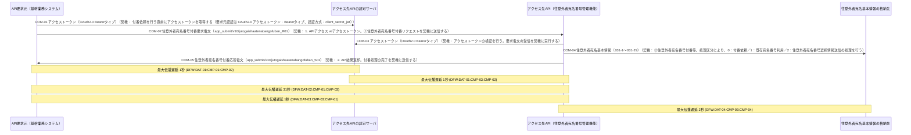

# データフロー・タイミング分析結果

- 対象: 住登外者宛名番号付番API データフロー・タイミング分析（根拠: 2026-08_digital-agency_atenabango-fuban-api_spec:53-66 の見出し「## 図形内テキスト（APIシーケンス）」に出力されたシーケンス図の図形内テキスト12行）

## 1. 構成要素・データ項目

### 1.1 構成要素一覧

| 構成要素ID | 名称 | 種別 | 備考 |
| --- | --- | --- | --- |
| CMP-01 | API要求元（基幹業務システム） | service | 図形内テキスト（APIシーケンス）1行目。2026-08_digital-agency_atenabango-fuban-api_spec:55 |
| CMP-02 | アクセス先APIの認可サーバ | service | 図形内テキスト（APIシーケンス）2行目。2026-08_digital-agency_atenabango-fuban-api_spec:56 |
| CMP-03 | アクセス先API（住登外者宛名番号管理機能） | service | 図形内テキスト（APIシーケンス）3行目。2026-08_digital-agency_atenabango-fuban-api_spec:57 |
| CMP-04 | 住登外者宛名基本情報の格納先 | store | 項目定義書（住登外者宛名番号管理）住登外者宛名基本情報のデータ項目29件の永続化先。2026-08_digital-agency_atenabango-kanri_item-definition:12-58 |

### 1.2 データ項目一覧

| データ項目ID | 名称 | 備考 |
| --- | --- | --- |
| DAT-01 | アクセストークン（OAuth2.0 Bearerタイプ） | 要求元認証で用いる。2026-08_digital-agency_atenabango-fuban-api_spec:37 |
| DAT-02 | 住登外者宛名番号付番要求電文（app_submit/v10/jutogaishaatenabangofuban_R01） | 図形内テキスト（APIシーケンス）11行目。2026-08_digital-agency_atenabango-fuban-api_spec:65 |
| DAT-03 | 住登外者宛名番号付番応答電文（app_submit/v10/jutogaishaatenabangofuban_S01） | 図形内テキスト（APIシーケンス）5行目。2026-08_digital-agency_atenabango-fuban-api_spec:59 |
| DAT-04 | 住登外者宛名基本情報（031-1〜031-29） | 2026-08_digital-agency_atenabango-kanri_item-definition:12-58 |

## 2. 通信一覧

| 通信ID | 送信元 | 宛先 | 方向 | データ項目 | タイミング | 最大遅延(秒) | 最小遅延(秒) | ACK | タイムアウト(秒) | 根拠位置 |
| --- | --- | --- | --- | --- | --- | --- | --- | --- | --- | --- |
| COM-01 | API要求元（基幹業務システム）(CMP-01) | アクセス先APIの認可サーバ(CMP-02) | ->> | アクセストークン（OAuth2.0 Bearerタイプ）(DAT-01) | 契機: 付番依頼を行う直前にアクセストークンを取得する（要求元認証は OAuth2.0 アクセストークン：Bearerタイプ、認証方式：client_secret_jwt） | 1 | 1 | application-ack | 30 | 2026-08_digital-agency_atenabango-fuban-api_spec / L56 / ## 図形内テキスト（APIシーケンス） / アクセス先APIの認可サーバ |
| COM-02 | API要求元（基幹業務システム）(CMP-01) | アクセス先API（住登外者宛名番号管理機能）(CMP-03) | ->> | 住登外者宛名番号付番要求電文（app_submit/v10/jutogaishaatenabangofuban_R01）(DAT-02) | 契機: 1. APIアクセス w/アクセストークン。①住登外者宛名番号付番リクエストを契機に送信する | 31 | 1 | application-ack | 30 | 2026-08_digital-agency_atenabango-fuban-api_spec / L61 / ## 図形内テキスト（APIシーケンス） / 1. APIアクセス w/アクセストークン ／ ①住登外者宛名番号付番リクエスト（同:60） |
| COM-03 | アクセス先API（住登外者宛名番号管理機能）(CMP-03) | アクセス先APIの認可サーバ(CMP-02) | ->> | アクセストークン（OAuth2.0 Bearerタイプ）(DAT-01) | 契機: アクセストークンの検証を行う。要求電文の受信を契機に実行する | 1 | 1 | application-ack | 30 | 2026-08_digital-agency_atenabango-fuban-api_spec / L63 / ## 図形内テキスト（APIシーケンス） / アクセストークンの検証を行う |
| COM-04 | アクセス先API（住登外者宛名番号管理機能）(CMP-03) | 住登外者宛名基本情報の格納先(CMP-04) | ->> | 住登外者宛名基本情報（031-1〜031-29）(DAT-04) | 契機: ②住登外者宛名番号付番等。処理区分により、0：付番依頼／1：既存宛名番号利用／2：住登外者宛名番号選択情報送信の処理を行う | 2 | 2 | application-ack | 30 | 2026-08_digital-agency_atenabango-fuban-api_spec / L62 / ## 図形内テキスト（APIシーケンス） / ②住登外者宛名番号付番等（処理区分の説明は同:66） |
| COM-05 | アクセス先API（住登外者宛名番号管理機能）(CMP-03) | API要求元（基幹業務システム）(CMP-01) | ->> | 住登外者宛名番号付番応答電文（app_submit/v10/jutogaishaatenabangofuban_S01）(DAT-03) | 契機: 2. API結果返却。付番処理の完了を契機に送信する | 1 | 1 | transport-ack | 30 | 2026-08_digital-agency_atenabango-fuban-api_spec / L58 / ## 図形内テキスト（APIシーケンス） / 2. API結果返却 ／ [app_submit/v10/jutogaishaatenabangofuban_S01]住登外者宛名番号付番応答電文（同:59） |

- 辺の最大遅延 = 送信待ち(周期系は intervalSeconds、event は0) + 伝送時間(transmissionLatencySeconds) + タイムアウト×再送回数。最小遅延 = 伝送時間。
- タイミングが確定しない通信は latency 不定として扱い、0秒で代替しない(`-` で表示)。

## 3. 伝播遅延の算出

### 3.1 最大伝播遅延（遅延窓）

| 遅延窓ID | データ項目 | 起点 | 終端 | 最大伝播遅延(秒) | 最小伝播遅延(秒) | クリティカル経路 | 状態 |
| --- | --- | --- | --- | --- | --- | --- | --- |
| DFW:DAT-01:CMP-01:CMP-02 | アクセストークン（OAuth2.0 Bearerタイプ）(DAT-01) | API要求元（基幹業務システム）(CMP-01) | アクセス先APIの認可サーバ(CMP-02) | 1 | 1 | COM-01 | 算出済 |
| DFW:DAT-01:CMP-03:CMP-02 | アクセストークン（OAuth2.0 Bearerタイプ）(DAT-01) | アクセス先API（住登外者宛名番号管理機能）(CMP-03) | アクセス先APIの認可サーバ(CMP-02) | 1 | 1 | COM-03 | 算出済 |
| DFW:DAT-02:CMP-01:CMP-03 | 住登外者宛名番号付番要求電文（app_submit/v10/jutogaishaatenabangofuban_R01）(DAT-02) | API要求元（基幹業務システム）(CMP-01) | アクセス先API（住登外者宛名番号管理機能）(CMP-03) | 31 | 1 | COM-02 | 算出済 |
| DFW:DAT-03:CMP-03:CMP-01 | 住登外者宛名番号付番応答電文（app_submit/v10/jutogaishaatenabangofuban_S01）(DAT-03) | アクセス先API（住登外者宛名番号管理機能）(CMP-03) | API要求元（基幹業務システム）(CMP-01) | 1 | 1 | COM-05 | 算出済 |
| DFW:DAT-04:CMP-03:CMP-04 | 住登外者宛名基本情報（031-1〜031-29）(DAT-04) | アクセス先API（住登外者宛名番号管理機能）(CMP-03) | 住登外者宛名基本情報の格納先(CMP-04) | 2 | 2 | COM-04 | 算出済 |

### 3.2 最大乖離時間（乖離窓）

- 対象なし

### 3.3 宣言値との照合

| 宣言種別 | 宣言ID | 対象窓ID | 宣言値(秒) | 算出値(秒) | 判定 |
| --- | --- | --- | --- | --- | --- |
| 最大伝播遅延 | PRP-01 | DFW:DAT-02:CMP-01:CMP-03 | 31 | 31 | 一致 |
| 最大伝播遅延 | PRP-02 | DFW:DAT-04:CMP-03:CMP-04 | 2 | 2 | 一致 |
| 最大伝播遅延 | PRP-03 | DFW:DAT-03:CMP-03:CMP-01 | 1 | 1 | 一致 |
| 最大伝播遅延 | PRP-04 | DFW:DAT-01:CMP-01:CMP-02 | 1 | 1 | 一致 |

## 4. シーケンス図(mermaid)

## 5. テスト条件との突合

### 5.1 遅延窓・乖離窓の被覆

| 窓ID | 種別 | 秒数 | 参照テスト条件ID | 状態 |
| --- | --- | --- | --- | --- |
| DFW:DAT-01:CMP-01:CMP-02 | 遅延窓 | 1 | TC-028 | 被覆 |
| DFW:DAT-01:CMP-03:CMP-02 | 遅延窓 | 1 | TC-028 | 被覆 |
| DFW:DAT-02:CMP-01:CMP-03 | 遅延窓 | 31 | TC-028, TC-031 | 被覆 |
| DFW:DAT-03:CMP-03:CMP-01 | 遅延窓 | 1 | TC-033 | 被覆 |
| DFW:DAT-04:CMP-03:CMP-04 | 遅延窓 | 2 | TC-029 | 被覆 |

### 5.2 遅延窓被覆率

- 分母(0秒超かつ算出済みの遅延窓＋乖離窓の件数): 5 件
- 分子(実在するテスト条件の coveredDelayWindowIds から実際に参照されている件数): 5 件
- 遅延窓被覆率: 100%
- 宣言値(100%)との照合: 一致

## 6. 決定的検査

- 指摘なし

**判定区分カタログの注記(testdesign://data-flow-timing/analysis-criteria):**

- 本検査は渡された通信母集団に対してのみ成立し、渡していない通信の取りこぼしは検出できない。
- 遅延値は仕様上の周期・タイムアウト宣言から導いた設計上の最悪値であり、実測値の代替にしない。
- 辺の最大遅延は「送信待ち(周期系は intervalSeconds、eventは0) + 伝送時間 + タイムアウト×再送回数」、最小遅延は「伝送時間」で算出する。
- 最大乖離は「最も遅い観測点の最悪値 − 最も速い観測点の最良値」であり、周期差そのものと一致するとは限らない。
- タイミングが未定義の辺は0秒で代替せず、その辺を含む経路の遅延窓・乖離窓を「未算出」として区別する。
- mermaid の矢印記法は timing.kind と対応する。event かつ ACK ありは `->>`、event かつ ACK なしは `-)`、periodic / batch / on-demand は `--)`、タイミング未定義は `-x` で描画する。
- 本ツールが扱うのはSUT内部の構成要素間の通信タイミングであり、テスト作業そのものの実行順序(analyze_execution_order)とは別概念である。

## 7. extract_test_conditions 引き渡し

| 提案条件ID | target | 条件文(雛形) | source | derivedFrom | recommendedTechniques | 対応窓ID |
| --- | --- | --- | --- | --- | --- | --- |
| DFT-DELAY:DAT-01:CMP-01:CMP-02 | アクセス先APIの認可サーバ | 「アクセストークン（OAuth2.0 Bearerタイプ）」がAPI要求元（基幹業務システム）で変化してからアクセス先APIの認可サーバへ反映されるまで最大 1 秒の遅延窓があり、その窓の間のアクセス先APIの認可サーバ側の振る舞いが規定どおりであること | testbase | 未確定 | timing-order-test | DFW:DAT-01:CMP-01:CMP-02 |
| DFT-DELAY:DAT-01:CMP-03:CMP-02 | アクセス先APIの認可サーバ | 「アクセストークン（OAuth2.0 Bearerタイプ）」がアクセス先API（住登外者宛名番号管理機能）で変化してからアクセス先APIの認可サーバへ反映されるまで最大 1 秒の遅延窓があり、その窓の間のアクセス先APIの認可サーバ側の振る舞いが規定どおりであること | testbase | 未確定 | timing-order-test | DFW:DAT-01:CMP-03:CMP-02 |
| DFT-DELAY:DAT-02:CMP-01:CMP-03 | アクセス先API（住登外者宛名番号管理機能） | 「住登外者宛名番号付番要求電文（app_submit/v10/jutogaishaatenabangofuban_R01）」がAPI要求元（基幹業務システム）で変化してからアクセス先API（住登外者宛名番号管理機能）へ反映されるまで最大 31 秒の遅延窓があり、その窓の間のアクセス先API（住登外者宛名番号管理機能）側の振る舞いが規定どおりであること | testbase | requirement:031-1, requirement:031-23, requirement:E0001 | timing-order-test | DFW:DAT-02:CMP-01:CMP-03 |
| DFT-DELAY:DAT-03:CMP-03:CMP-01 | API要求元（基幹業務システム） | 「住登外者宛名番号付番応答電文（app_submit/v10/jutogaishaatenabangofuban_S01）」がアクセス先API（住登外者宛名番号管理機能）で変化してからAPI要求元（基幹業務システム）へ反映されるまで最大 1 秒の遅延窓があり、その窓の間のAPI要求元（基幹業務システム）側の振る舞いが規定どおりであること | testbase | requirement:031-1, requirement:031-27, requirement:031-28, requirement:031-29 | timing-order-test | DFW:DAT-03:CMP-03:CMP-01 |
| DFT-DELAY:DAT-04:CMP-03:CMP-04 | 住登外者宛名基本情報の格納先 | 「住登外者宛名基本情報（031-1〜031-29）」がアクセス先API（住登外者宛名番号管理機能）で変化してから住登外者宛名基本情報の格納先へ反映されるまで最大 2 秒の遅延窓があり、その窓の間の住登外者宛名基本情報の格納先側の振る舞いが規定どおりであること | testbase | requirement:031-1, requirement:031-23, requirement:031-27, requirement:031-28, requirement:031-29 | timing-order-test | DFW:DAT-04:CMP-03:CMP-04 |

- `derivedFrom` セルは `kind:id` 形式で表示している。投入時は `{ kind: "requirement", id: "..." }` へ写すこと。

**`derivedFrom` を確定できない候補:**

- [medium] DFT-DELAY:DAT-01:CMP-01:CMP-02: 経路上の通信に requirementIds が1件も無く、`derivedFrom` を確定できない。`extract_test_conditions` の `derivedFrom` は1件以上必須のため、このままでは投入できない。通信の根拠要件IDを補うこと。
- [medium] DFT-DELAY:DAT-01:CMP-03:CMP-02: 経路上の通信に requirementIds が1件も無く、`derivedFrom` を確定できない。`extract_test_conditions` の `derivedFrom` は1件以上必須のため、このままでは投入できない。通信の根拠要件IDを補うこと。

- `extract_test_conditions` 実行後に本ツールを再実行するときは、`対応窓ID` を `testConditions[].coveredDelayWindowIds` へ入れて突合すること。
- 観点カテゴリは本ツールでは決め打ちしない。`testcondition://perspectives/catalog` の `TPC-08`(タイミング・順序) を第一候補として呼び出し側が選ぶこと。

## 8. サマリ

構成要素 4 / データ項目 4 / 通信 5 / 遅延窓 5件(算出済 5件) / 乖離窓 0件(算出済 0件) / 指摘件数 0

## 次に実行すべきツール

| 実行状態 | ツール名 | 提示理由 |
| --- | --- | --- |
| 未実施 | extract_test_conditions | 算出した遅延窓・乖離窓のテスト条件化が未実施である |

- 未実施: 1件（うち実施済み申告だが証跡未照合: 0件） / 実施済み: 0件
- 未実施の後続ツールが残ったまま成果物を確定しないこと。この節は本ツールが静的に保持する後続表と、生成物から機械的に導いたシグナル（has-delay-windows）から生成している。
