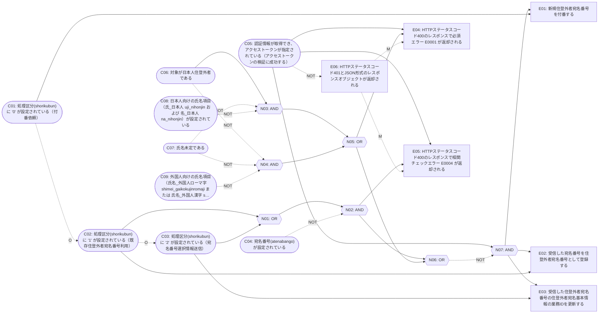

# 原因結果グラフ分析結果

## 1. 前提と宣言

### 1.1 対象セクション

- セクションID: CEG-FUBAN-01
- セクション名: 住登外者宛名番号付番API 処理区分と必須パラメータの相関（fuban-api_spec:66, 81-82, 96-98, 101, 104-111, 242, 245）
- 仕様文: 545 文字 / 16 文（検査対象として分割した文数）

### 1.2 原因一覧

| ID | 命題 | 引用 | 裏付け |
| --- | --- | --- | --- |
| C01 | 処理区分(shorikubun)に "0" が設定されている（付番依頼） | 通常新規付番する場合の初回付番依頼時"0"を設定 | 仕様文に実在 |
| C02 | 処理区分(shorikubun)に "1" が設定されている（既存住登外者宛名番号利用） | 既存の宛名番号を利用し、住登外者を登録する場合"1"を設定 | 仕様文に実在 |
| C03 | 処理区分(shorikubun)に "2" が設定されている（宛名番号選択情報送信） | 候補者から宛名番号を選択し、登録する場合"2"を設定 | 仕様文に実在 |
| C04 | 宛名番号(atenabango)が設定されている | ※※処理区分"1"、または"2"の場合は必須 | 仕様文に実在 |
| C05 | 認証情報が取得でき、アクセストークンが指定されている（アクセストークンの検証に成功する） | 認証情報が取得できないまたはアクセストークンが未指定の場合は | 仕様文に実在 |
| C06 | 対象が日本人住登外者である | ※※日本人住登外者の場合かつ氏名未定ではない場合は必須 | 仕様文に実在 |
| C07 | 氏名未定である | ※※氏名未定でない場合は必須 | 仕様文に実在 |
| C08 | 日本人向けの氏名項目（氏_日本人 uji_nihonjin および 名_日本人 na_nihonjin）が設定されている | ※※日本人住登外者の場合かつ氏名未定ではない場合は必須 | 仕様文に実在 |
| C09 | 外国人向けの氏名項目（氏名_外国人ローマ字 shimei_gaikokujinromaji または 氏名_外国人漢字 shimei_gaikokujinkanji）が設定されている | ※※ローマ字表記での氏名を有する外国人住登外者は必須 | 仕様文に実在 |

### 1.3 結果一覧

| ID | 命題 | 論理 | 引用 | 裏付け |
| --- | --- | --- | --- | --- |
| E01 | 新規住登外者宛名番号を付番する | and | 「処理区分」により、以下の処理を行う。0：付番依頼新規住登外者宛名番号を付番する。 | 仕様文に実在 |
| E02 | 受信した宛名番号を住登外者宛名番号として登録する | and | 1：既存宛名番号利用→受信した宛名番号を住登外者宛名番号として登録する。 | 仕様文に実在 |
| E03 | 受信した住登外者宛名番号の住登外者宛名基本情報の業務IDを更新する | and | ２：住登外者宛名番号選択情報送信→受信した住登外者宛名番号の住登外者宛名基本情報の業務IDを更新する。 | 仕様文に実在 |
| E04 | HTTPステータスコード400のレスポンスで必須エラー E0001 が返却される | and | E0001 必須エラー 【項目名】が設定されていません。 | 仕様文に実在 |
| E05 | HTTPステータスコード400のレスポンスで相関チェックエラー E0004 が返却される | and | E0004 相関チェックエラー 【項目名】が設定されている場合、【項目名】は設定必須です。 | 仕様文に実在 |
| E06 | HTTPステータスコード401とJSON形式のレスポンスオブジェクトが返却される | and | HTTPステータスコード401とJSON形式のレスポンスオブジェクトが返却される | 仕様文に実在 |

### 1.4 中間ノード

| ID | 命題 | 論理 |
| --- | --- | --- |
| N01 | 宛名番号が必須となる処理区分（"1" または "2"）である | or |
| N02 | 宛名番号が必須となる処理区分であるにもかかわらず宛名番号が未設定である | and |
| N03 | 日本人住登外者かつ氏名未定でないにもかかわらず日本人向けの氏名項目が未設定である | and |
| N04 | 外国人住登外者かつ氏名未定でないにもかかわらず外国人向けの氏名項目が未設定である | and |
| N05 | 氏名系の必須パラメータが未設定である | or |
| N06 | 送信したパラメータのチェックでエラーとなる状態である | or |
| N07 | アクセストークンの検証に成功し、かつパラメータチェックでエラーとならない | and |

### 1.5 制約一覧

| 制約ID | 種別 | 対象ノード | 意味 |
| --- | --- | --- | --- |
| CN-01 | onlyOne | C01, C02, C03 | 唯一(O): ちょうど1件が真 |
| CN-02 | masks | E06, E04 | 隠蔽(M): 先の結果が真なら後の結果は評価対象外 |
| CN-03 | masks | E06, E05 | 隠蔽(M): 先の結果が真なら後の結果は評価対象外 |

## 2. 原因結果グラフ

### 2.1 mermaid 図



### 2.2 辺一覧

| From | To | 種別 |
| --- | --- | --- |
| C02 | N01 | identity |
| C03 | N01 | identity |
| N01 | N02 | identity |
| C04 | N02 | not |
| C06 | N03 | identity |
| C07 | N03 | not |
| C08 | N03 | not |
| C06 | N04 | not |
| C07 | N04 | not |
| C09 | N04 | not |
| N03 | N05 | identity |
| N04 | N05 | identity |
| N02 | N06 | identity |
| N05 | N06 | identity |
| C05 | N07 | identity |
| N06 | N07 | not |
| N07 | E01 | identity |
| C01 | E01 | identity |
| N07 | E02 | identity |
| C02 | E02 | identity |
| N07 | E03 | identity |
| C03 | E03 | identity |
| C05 | E04 | identity |
| N05 | E04 | identity |
| C05 | E05 | identity |
| N02 | E05 | identity |
| C05 | E06 | not |

## 3. 決定的検査(自動)

### 3.1 グラフ構造検査

- なし

### 3.2 孤立原因

- なし

### 3.3 導出されない結果

- なし

### 3.4 中間ノードの片側未接続

- なし

### 3.5 制約の整合性

- なし

### 3.6 組合せ数とデシジョンテーブル列数

- 原因数: 9 / 理論上限の組合せ数: 2^9 = 512
- 制約充足後の組合せ数(=デシジョンテーブル列数): 192 / 圧縮後の列数: 33
- 上記 192 / 33 の根拠は 5.2 節のルール表本文（圧縮後 33 行）に一致する。
- 宣言列数: 192 / 算出列数: 192 / 判定: 一致

### 3.7 結果の可変性検査

- なし

### 3.8 引用の仕様文実在照合

- なし

### 3.9 仕様文のモデル化網羅

- モデル化率: 14/16 (87.5%)
- [medium] CEG-16 文1: 「送信したパラメータのチェックにてエラーとなった場合は、HTTPステータスコード400とJSON形式のレスポンスオブジェクトが返却される」
- [medium] CEG-16 文14: 「※※漢字表記での氏名を有する外国人住登外者は必須」

### 3.10 論理接続語のモデル反映検査

- [medium] CEG-17 文10: 仕様文の第10文は論理接続語（または）を含むが、モデル側に論理合流・or 論理・not 辺・制約のいずれも現れていない: 「※※処理区分"1"、または"2"の場合は必須」

### 3.11 曖昧語(参考)

- [info] CEG-18 未定: incomplete-note / 出現 2 件

### 3.12 サマリ

- 原因数: 9 / 結果数: 6 / 中間ノード数: 7 / 辺数: 27 / 制約数: 3
- 全列挙: 実施 / 理論上限: 512 / 制約充足後: 192 / 圧縮後: 33
- モデル化文数: 14/16 (87.5%)
- 指摘件数: high 0 件 / medium 3 件 / info 0 件

## 4. 判定区分と対処指針(カタログ)

| 区分ID | 区分 | 重大度 | 説明 | 対処 |
| --- | --- | --- | --- | --- |
| CEG-01 | 未知ノードの参照 | high | 辺または制約が、原因・中間ノード・結果のいずれにも定義されていないIDを参照している。 | 参照先IDの綴りを確認し、定義済みIDへ修正するか、当該ノードをモデルに追加すること。 |
| CEG-02 | ノードID・制約IDの重複 | high | 原因・中間ノード・結果を横断して同一のノードIDが宣言されている、または制約IDが重複している。 | IDは種別を横断して一意にすること。重複したまま列挙するとどのノードを指すか決まらない。 |
| CEG-03 | IDプレフィックスの不一致 | info | ノードIDまたは制約IDが、その種別に期待されるプレフィックスで始まっていない。 | 種別ごとのプレフィックス規約に合わせるか、入力でプレフィックスを明示して規約を宣言すること。 |
| CEG-04 | 孤立原因（どの結果にも接続しない原因） | high | 原因ノードから辺をたどってもどの結果ノードにも到達しない（出辺が1本もない場合を含む）。その原因は列挙しても意味を持たない。 | 当該原因が影響する結果を仕様文から特定して辺を追加するか、原因として不要なら削除すること。 |
| CEG-05 | 導出されない結果（どの原因からも導かれない結果） | high | 結果ノードを辺の逆向きにたどってもどの原因ノードにも到達しない（入辺が1本もない場合を含む）。 | 当該結果を導く条件を仕様文から特定して辺を追加するか、結果として不要なら削除すること。 |
| CEG-06 | 中間ノードの片側未接続 | medium | 中間ノードに入辺または出辺が存在せず、論理合流点として機能していない。 | 中間ノードは原因側からの入辺と結果側への出辺の両方を持たせること。不要なら削除すること。 |
| CEG-07 | グラフの循環 | high | 辺の向きをたどると同じノードへ戻る経路がある。原因結果グラフは非循環でなければ評価順が定まらない。 | 循環に含まれる辺の向きを見直し、原因から結果への一方向のグラフへ直すこと。 |
| CEG-08 | 制約の指定不正（対象種別・要素数・重複） | high | 制約の対象ノードの種別（原因か結果か）・要素数・重複が制約種別の要求と合っていない。 | 排他・包含・唯一は原因2件以上、requires は原因ちょうど2件、masks は結果ちょうど2件を、重複なしで指定すること。 |
| CEG-09 | 制約の矛盾（同時に成立し得ない指定） | high | 制約を同時に満たす原因の真偽組合せが存在しない、または requires と排他・唯一が同じ原因の組について同時に指定されている。 | 制約を1件ずつ外して意図した組合せが残るか確認し、仕様文に沿わない制約を除去すること。 |
| CEG-10 | 制約による原因値の固定 | high | 制約の結果として、ある原因が全ての有効な組合せで同一の真偽値に固定されており、条件項目として機能していない。 | 制約の指定を見直すか、当該原因を条件項目から外して固定の前提条件として扱うこと。 |
| CEG-11 | 冗長な制約 | info | その制約を外しても有効な原因の組合せ集合が変化しない（他の制約に含意されている）。 | 制約表を簡潔に保つため削除を検討する。仕様文に明記された制約なら意図的な冗長として残してよい。 |
| CEG-12 | 常に偽の結果 | high | 有効な原因の組合せすべてで当該結果が偽になり、成立させる入力が存在しない。 | 当該結果へ至る辺の向き・論理（and / or）・not 指定、および制約の指定を見直すこと。 |
| CEG-13 | 原因に依存しない結果 | medium | 有効な原因の組合せすべてで当該結果が同一値であり、原因の真偽に依存していない。 | 原因の組合せで結果が変化するようモデルを見直すか、原因非依存の仕様であることを確認すること。 |
| CEG-14 | 仕様文に存在しない引用 | high | ノードの引用（quote）が、渡された仕様文本文に存在しない（要約・言い換え・創作）。 | 引用は仕様文本文からそのまま切り出すこと。要約や解釈は statement / note 側に書くこと。 |
| CEG-15 | 引用未指定のノード | medium | 原因または結果に引用が指定されておらず、仕様文のどこに由来するか照合できない。 | 根拠となる仕様文の一文を quote として指定し、裏付けを検証可能にすること。 |
| CEG-16 | モデル化されていない仕様文 | medium | 仕様文中の文が、どの原因・結果の引用にも紐づいていない。条件・動作の取りこぼしの疑いがある。 | 当該文が条件・動作を述べているなら原因／結果としてモデル化し、対象外なら対象外である理由を note に明記すること。 |
| CEG-17 | 論理接続語のモデル未反映 | medium | 「かつ」「または」「ただし」「以外」等の論理接続語を含む文に対して、モデル側に論理合流・or 論理・not 辺・制約のいずれも現れていない。 | 接続語が表す論理関係を、中間ノードの and / or、not 辺、または制約として明示的にモデル化すること。 |
| CEG-18 | 曖昧語の残存（参考） | info | 仕様文に曖昧・非計測的な表現が残っている。原因や結果の真偽判定条件が一意に決まらない恐れがある。 | 曖昧語を計測可能な条件へ置き換えられるか仕様提供元に確認すること。参考情報であり自動判定はしない。 |
| CEG-19 | 宣言列数と算出列数の不一致 | high | 呼び出し側が宣言したデシジョンテーブル列数が、原因と制約から算出した列数と一致しない。 | 宣言値の根拠を確認し、モデル（原因・制約）側の誤りか宣言値側の誤りかを切り分けること。 |
| CEG-20 | デシジョンテーブル引き渡しの不整合 | high | 原因結果グラフから生成した design_decision_table 入力を実際に同ツールの算出ロジックへ通した結果が、原因結果グラフ側の組合せ数・動作値と一致しない。 | 引き渡し変換またはどちらかの算出ロジックに不具合がある。引き渡しJSONをそのまま design_decision_table へ渡さず、原因・制約のモデルと変換処理を確認すること。 |

- 本検査は渡された仕様文（specText）と渡されたモデルに対してのみ成立する。渡していない仕様文の条件・結果の取りこぼしは検出できない。
- 原因・結果・制約への構造化は意味的層（呼び出し側LLM）の責務であり、決定的層はモデルの整合性と仕様文本文による裏付けのみを検査する。モデルが誤っていれば検査結果も誤る。
- 提示する制約充足後の組合せ数・デシジョンテーブル列数は全列挙を実施した場合にのみ意味を持つ。全列挙を行えなかった場合は理論上限（2の原因数乗）のみを示し、制約充足後の値は「未算出」と明記する。
- モデル化率は未モデル化文の全件列挙を根拠とする。率だけを提示して未モデル化文を隠すことはしない。
- 圧縮後の列数は、結果の値が同一で原因値が1箇所だけ異なる列を無関係（-）へ畳んだ結果であり、元の組合せ数を減らす操作ではない。
- デシジョンテーブルへの引き渡しは、生成したJSONを design_decision_table の算出ロジックへ実際に通した結果と突き合わせたうえで提示する。渡せる形式であることの宣言だけで済ませない。圧縮後の列数は両者で圧縮アルゴリズムが異なるため一致しないことがあり、これは不整合として扱わない。

## 5. デシジョンテーブルへの引き渡し

### 5.1 条件項目・動作項目

| 区分 | ID | 内容 |
| --- | --- | --- |
| 条件項目 | C01 | 処理区分(shorikubun)に "0" が設定されている（付番依頼） |
| 条件項目 | C02 | 処理区分(shorikubun)に "1" が設定されている（既存住登外者宛名番号利用） |
| 条件項目 | C03 | 処理区分(shorikubun)に "2" が設定されている（宛名番号選択情報送信） |
| 条件項目 | C04 | 宛名番号(atenabango)が設定されている |
| 条件項目 | C05 | 認証情報が取得でき、アクセストークンが指定されている（アクセストークンの検証に成功する） |
| 条件項目 | C06 | 対象が日本人住登外者である |
| 条件項目 | C07 | 氏名未定である |
| 条件項目 | C08 | 日本人向けの氏名項目（氏_日本人 uji_nihonjin および 名_日本人 na_nihonjin）が設定されている |
| 条件項目 | C09 | 外国人向けの氏名項目（氏名_外国人ローマ字 shimei_gaikokujinromaji または 氏名_外国人漢字 shimei_gaikokujinkanji）が設定されている |
| 動作項目 | E01 | 新規住登外者宛名番号を付番する |
| 動作項目 | E02 | 受信した宛名番号を住登外者宛名番号として登録する |
| 動作項目 | E03 | 受信した住登外者宛名番号の住登外者宛名基本情報の業務IDを更新する |
| 動作項目 | E04 | HTTPステータスコード400のレスポンスで必須エラー E0001 が返却される |
| 動作項目 | E05 | HTTPステータスコード400のレスポンスで相関チェックエラー E0004 が返却される |
| 動作項目 | E06 | HTTPステータスコード401とJSON形式のレスポンスオブジェクトが返却される |

### 5.2 ルール表(圧縮後)

| No | C01 | C02 | C03 | C04 | C05 | C06 | C07 | C08 | C09 | E01 | E02 | E03 | E04 | E05 | E06 |
| --- | --- | --- | --- | --- | --- | --- | --- | --- | --- | --- | --- | --- | --- | --- | --- |
| 1 | F | F | T | - | F | - | - | - | - | F | F | F | - | - | T |
| 2 | F | F | T | F | T | F | F | - | F | F | F | F | T | T | F |
| 3 | F | F | T | F | T | F | F | - | T | F | F | F | F | T | F |
| 4 | F | F | T | F | T | F | T | - | - | F | F | F | F | T | F |
| 5 | F | F | T | F | T | T | F | F | - | F | F | F | T | T | F |
| 6 | F | F | T | F | T | T | - | T | - | F | F | F | F | T | F |
| 7 | F | F | T | F | T | T | T | F | - | F | F | F | F | T | F |
| 8 | F | F | T | T | T | F | F | - | F | F | F | F | T | F | F |
| 9 | F | F | T | T | T | F | F | - | T | F | F | T | F | F | F |
| 10 | F | F | T | T | T | F | T | - | - | F | F | T | F | F | F |
| 11 | F | F | T | T | T | T | F | F | - | F | F | F | T | F | F |
| 12 | F | F | T | T | T | T | - | T | - | F | F | T | F | F | F |
| 13 | F | F | T | T | T | T | T | F | - | F | F | T | F | F | F |
| 14 | F | T | F | - | F | - | - | - | - | F | F | F | - | - | T |
| 15 | F | T | F | F | T | F | F | - | F | F | F | F | T | T | F |
| 16 | F | T | F | F | T | F | F | - | T | F | F | F | F | T | F |
| 17 | F | T | F | F | T | F | T | - | - | F | F | F | F | T | F |
| 18 | F | T | F | F | T | T | F | F | - | F | F | F | T | T | F |
| 19 | F | T | F | F | T | T | - | T | - | F | F | F | F | T | F |
| 20 | F | T | F | F | T | T | T | F | - | F | F | F | F | T | F |
| 21 | F | T | F | T | T | F | F | - | F | F | F | F | T | F | F |
| 22 | F | T | F | T | T | F | F | - | T | F | T | F | F | F | F |
| 23 | F | T | F | T | T | F | T | - | - | F | T | F | F | F | F |
| 24 | F | T | F | T | T | T | F | F | - | F | F | F | T | F | F |
| 25 | F | T | F | T | T | T | - | T | - | F | T | F | F | F | F |
| 26 | F | T | F | T | T | T | T | F | - | F | T | F | F | F | F |
| 27 | T | F | F | - | F | - | - | - | - | F | F | F | - | - | T |
| 28 | T | F | F | - | T | F | F | - | F | F | F | F | T | F | F |
| 29 | T | F | F | - | T | F | F | - | T | T | F | F | F | F | F |
| 30 | T | F | F | - | T | F | T | - | - | T | F | F | F | F | F |
| 31 | T | F | F | - | T | T | F | F | - | F | F | F | T | F | F |
| 32 | T | F | F | - | T | T | - | T | - | T | F | F | F | F | F |
| 33 | T | F | F | - | T | T | T | F | - | T | F | F | F | F | F |

### 5.3 design_decision_table 入力(JSON)

```json
{
  "tableId": "CEG-FUBAN-01",
  "title": "住登外者宛名番号付番API 処理区分と必須パラメータの相関（fuban-api_spec:66, 81-82, 96-98, 101, 104-111, 242, 245）",
  "conditions": [
    {
      "id": "C01",
      "statement": "処理区分(shorikubun)に \"0\" が設定されている（付番依頼）",
      "levels": [
        "T",
        "F"
      ]
    },
    {
      "id": "C02",
      "statement": "処理区分(shorikubun)に \"1\" が設定されている（既存住登外者宛名番号利用）",
      "levels": [
        "T",
        "F"
      ]
    },
    {
      "id": "C03",
      "statement": "処理区分(shorikubun)に \"2\" が設定されている（宛名番号選択情報送信）",
      "levels": [
        "T",
        "F"
      ]
    },
    {
      "id": "C04",
      "statement": "宛名番号(atenabango)が設定されている",
      "levels": [
        "T",
        "F"
      ]
    },
    {
      "id": "C05",
      "statement": "認証情報が取得でき、アクセストークンが指定されている（アクセストークンの検証に成功する）",
      "levels": [
        "T",
        "F"
      ]
    },
    {
      "id": "C06",
      "statement": "対象が日本人住登外者である",
      "levels": [
        "T",
        "F"
      ]
    },
    {
      "id": "C07",
      "statement": "氏名未定である",
      "levels": [
        "T",
        "F"
      ]
    },
    {
      "id": "C08",
      "statement": "日本人向けの氏名項目（氏_日本人 uji_nihonjin および 名_日本人 na_nihonjin）が設定されている",
      "levels": [
        "T",
        "F"
      ]
    },
    {
      "id": "C09",
      "statement": "外国人向けの氏名項目（氏名_外国人ローマ字 shimei_gaikokujinromaji または 氏名_外国人漢字 shimei_gaikokujinkanji）が設定されている",
      "levels": [
        "T",
        "F"
      ]
    }
  ],
  "actions": [
    {
      "id": "E01",
      "statement": "新規住登外者宛名番号を付番する"
    },
    {
      "id": "E02",
      "statement": "受信した宛名番号を住登外者宛名番号として登録する"
    },
    {
      "id": "E03",
      "statement": "受信した住登外者宛名番号の住登外者宛名基本情報の業務IDを更新する"
    },
    {
      "id": "E04",
      "statement": "HTTPステータスコード400のレスポンスで必須エラー E0001 が返却される"
    },
    {
      "id": "E05",
      "statement": "HTTPステータスコード400のレスポンスで相関チェックエラー E0004 が返却される"
    },
    {
      "id": "E06",
      "statement": "HTTPステータスコード401とJSON形式のレスポンスオブジェクトが返却される"
    }
  ],
  "invalidCombinations": [
    {
      "id": "IC1",
      "when": {
        "C01": "F",
        "C02": "F",
        "C03": "F",
        "C04": "F",
        "C05": "F",
        "C06": "F",
        "C07": "F",
        "C08": "F",
        "C09": "F"
      },
      "reason": "原因結果グラフの制約 CN-01（唯一(O): ちょうど1件が真）を満たさない組合せ。"
    },
    {
      "id": "IC2",
      "when": {
        "C01": "F",
        "C02": "F",
        "C03": "F",
        "C04": "F",
        "C05": "F",
        "C06": "F",
        "C07": "F",
        "C08": "F",
        "C09": "T"
      },
      "reason": "原因結果グラフの制約 CN-01（唯一(O): ちょうど1件が真）を満たさない組合せ。"
    },
    {
      "id": "IC3",
      "when": {
        "C01": "F",
        "C02": "F",
        "C03": "F",
        "C04": "F",
        "C05": "F",
        "C06": "F",
        "C07": "F",
        "C08": "T",
        "C09": "F"
      },
      "reason": "原因結果グラフの制約 CN-01（唯一(O): ちょうど1件が真）を満たさない組合せ。"
    },
    {
      "id": "IC4",
      "when": {
        "C01": "F",
        "C02": "F",
        "C03": "F",
        "C04": "F",
        "C05": "F",
        "C06": "F",
        "C07": "F",
        "C08": "T",
        "C09": "T"
      },
      "reason": "原因結果グラフの制約 CN-01（唯一(O): ちょうど1件が真）を満たさない組合せ。"
    },
    {
      "id": "IC5",
      "when": {
        "C01": "F",
        "C02": "F",
        "C03": "F",
        "C04": "F",
        "C05": "F",
        "C06": "F",
        "C07": "T",
        "C08": "F",
        "C09": "F"
      },
      "reason": "原因結果グラフの制約 CN-01（唯一(O): ちょうど1件が真）を満たさない組合せ。"
    },
    {
      "id": "IC6",
      "when": {
        "C01": "F",
        "C02": "F",
        "C03": "F",
        "C04": "F",
        "C05": "F",
        "C06": "F",
        "C07": "T",
        "C08": "F",
        "C09": "T"
      },
      "reason": "原因結果グラフの制約 CN-01（唯一(O): ちょうど1件が真）を満たさない組合せ。"
    },
    {
      "id": "IC7",
      "when": {
        "C01": "F",
        "C02": "F",
        "C03": "F",
        "C04": "F",
        "C05": "F",
        "C06": "F",
        "C07": "T",
        "C08": "T",
        "C09": "F"
      },
      "reason": "原因結果グラフの制約 CN-01（唯一(O): ちょうど1件が真）を満たさない組合せ。"
    },
    {
      "id": "IC8",
      "when": {
        "C01": "F",
        "C02": "F",
        "C03": "F",
        "C04": "F",
        "C05": "F",
        "C06": "F",
        "C07": "T",
        "C08": "T",
        "C09": "T"
      },
      "reason": "原因結果グラフの制約 CN-01（唯一(O): ちょうど1件が真）を満たさない組合せ。"
    },
    {
      "id": "IC9",
      "when": {
        "C01": "F",
        "C02": "F",
        "C03": "F",
        "C04": "F",
        "C05": "F",
        "C06": "T",
        "C07": "F",
        "C08": "F",
        "C09": "F"
      },
      "reason": "原因結果グラフの制約 CN-01（唯一(O): ちょうど1件が真）を満たさない組合せ。"
    },
    {
      "id": "IC10",
      "when": {
        "C01": "F",
        "C02": "F",
        "C03": "F",
        "C04": "F",
        "C05": "F",
        "C06": "T",
        "C07": "F",
        "C08": "F",
        "C09": "T"
      },
      "reason": "原因結果グラフの制約 CN-01（唯一(O): ちょうど1件が真）を満たさない組合せ。"
    },
    {
      "id": "IC11",
      "when": {
        "C01": "F",
        "C02": "F",
        "C03": "F",
        "C04": "F",
        "C05": "F",
        "C06": "T",
        "C07": "F",
        "C08": "T",
        "C09": "F"
      },
      "reason": "原因結果グラフの制約 CN-01（唯一(O): ちょうど1件が真）を満たさない組合せ。"
    },
    {
      "id": "IC12",
      "when": {
        "C01": "F",
        "C02": "F",
        "C03": "F",
        "C04": "F",
        "C05": "F",
        "C06": "T",
        "C07": "F",
        "C08": "T",
        "C09": "T"
      },
      "reason": "原因結果グラフの制約 CN-01（唯一(O): ちょうど1件が真）を満たさない組合せ。"
    },
    {
      "id": "IC13",
      "when": {
        "C01": "F",
        "C02": "F",
        "C03": "F",
        "C04": "F",
        "C05": "F",
        "C06": "T",
        "C07": "T",
        "C08": "F",
        "C09": "F"
      },
      "reason": "原因結果グラフの制約 CN-01（唯一(O): ちょうど1件が真）を満たさない組合せ。"
    },
    {
      "id": "IC14",
      "when": {
        "C01": "F",
        "C02": "F",
        "C03": "F",
        "C04": "F",
        "C05": "F",
        "C06": "T",
        "C07": "T",
        "C08": "F",
        "C09": "T"
      },
      "reason": "原因結果グラフの制約 CN-01（唯一(O): ちょうど1件が真）を満たさない組合せ。"
    },
    {
      "id": "IC15",
      "when": {
        "C01": "F",
        "C02": "F",
        "C03": "F",
        "C04": "F",
        "C05": "F",
        "C06": "T",
        "C07": "T",
        "C08": "T",
        "C09": "F"
      },
      "reason": "原因結果グラフの制約 CN-01（唯一(O): ちょうど1件が真）を満たさない組合せ。"
    },
    {
      "id": "IC16",
      "when": {
        "C01": "F",
        "C02": "F",
        "C03": "F",
        "C04": "F",
        "C05": "F",
        "C06": "T",
        "C07": "T",
        "C08": "T",
        "C09": "T"
      },
      "reason": "原因結果グラフの制約 CN-01（唯一(O): ちょうど1件が真）を満たさない組合せ。"
    },
    {
      "id": "IC17",
      "when": {
        "C01": "F",
        "C02": "F",
        "C03": "F",
        "C04": "F",
        "C05": "T",
        "C06": "F",
        "C07": "F",
        "C08": "F",
        "C09": "F"
      },
      "reason": "原因結果グラフの制約 CN-01（唯一(O): ちょうど1件が真）を満たさない組合せ。"
    },
    {
      "id": "IC18",
      "when": {
        "C01": "F",
        "C02": "F",
        "C03": "F",
        "C04": "F",
        "C05": "T",
        "C06": "F",
        "C07": "F",
        "C08": "F",
        "C09": "T"
      },
      "reason": "原因結果グラフの制約 CN-01（唯一(O): ちょうど1件が真）を満たさない組合せ。"
    },
    {
      "id": "IC19",
      "when": {
        "C01": "F",
        "C02": "F",
        "C03": "F",
        "C04": "F",
        "C05": "T",
        "C06": "F",
        "C07": "F",
        "C08": "T",
        "C09": "F"
      },
      "reason": "原因結果グラフの制約 CN-01（唯一(O): ちょうど1件が真）を満たさない組合せ。"
    },
    {
      "id": "IC20",
      "when": {
        "C01": "F",
        "C02": "F",
        "C03": "F",
        "C04": "F",
        "C05": "T",
        "C06": "F",
        "C07": "F",
        "C08": "T",
        "C09": "T"
      },
      "reason": "原因結果グラフの制約 CN-01（唯一(O): ちょうど1件が真）を満たさない組合せ。"
    },
    {
      "id": "IC21",
      "when": {
        "C01": "F",
        "C02": "F",
        "C03": "F",
        "C04": "F",
        "C05": "T",
        "C06": "F",
        "C07": "T",
        "C08": "F",
        "C09": "F"
      },
      "reason": "原因結果グラフの制約 CN-01（唯一(O): ちょうど1件が真）を満たさない組合せ。"
    },
    {
      "id": "IC22",
      "when": {
        "C01": "F",
        "C02": "F",
        "C03": "F",
        "C04": "F",
        "C05": "T",
        "C06": "F",
        "C07": "T",
        "C08": "F",
        "C09": "T"
      },
      "reason": "原因結果グラフの制約 CN-01（唯一(O): ちょうど1件が真）を満たさない組合せ。"
    },
    {
      "id": "IC23",
      "when": {
        "C01": "F",
        "C02": "F",
        "C03": "F",
        "C04": "F",
        "C05": "T",
        "C06": "F",
        "C07": "T",
        "C08": "T",
        "C09": "F"
      },
      "reason": "原因結果グラフの制約 CN-01（唯一(O): ちょうど1件が真）を満たさない組合せ。"
    },
    {
      "id": "IC24",
      "when": {
        "C01": "F",
        "C02": "F",
        "C03": "F",
        "C04": "F",
        "C05": "T",
        "C06": "F",
        "C07": "T",
        "C08": "T",
        "C09": "T"
      },
      "reason": "原因結果グラフの制約 CN-01（唯一(O): ちょうど1件が真）を満たさない組合せ。"
    },
    {
      "id": "IC25",
      "when": {
        "C01": "F",
        "C02": "F",
        "C03": "F",
        "C04": "F",
        "C05": "T",
        "C06": "T",
        "C07": "F",
        "C08": "F",
        "C09": "F"
      },
      "reason": "原因結果グラフの制約 CN-01（唯一(O): ちょうど1件が真）を満たさない組合せ。"
    },
    {
      "id": "IC26",
      "when": {
        "C01": "F",
        "C02": "F",
        "C03": "F",
        "C04": "F",
        "C05": "T",
        "C06": "T",
        "C07": "F",
        "C08": "F",
        "C09": "T"
      },
      "reason": "原因結果グラフの制約 CN-01（唯一(O): ちょうど1件が真）を満たさない組合せ。"
    },
    {
      "id": "IC27",
      "when": {
        "C01": "F",
        "C02": "F",
        "C03": "F",
        "C04": "F",
        "C05": "T",
        "C06": "T",
        "C07": "F",
        "C08": "T",
        "C09": "F"
      },
      "reason": "原因結果グラフの制約 CN-01（唯一(O): ちょうど1件が真）を満たさない組合せ。"
    },
    {
      "id": "IC28",
      "when": {
        "C01": "F",
        "C02": "F",
        "C03": "F",
        "C04": "F",
        "C05": "T",
        "C06": "T",
        "C07": "F",
        "C08": "T",
        "C09": "T"
      },
      "reason": "原因結果グラフの制約 CN-01（唯一(O): ちょうど1件が真）を満たさない組合せ。"
    },
    {
      "id": "IC29",
      "when": {
        "C01": "F",
        "C02": "F",
        "C03": "F",
        "C04": "F",
        "C05": "T",
        "C06": "T",
        "C07": "T",
        "C08": "F",
        "C09": "F"
      },
      "reason": "原因結果グラフの制約 CN-01（唯一(O): ちょうど1件が真）を満たさない組合せ。"
    },
    {
      "id": "IC30",
      "when": {
        "C01": "F",
        "C02": "F",
        "C03": "F",
        "C04": "F",
        "C05": "T",
        "C06": "T",
        "C07": "T",
        "C08": "F",
        "C09": "T"
      },
      "reason": "原因結果グラフの制約 CN-01（唯一(O): ちょうど1件が真）を満たさない組合せ。"
    },
    {
      "id": "IC31",
      "when": {
        "C01": "F",
        "C02": "F",
        "C03": "F",
        "C04": "F",
        "C05": "T",
        "C06": "T",
        "C07": "T",
        "C08": "T",
        "C09": "F"
      },
      "reason": "原因結果グラフの制約 CN-01（唯一(O): ちょうど1件が真）を満たさない組合せ。"
    },
    {
      "id": "IC32",
      "when": {
        "C01": "F",
        "C02": "F",
        "C03": "F",
        "C04": "F",
        "C05": "T",
        "C06": "T",
        "C07": "T",
        "C08": "T",
        "C09": "T"
      },
      "reason": "原因結果グラフの制約 CN-01（唯一(O): ちょうど1件が真）を満たさない組合せ。"
    },
    {
      "id": "IC33",
      "when": {
        "C01": "F",
        "C02": "F",
        "C03": "F",
        "C04": "T",
        "C05": "F",
        "C06": "F",
        "C07": "F",
        "C08": "F",
        "C09": "F"
      },
      "reason": "原因結果グラフの制約 CN-01（唯一(O): ちょうど1件が真）を満たさない組合せ。"
    },
    {
      "id": "IC34",
      "when": {
        "C01": "F",
        "C02": "F",
        "C03": "F",
        "C04": "T",
        "C05": "F",
        "C06": "F",
        "C07": "F",
        "C08": "F",
        "C09": "T"
      },
      "reason": "原因結果グラフの制約 CN-01（唯一(O): ちょうど1件が真）を満たさない組合せ。"
    },
    {
      "id": "IC35",
      "when": {
        "C01": "F",
        "C02": "F",
        "C03": "F",
        "C04": "T",
        "C05": "F",
        "C06": "F",
        "C07": "F",
        "C08": "T",
        "C09": "F"
      },
      "reason": "原因結果グラフの制約 CN-01（唯一(O): ちょうど1件が真）を満たさない組合せ。"
    },
    {
      "id": "IC36",
      "when": {
        "C01": "F",
        "C02": "F",
        "C03": "F",
        "C04": "T",
        "C05": "F",
        "C06": "F",
        "C07": "F",
        "C08": "T",
        "C09": "T"
      },
      "reason": "原因結果グラフの制約 CN-01（唯一(O): ちょうど1件が真）を満たさない組合せ。"
    },
    {
      "id": "IC37",
      "when": {
        "C01": "F",
        "C02": "F",
        "C03": "F",
        "C04": "T",
        "C05": "F",
        "C06": "F",
        "C07": "T",
        "C08": "F",
        "C09": "F"
      },
      "reason": "原因結果グラフの制約 CN-01（唯一(O): ちょうど1件が真）を満たさない組合せ。"
    },
    {
      "id": "IC38",
      "when": {
        "C01": "F",
        "C02": "F",
        "C03": "F",
        "C04": "T",
        "C05": "F",
        "C06": "F",
        "C07": "T",
        "C08": "F",
        "C09": "T"
      },
      "reason": "原因結果グラフの制約 CN-01（唯一(O): ちょうど1件が真）を満たさない組合せ。"
    },
    {
      "id": "IC39",
      "when": {
        "C01": "F",
        "C02": "F",
        "C03": "F",
        "C04": "T",
        "C05": "F",
        "C06": "F",
        "C07": "T",
        "C08": "T",
        "C09": "F"
      },
      "reason": "原因結果グラフの制約 CN-01（唯一(O): ちょうど1件が真）を満たさない組合せ。"
    },
    {
      "id": "IC40",
      "when": {
        "C01": "F",
        "C02": "F",
        "C03": "F",
        "C04": "T",
        "C05": "F",
        "C06": "F",
        "C07": "T",
        "C08": "T",
        "C09": "T"
      },
      "reason": "原因結果グラフの制約 CN-01（唯一(O): ちょうど1件が真）を満たさない組合せ。"
    },
    {
      "id": "IC41",
      "when": {
        "C01": "F",
        "C02": "F",
        "C03": "F",
        "C04": "T",
        "C05": "F",
        "C06": "T",
        "C07": "F",
        "C08": "F",
        "C09": "F"
      },
      "reason": "原因結果グラフの制約 CN-01（唯一(O): ちょうど1件が真）を満たさない組合せ。"
    },
    {
      "id": "IC42",
      "when": {
        "C01": "F",
        "C02": "F",
        "C03": "F",
        "C04": "T",
        "C05": "F",
        "C06": "T",
        "C07": "F",
        "C08": "F",
        "C09": "T"
      },
      "reason": "原因結果グラフの制約 CN-01（唯一(O): ちょうど1件が真）を満たさない組合せ。"
    },
    {
      "id": "IC43",
      "when": {
        "C01": "F",
        "C02": "F",
        "C03": "F",
        "C04": "T",
        "C05": "F",
        "C06": "T",
        "C07": "F",
        "C08": "T",
        "C09": "F"
      },
      "reason": "原因結果グラフの制約 CN-01（唯一(O): ちょうど1件が真）を満たさない組合せ。"
    },
    {
      "id": "IC44",
      "when": {
        "C01": "F",
        "C02": "F",
        "C03": "F",
        "C04": "T",
        "C05": "F",
        "C06": "T",
        "C07": "F",
        "C08": "T",
        "C09": "T"
      },
      "reason": "原因結果グラフの制約 CN-01（唯一(O): ちょうど1件が真）を満たさない組合せ。"
    },
    {
      "id": "IC45",
      "when": {
        "C01": "F",
        "C02": "F",
        "C03": "F",
        "C04": "T",
        "C05": "F",
        "C06": "T",
        "C07": "T",
        "C08": "F",
        "C09": "F"
      },
      "reason": "原因結果グラフの制約 CN-01（唯一(O): ちょうど1件が真）を満たさない組合せ。"
    },
    {
      "id": "IC46",
      "when": {
        "C01": "F",
        "C02": "F",
        "C03": "F",
        "C04": "T",
        "C05": "F",
        "C06": "T",
        "C07": "T",
        "C08": "F",
        "C09": "T"
      },
      "reason": "原因結果グラフの制約 CN-01（唯一(O): ちょうど1件が真）を満たさない組合せ。"
    },
    {
      "id": "IC47",
      "when": {
        "C01": "F",
        "C02": "F",
        "C03": "F",
        "C04": "T",
        "C05": "F",
        "C06": "T",
        "C07": "T",
        "C08": "T",
        "C09": "F"
      },
      "reason": "原因結果グラフの制約 CN-01（唯一(O): ちょうど1件が真）を満たさない組合せ。"
    },
    {
      "id": "IC48",
      "when": {
        "C01": "F",
        "C02": "F",
        "C03": "F",
        "C04": "T",
        "C05": "F",
        "C06": "T",
        "C07": "T",
        "C08": "T",
        "C09": "T"
      },
      "reason": "原因結果グラフの制約 CN-01（唯一(O): ちょうど1件が真）を満たさない組合せ。"
    },
    {
      "id": "IC49",
      "when": {
        "C01": "F",
        "C02": "F",
        "C03": "F",
        "C04": "T",
        "C05": "T",
        "C06": "F",
        "C07": "F",
        "C08": "F",
        "C09": "F"
      },
      "reason": "原因結果グラフの制約 CN-01（唯一(O): ちょうど1件が真）を満たさない組合せ。"
    },
    {
      "id": "IC50",
      "when": {
        "C01": "F",
        "C02": "F",
        "C03": "F",
        "C04": "T",
        "C05": "T",
        "C06": "F",
        "C07": "F",
        "C08": "F",
        "C09": "T"
      },
      "reason": "原因結果グラフの制約 CN-01（唯一(O): ちょうど1件が真）を満たさない組合せ。"
    },
    {
      "id": "IC51",
      "when": {
        "C01": "F",
        "C02": "F",
        "C03": "F",
        "C04": "T",
        "C05": "T",
        "C06": "F",
        "C07": "F",
        "C08": "T",
        "C09": "F"
      },
      "reason": "原因結果グラフの制約 CN-01（唯一(O): ちょうど1件が真）を満たさない組合せ。"
    },
    {
      "id": "IC52",
      "when": {
        "C01": "F",
        "C02": "F",
        "C03": "F",
        "C04": "T",
        "C05": "T",
        "C06": "F",
        "C07": "F",
        "C08": "T",
        "C09": "T"
      },
      "reason": "原因結果グラフの制約 CN-01（唯一(O): ちょうど1件が真）を満たさない組合せ。"
    },
    {
      "id": "IC53",
      "when": {
        "C01": "F",
        "C02": "F",
        "C03": "F",
        "C04": "T",
        "C05": "T",
        "C06": "F",
        "C07": "T",
        "C08": "F",
        "C09": "F"
      },
      "reason": "原因結果グラフの制約 CN-01（唯一(O): ちょうど1件が真）を満たさない組合せ。"
    },
    {
      "id": "IC54",
      "when": {
        "C01": "F",
        "C02": "F",
        "C03": "F",
        "C04": "T",
        "C05": "T",
        "C06": "F",
        "C07": "T",
        "C08": "F",
        "C09": "T"
      },
      "reason": "原因結果グラフの制約 CN-01（唯一(O): ちょうど1件が真）を満たさない組合せ。"
    },
    {
      "id": "IC55",
      "when": {
        "C01": "F",
        "C02": "F",
        "C03": "F",
        "C04": "T",
        "C05": "T",
        "C06": "F",
        "C07": "T",
        "C08": "T",
        "C09": "F"
      },
      "reason": "原因結果グラフの制約 CN-01（唯一(O): ちょうど1件が真）を満たさない組合せ。"
    },
    {
      "id": "IC56",
      "when": {
        "C01": "F",
        "C02": "F",
        "C03": "F",
        "C04": "T",
        "C05": "T",
        "C06": "F",
        "C07": "T",
        "C08": "T",
        "C09": "T"
      },
      "reason": "原因結果グラフの制約 CN-01（唯一(O): ちょうど1件が真）を満たさない組合せ。"
    },
    {
      "id": "IC57",
      "when": {
        "C01": "F",
        "C02": "F",
        "C03": "F",
        "C04": "T",
        "C05": "T",
        "C06": "T",
        "C07": "F",
        "C08": "F",
        "C09": "F"
      },
      "reason": "原因結果グラフの制約 CN-01（唯一(O): ちょうど1件が真）を満たさない組合せ。"
    },
    {
      "id": "IC58",
      "when": {
        "C01": "F",
        "C02": "F",
        "C03": "F",
        "C04": "T",
        "C05": "T",
        "C06": "T",
        "C07": "F",
        "C08": "F",
        "C09": "T"
      },
      "reason": "原因結果グラフの制約 CN-01（唯一(O): ちょうど1件が真）を満たさない組合せ。"
    },
    {
      "id": "IC59",
      "when": {
        "C01": "F",
        "C02": "F",
        "C03": "F",
        "C04": "T",
        "C05": "T",
        "C06": "T",
        "C07": "F",
        "C08": "T",
        "C09": "F"
      },
      "reason": "原因結果グラフの制約 CN-01（唯一(O): ちょうど1件が真）を満たさない組合せ。"
    },
    {
      "id": "IC60",
      "when": {
        "C01": "F",
        "C02": "F",
        "C03": "F",
        "C04": "T",
        "C05": "T",
        "C06": "T",
        "C07": "F",
        "C08": "T",
        "C09": "T"
      },
      "reason": "原因結果グラフの制約 CN-01（唯一(O): ちょうど1件が真）を満たさない組合せ。"
    },
    {
      "id": "IC61",
      "when": {
        "C01": "F",
        "C02": "F",
        "C03": "F",
        "C04": "T",
        "C05": "T",
        "C06": "T",
        "C07": "T",
        "C08": "F",
        "C09": "F"
      },
      "reason": "原因結果グラフの制約 CN-01（唯一(O): ちょうど1件が真）を満たさない組合せ。"
    },
    {
      "id": "IC62",
      "when": {
        "C01": "F",
        "C02": "F",
        "C03": "F",
        "C04": "T",
        "C05": "T",
        "C06": "T",
        "C07": "T",
        "C08": "F",
        "C09": "T"
      },
      "reason": "原因結果グラフの制約 CN-01（唯一(O): ちょうど1件が真）を満たさない組合せ。"
    },
    {
      "id": "IC63",
      "when": {
        "C01": "F",
        "C02": "F",
        "C03": "F",
        "C04": "T",
        "C05": "T",
        "C06": "T",
        "C07": "T",
        "C08": "T",
        "C09": "F"
      },
      "reason": "原因結果グラフの制約 CN-01（唯一(O): ちょうど1件が真）を満たさない組合せ。"
    },
    {
      "id": "IC64",
      "when": {
        "C01": "F",
        "C02": "F",
        "C03": "F",
        "C04": "T",
        "C05": "T",
        "C06": "T",
        "C07": "T",
        "C08": "T",
        "C09": "T"
      },
      "reason": "原因結果グラフの制約 CN-01（唯一(O): ちょうど1件が真）を満たさない組合せ。"
    },
    {
      "id": "IC65",
      "when": {
        "C01": "F",
        "C02": "T",
        "C03": "T",
        "C04": "F",
        "C05": "F",
        "C06": "F",
        "C07": "F",
        "C08": "F",
        "C09": "F"
      },
      "reason": "原因結果グラフの制約 CN-01（唯一(O): ちょうど1件が真）を満たさない組合せ。"
    },
    {
      "id": "IC66",
      "when": {
        "C01": "F",
        "C02": "T",
        "C03": "T",
        "C04": "F",
        "C05": "F",
        "C06": "F",
        "C07": "F",
        "C08": "F",
        "C09": "T"
      },
      "reason": "原因結果グラフの制約 CN-01（唯一(O): ちょうど1件が真）を満たさない組合せ。"
    },
    {
      "id": "IC67",
      "when": {
        "C01": "F",
        "C02": "T",
        "C03": "T",
        "C04": "F",
        "C05": "F",
        "C06": "F",
        "C07": "F",
        "C08": "T",
        "C09": "F"
      },
      "reason": "原因結果グラフの制約 CN-01（唯一(O): ちょうど1件が真）を満たさない組合せ。"
    },
    {
      "id": "IC68",
      "when": {
        "C01": "F",
        "C02": "T",
        "C03": "T",
        "C04": "F",
        "C05": "F",
        "C06": "F",
        "C07": "F",
        "C08": "T",
        "C09": "T"
      },
      "reason": "原因結果グラフの制約 CN-01（唯一(O): ちょうど1件が真）を満たさない組合せ。"
    },
    {
      "id": "IC69",
      "when": {
        "C01": "F",
        "C02": "T",
        "C03": "T",
        "C04": "F",
        "C05": "F",
        "C06": "F",
        "C07": "T",
        "C08": "F",
        "C09": "F"
      },
      "reason": "原因結果グラフの制約 CN-01（唯一(O): ちょうど1件が真）を満たさない組合せ。"
    },
    {
      "id": "IC70",
      "when": {
        "C01": "F",
        "C02": "T",
        "C03": "T",
        "C04": "F",
        "C05": "F",
        "C06": "F",
        "C07": "T",
        "C08": "F",
        "C09": "T"
      },
      "reason": "原因結果グラフの制約 CN-01（唯一(O): ちょうど1件が真）を満たさない組合せ。"
    },
    {
      "id": "IC71",
      "when": {
        "C01": "F",
        "C02": "T",
        "C03": "T",
        "C04": "F",
        "C05": "F",
        "C06": "F",
        "C07": "T",
        "C08": "T",
        "C09": "F"
      },
      "reason": "原因結果グラフの制約 CN-01（唯一(O): ちょうど1件が真）を満たさない組合せ。"
    },
    {
      "id": "IC72",
      "when": {
        "C01": "F",
        "C02": "T",
        "C03": "T",
        "C04": "F",
        "C05": "F",
        "C06": "F",
        "C07": "T",
        "C08": "T",
        "C09": "T"
      },
      "reason": "原因結果グラフの制約 CN-01（唯一(O): ちょうど1件が真）を満たさない組合せ。"
    },
    {
      "id": "IC73",
      "when": {
        "C01": "F",
        "C02": "T",
        "C03": "T",
        "C04": "F",
        "C05": "F",
        "C06": "T",
        "C07": "F",
        "C08": "F",
        "C09": "F"
      },
      "reason": "原因結果グラフの制約 CN-01（唯一(O): ちょうど1件が真）を満たさない組合せ。"
    },
    {
      "id": "IC74",
      "when": {
        "C01": "F",
        "C02": "T",
        "C03": "T",
        "C04": "F",
        "C05": "F",
        "C06": "T",
        "C07": "F",
        "C08": "F",
        "C09": "T"
      },
      "reason": "原因結果グラフの制約 CN-01（唯一(O): ちょうど1件が真）を満たさない組合せ。"
    },
    {
      "id": "IC75",
      "when": {
        "C01": "F",
        "C02": "T",
        "C03": "T",
        "C04": "F",
        "C05": "F",
        "C06": "T",
        "C07": "F",
        "C08": "T",
        "C09": "F"
      },
      "reason": "原因結果グラフの制約 CN-01（唯一(O): ちょうど1件が真）を満たさない組合せ。"
    },
    {
      "id": "IC76",
      "when": {
        "C01": "F",
        "C02": "T",
        "C03": "T",
        "C04": "F",
        "C05": "F",
        "C06": "T",
        "C07": "F",
        "C08": "T",
        "C09": "T"
      },
      "reason": "原因結果グラフの制約 CN-01（唯一(O): ちょうど1件が真）を満たさない組合せ。"
    },
    {
      "id": "IC77",
      "when": {
        "C01": "F",
        "C02": "T",
        "C03": "T",
        "C04": "F",
        "C05": "F",
        "C06": "T",
        "C07": "T",
        "C08": "F",
        "C09": "F"
      },
      "reason": "原因結果グラフの制約 CN-01（唯一(O): ちょうど1件が真）を満たさない組合せ。"
    },
    {
      "id": "IC78",
      "when": {
        "C01": "F",
        "C02": "T",
        "C03": "T",
        "C04": "F",
        "C05": "F",
        "C06": "T",
        "C07": "T",
        "C08": "F",
        "C09": "T"
      },
      "reason": "原因結果グラフの制約 CN-01（唯一(O): ちょうど1件が真）を満たさない組合せ。"
    },
    {
      "id": "IC79",
      "when": {
        "C01": "F",
        "C02": "T",
        "C03": "T",
        "C04": "F",
        "C05": "F",
        "C06": "T",
        "C07": "T",
        "C08": "T",
        "C09": "F"
      },
      "reason": "原因結果グラフの制約 CN-01（唯一(O): ちょうど1件が真）を満たさない組合せ。"
    },
    {
      "id": "IC80",
      "when": {
        "C01": "F",
        "C02": "T",
        "C03": "T",
        "C04": "F",
        "C05": "F",
        "C06": "T",
        "C07": "T",
        "C08": "T",
        "C09": "T"
      },
      "reason": "原因結果グラフの制約 CN-01（唯一(O): ちょうど1件が真）を満たさない組合せ。"
    },
    {
      "id": "IC81",
      "when": {
        "C01": "F",
        "C02": "T",
        "C03": "T",
        "C04": "F",
        "C05": "T",
        "C06": "F",
        "C07": "F",
        "C08": "F",
        "C09": "F"
      },
      "reason": "原因結果グラフの制約 CN-01（唯一(O): ちょうど1件が真）を満たさない組合せ。"
    },
    {
      "id": "IC82",
      "when": {
        "C01": "F",
        "C02": "T",
        "C03": "T",
        "C04": "F",
        "C05": "T",
        "C06": "F",
        "C07": "F",
        "C08": "F",
        "C09": "T"
      },
      "reason": "原因結果グラフの制約 CN-01（唯一(O): ちょうど1件が真）を満たさない組合せ。"
    },
    {
      "id": "IC83",
      "when": {
        "C01": "F",
        "C02": "T",
        "C03": "T",
        "C04": "F",
        "C05": "T",
        "C06": "F",
        "C07": "F",
        "C08": "T",
        "C09": "F"
      },
      "reason": "原因結果グラフの制約 CN-01（唯一(O): ちょうど1件が真）を満たさない組合せ。"
    },
    {
      "id": "IC84",
      "when": {
        "C01": "F",
        "C02": "T",
        "C03": "T",
        "C04": "F",
        "C05": "T",
        "C06": "F",
        "C07": "F",
        "C08": "T",
        "C09": "T"
      },
      "reason": "原因結果グラフの制約 CN-01（唯一(O): ちょうど1件が真）を満たさない組合せ。"
    },
    {
      "id": "IC85",
      "when": {
        "C01": "F",
        "C02": "T",
        "C03": "T",
        "C04": "F",
        "C05": "T",
        "C06": "F",
        "C07": "T",
        "C08": "F",
        "C09": "F"
      },
      "reason": "原因結果グラフの制約 CN-01（唯一(O): ちょうど1件が真）を満たさない組合せ。"
    },
    {
      "id": "IC86",
      "when": {
        "C01": "F",
        "C02": "T",
        "C03": "T",
        "C04": "F",
        "C05": "T",
        "C06": "F",
        "C07": "T",
        "C08": "F",
        "C09": "T"
      },
      "reason": "原因結果グラフの制約 CN-01（唯一(O): ちょうど1件が真）を満たさない組合せ。"
    },
    {
      "id": "IC87",
      "when": {
        "C01": "F",
        "C02": "T",
        "C03": "T",
        "C04": "F",
        "C05": "T",
        "C06": "F",
        "C07": "T",
        "C08": "T",
        "C09": "F"
      },
      "reason": "原因結果グラフの制約 CN-01（唯一(O): ちょうど1件が真）を満たさない組合せ。"
    },
    {
      "id": "IC88",
      "when": {
        "C01": "F",
        "C02": "T",
        "C03": "T",
        "C04": "F",
        "C05": "T",
        "C06": "F",
        "C07": "T",
        "C08": "T",
        "C09": "T"
      },
      "reason": "原因結果グラフの制約 CN-01（唯一(O): ちょうど1件が真）を満たさない組合せ。"
    },
    {
      "id": "IC89",
      "when": {
        "C01": "F",
        "C02": "T",
        "C03": "T",
        "C04": "F",
        "C05": "T",
        "C06": "T",
        "C07": "F",
        "C08": "F",
        "C09": "F"
      },
      "reason": "原因結果グラフの制約 CN-01（唯一(O): ちょうど1件が真）を満たさない組合せ。"
    },
    {
      "id": "IC90",
      "when": {
        "C01": "F",
        "C02": "T",
        "C03": "T",
        "C04": "F",
        "C05": "T",
        "C06": "T",
        "C07": "F",
        "C08": "F",
        "C09": "T"
      },
      "reason": "原因結果グラフの制約 CN-01（唯一(O): ちょうど1件が真）を満たさない組合せ。"
    },
    {
      "id": "IC91",
      "when": {
        "C01": "F",
        "C02": "T",
        "C03": "T",
        "C04": "F",
        "C05": "T",
        "C06": "T",
        "C07": "F",
        "C08": "T",
        "C09": "F"
      },
      "reason": "原因結果グラフの制約 CN-01（唯一(O): ちょうど1件が真）を満たさない組合せ。"
    },
    {
      "id": "IC92",
      "when": {
        "C01": "F",
        "C02": "T",
        "C03": "T",
        "C04": "F",
        "C05": "T",
        "C06": "T",
        "C07": "F",
        "C08": "T",
        "C09": "T"
      },
      "reason": "原因結果グラフの制約 CN-01（唯一(O): ちょうど1件が真）を満たさない組合せ。"
    },
    {
      "id": "IC93",
      "when": {
        "C01": "F",
        "C02": "T",
        "C03": "T",
        "C04": "F",
        "C05": "T",
        "C06": "T",
        "C07": "T",
        "C08": "F",
        "C09": "F"
      },
      "reason": "原因結果グラフの制約 CN-01（唯一(O): ちょうど1件が真）を満たさない組合せ。"
    },
    {
      "id": "IC94",
      "when": {
        "C01": "F",
        "C02": "T",
        "C03": "T",
        "C04": "F",
        "C05": "T",
        "C06": "T",
        "C07": "T",
        "C08": "F",
        "C09": "T"
      },
      "reason": "原因結果グラフの制約 CN-01（唯一(O): ちょうど1件が真）を満たさない組合せ。"
    },
    {
      "id": "IC95",
      "when": {
        "C01": "F",
        "C02": "T",
        "C03": "T",
        "C04": "F",
        "C05": "T",
        "C06": "T",
        "C07": "T",
        "C08": "T",
        "C09": "F"
      },
      "reason": "原因結果グラフの制約 CN-01（唯一(O): ちょうど1件が真）を満たさない組合せ。"
    },
    {
      "id": "IC96",
      "when": {
        "C01": "F",
        "C02": "T",
        "C03": "T",
        "C04": "F",
        "C05": "T",
        "C06": "T",
        "C07": "T",
        "C08": "T",
        "C09": "T"
      },
      "reason": "原因結果グラフの制約 CN-01（唯一(O): ちょうど1件が真）を満たさない組合せ。"
    },
    {
      "id": "IC97",
      "when": {
        "C01": "F",
        "C02": "T",
        "C03": "T",
        "C04": "T",
        "C05": "F",
        "C06": "F",
        "C07": "F",
        "C08": "F",
        "C09": "F"
      },
      "reason": "原因結果グラフの制約 CN-01（唯一(O): ちょうど1件が真）を満たさない組合せ。"
    },
    {
      "id": "IC98",
      "when": {
        "C01": "F",
        "C02": "T",
        "C03": "T",
        "C04": "T",
        "C05": "F",
        "C06": "F",
        "C07": "F",
        "C08": "F",
        "C09": "T"
      },
      "reason": "原因結果グラフの制約 CN-01（唯一(O): ちょうど1件が真）を満たさない組合せ。"
    },
    {
      "id": "IC99",
      "when": {
        "C01": "F",
        "C02": "T",
        "C03": "T",
        "C04": "T",
        "C05": "F",
        "C06": "F",
        "C07": "F",
        "C08": "T",
        "C09": "F"
      },
      "reason": "原因結果グラフの制約 CN-01（唯一(O): ちょうど1件が真）を満たさない組合せ。"
    },
    {
      "id": "IC100",
      "when": {
        "C01": "F",
        "C02": "T",
        "C03": "T",
        "C04": "T",
        "C05": "F",
        "C06": "F",
        "C07": "F",
        "C08": "T",
        "C09": "T"
      },
      "reason": "原因結果グラフの制約 CN-01（唯一(O): ちょうど1件が真）を満たさない組合せ。"
    },
    {
      "id": "IC101",
      "when": {
        "C01": "F",
        "C02": "T",
        "C03": "T",
        "C04": "T",
        "C05": "F",
        "C06": "F",
        "C07": "T",
        "C08": "F",
        "C09": "F"
      },
      "reason": "原因結果グラフの制約 CN-01（唯一(O): ちょうど1件が真）を満たさない組合せ。"
    },
    {
      "id": "IC102",
      "when": {
        "C01": "F",
        "C02": "T",
        "C03": "T",
        "C04": "T",
        "C05": "F",
        "C06": "F",
        "C07": "T",
        "C08": "F",
        "C09": "T"
      },
      "reason": "原因結果グラフの制約 CN-01（唯一(O): ちょうど1件が真）を満たさない組合せ。"
    },
    {
      "id": "IC103",
      "when": {
        "C01": "F",
        "C02": "T",
        "C03": "T",
        "C04": "T",
        "C05": "F",
        "C06": "F",
        "C07": "T",
        "C08": "T",
        "C09": "F"
      },
      "reason": "原因結果グラフの制約 CN-01（唯一(O): ちょうど1件が真）を満たさない組合せ。"
    },
    {
      "id": "IC104",
      "when": {
        "C01": "F",
        "C02": "T",
        "C03": "T",
        "C04": "T",
        "C05": "F",
        "C06": "F",
        "C07": "T",
        "C08": "T",
        "C09": "T"
      },
      "reason": "原因結果グラフの制約 CN-01（唯一(O): ちょうど1件が真）を満たさない組合せ。"
    },
    {
      "id": "IC105",
      "when": {
        "C01": "F",
        "C02": "T",
        "C03": "T",
        "C04": "T",
        "C05": "F",
        "C06": "T",
        "C07": "F",
        "C08": "F",
        "C09": "F"
      },
      "reason": "原因結果グラフの制約 CN-01（唯一(O): ちょうど1件が真）を満たさない組合せ。"
    },
    {
      "id": "IC106",
      "when": {
        "C01": "F",
        "C02": "T",
        "C03": "T",
        "C04": "T",
        "C05": "F",
        "C06": "T",
        "C07": "F",
        "C08": "F",
        "C09": "T"
      },
      "reason": "原因結果グラフの制約 CN-01（唯一(O): ちょうど1件が真）を満たさない組合せ。"
    },
    {
      "id": "IC107",
      "when": {
        "C01": "F",
        "C02": "T",
        "C03": "T",
        "C04": "T",
        "C05": "F",
        "C06": "T",
        "C07": "F",
        "C08": "T",
        "C09": "F"
      },
      "reason": "原因結果グラフの制約 CN-01（唯一(O): ちょうど1件が真）を満たさない組合せ。"
    },
    {
      "id": "IC108",
      "when": {
        "C01": "F",
        "C02": "T",
        "C03": "T",
        "C04": "T",
        "C05": "F",
        "C06": "T",
        "C07": "F",
        "C08": "T",
        "C09": "T"
      },
      "reason": "原因結果グラフの制約 CN-01（唯一(O): ちょうど1件が真）を満たさない組合せ。"
    },
    {
      "id": "IC109",
      "when": {
        "C01": "F",
        "C02": "T",
        "C03": "T",
        "C04": "T",
        "C05": "F",
        "C06": "T",
        "C07": "T",
        "C08": "F",
        "C09": "F"
      },
      "reason": "原因結果グラフの制約 CN-01（唯一(O): ちょうど1件が真）を満たさない組合せ。"
    },
    {
      "id": "IC110",
      "when": {
        "C01": "F",
        "C02": "T",
        "C03": "T",
        "C04": "T",
        "C05": "F",
        "C06": "T",
        "C07": "T",
        "C08": "F",
        "C09": "T"
      },
      "reason": "原因結果グラフの制約 CN-01（唯一(O): ちょうど1件が真）を満たさない組合せ。"
    },
    {
      "id": "IC111",
      "when": {
        "C01": "F",
        "C02": "T",
        "C03": "T",
        "C04": "T",
        "C05": "F",
        "C06": "T",
        "C07": "T",
        "C08": "T",
        "C09": "F"
      },
      "reason": "原因結果グラフの制約 CN-01（唯一(O): ちょうど1件が真）を満たさない組合せ。"
    },
    {
      "id": "IC112",
      "when": {
        "C01": "F",
        "C02": "T",
        "C03": "T",
        "C04": "T",
        "C05": "F",
        "C06": "T",
        "C07": "T",
        "C08": "T",
        "C09": "T"
      },
      "reason": "原因結果グラフの制約 CN-01（唯一(O): ちょうど1件が真）を満たさない組合せ。"
    },
    {
      "id": "IC113",
      "when": {
        "C01": "F",
        "C02": "T",
        "C03": "T",
        "C04": "T",
        "C05": "T",
        "C06": "F",
        "C07": "F",
        "C08": "F",
        "C09": "F"
      },
      "reason": "原因結果グラフの制約 CN-01（唯一(O): ちょうど1件が真）を満たさない組合せ。"
    },
    {
      "id": "IC114",
      "when": {
        "C01": "F",
        "C02": "T",
        "C03": "T",
        "C04": "T",
        "C05": "T",
        "C06": "F",
        "C07": "F",
        "C08": "F",
        "C09": "T"
      },
      "reason": "原因結果グラフの制約 CN-01（唯一(O): ちょうど1件が真）を満たさない組合せ。"
    },
    {
      "id": "IC115",
      "when": {
        "C01": "F",
        "C02": "T",
        "C03": "T",
        "C04": "T",
        "C05": "T",
        "C06": "F",
        "C07": "F",
        "C08": "T",
        "C09": "F"
      },
      "reason": "原因結果グラフの制約 CN-01（唯一(O): ちょうど1件が真）を満たさない組合せ。"
    },
    {
      "id": "IC116",
      "when": {
        "C01": "F",
        "C02": "T",
        "C03": "T",
        "C04": "T",
        "C05": "T",
        "C06": "F",
        "C07": "F",
        "C08": "T",
        "C09": "T"
      },
      "reason": "原因結果グラフの制約 CN-01（唯一(O): ちょうど1件が真）を満たさない組合せ。"
    },
    {
      "id": "IC117",
      "when": {
        "C01": "F",
        "C02": "T",
        "C03": "T",
        "C04": "T",
        "C05": "T",
        "C06": "F",
        "C07": "T",
        "C08": "F",
        "C09": "F"
      },
      "reason": "原因結果グラフの制約 CN-01（唯一(O): ちょうど1件が真）を満たさない組合せ。"
    },
    {
      "id": "IC118",
      "when": {
        "C01": "F",
        "C02": "T",
        "C03": "T",
        "C04": "T",
        "C05": "T",
        "C06": "F",
        "C07": "T",
        "C08": "F",
        "C09": "T"
      },
      "reason": "原因結果グラフの制約 CN-01（唯一(O): ちょうど1件が真）を満たさない組合せ。"
    },
    {
      "id": "IC119",
      "when": {
        "C01": "F",
        "C02": "T",
        "C03": "T",
        "C04": "T",
        "C05": "T",
        "C06": "F",
        "C07": "T",
        "C08": "T",
        "C09": "F"
      },
      "reason": "原因結果グラフの制約 CN-01（唯一(O): ちょうど1件が真）を満たさない組合せ。"
    },
    {
      "id": "IC120",
      "when": {
        "C01": "F",
        "C02": "T",
        "C03": "T",
        "C04": "T",
        "C05": "T",
        "C06": "F",
        "C07": "T",
        "C08": "T",
        "C09": "T"
      },
      "reason": "原因結果グラフの制約 CN-01（唯一(O): ちょうど1件が真）を満たさない組合せ。"
    },
    {
      "id": "IC121",
      "when": {
        "C01": "F",
        "C02": "T",
        "C03": "T",
        "C04": "T",
        "C05": "T",
        "C06": "T",
        "C07": "F",
        "C08": "F",
        "C09": "F"
      },
      "reason": "原因結果グラフの制約 CN-01（唯一(O): ちょうど1件が真）を満たさない組合せ。"
    },
    {
      "id": "IC122",
      "when": {
        "C01": "F",
        "C02": "T",
        "C03": "T",
        "C04": "T",
        "C05": "T",
        "C06": "T",
        "C07": "F",
        "C08": "F",
        "C09": "T"
      },
      "reason": "原因結果グラフの制約 CN-01（唯一(O): ちょうど1件が真）を満たさない組合せ。"
    },
    {
      "id": "IC123",
      "when": {
        "C01": "F",
        "C02": "T",
        "C03": "T",
        "C04": "T",
        "C05": "T",
        "C06": "T",
        "C07": "F",
        "C08": "T",
        "C09": "F"
      },
      "reason": "原因結果グラフの制約 CN-01（唯一(O): ちょうど1件が真）を満たさない組合せ。"
    },
    {
      "id": "IC124",
      "when": {
        "C01": "F",
        "C02": "T",
        "C03": "T",
        "C04": "T",
        "C05": "T",
        "C06": "T",
        "C07": "F",
        "C08": "T",
        "C09": "T"
      },
      "reason": "原因結果グラフの制約 CN-01（唯一(O): ちょうど1件が真）を満たさない組合せ。"
    },
    {
      "id": "IC125",
      "when": {
        "C01": "F",
        "C02": "T",
        "C03": "T",
        "C04": "T",
        "C05": "T",
        "C06": "T",
        "C07": "T",
        "C08": "F",
        "C09": "F"
      },
      "reason": "原因結果グラフの制約 CN-01（唯一(O): ちょうど1件が真）を満たさない組合せ。"
    },
    {
      "id": "IC126",
      "when": {
        "C01": "F",
        "C02": "T",
        "C03": "T",
        "C04": "T",
        "C05": "T",
        "C06": "T",
        "C07": "T",
        "C08": "F",
        "C09": "T"
      },
      "reason": "原因結果グラフの制約 CN-01（唯一(O): ちょうど1件が真）を満たさない組合せ。"
    },
    {
      "id": "IC127",
      "when": {
        "C01": "F",
        "C02": "T",
        "C03": "T",
        "C04": "T",
        "C05": "T",
        "C06": "T",
        "C07": "T",
        "C08": "T",
        "C09": "F"
      },
      "reason": "原因結果グラフの制約 CN-01（唯一(O): ちょうど1件が真）を満たさない組合せ。"
    },
    {
      "id": "IC128",
      "when": {
        "C01": "F",
        "C02": "T",
        "C03": "T",
        "C04": "T",
        "C05": "T",
        "C06": "T",
        "C07": "T",
        "C08": "T",
        "C09": "T"
      },
      "reason": "原因結果グラフの制約 CN-01（唯一(O): ちょうど1件が真）を満たさない組合せ。"
    },
    {
      "id": "IC129",
      "when": {
        "C01": "T",
        "C02": "F",
        "C03": "T",
        "C04": "F",
        "C05": "F",
        "C06": "F",
        "C07": "F",
        "C08": "F",
        "C09": "F"
      },
      "reason": "原因結果グラフの制約 CN-01（唯一(O): ちょうど1件が真）を満たさない組合せ。"
    },
    {
      "id": "IC130",
      "when": {
        "C01": "T",
        "C02": "F",
        "C03": "T",
        "C04": "F",
        "C05": "F",
        "C06": "F",
        "C07": "F",
        "C08": "F",
        "C09": "T"
      },
      "reason": "原因結果グラフの制約 CN-01（唯一(O): ちょうど1件が真）を満たさない組合せ。"
    },
    {
      "id": "IC131",
      "when": {
        "C01": "T",
        "C02": "F",
        "C03": "T",
        "C04": "F",
        "C05": "F",
        "C06": "F",
        "C07": "F",
        "C08": "T",
        "C09": "F"
      },
      "reason": "原因結果グラフの制約 CN-01（唯一(O): ちょうど1件が真）を満たさない組合せ。"
    },
    {
      "id": "IC132",
      "when": {
        "C01": "T",
        "C02": "F",
        "C03": "T",
        "C04": "F",
        "C05": "F",
        "C06": "F",
        "C07": "F",
        "C08": "T",
        "C09": "T"
      },
      "reason": "原因結果グラフの制約 CN-01（唯一(O): ちょうど1件が真）を満たさない組合せ。"
    },
    {
      "id": "IC133",
      "when": {
        "C01": "T",
        "C02": "F",
        "C03": "T",
        "C04": "F",
        "C05": "F",
        "C06": "F",
        "C07": "T",
        "C08": "F",
        "C09": "F"
      },
      "reason": "原因結果グラフの制約 CN-01（唯一(O): ちょうど1件が真）を満たさない組合せ。"
    },
    {
      "id": "IC134",
      "when": {
        "C01": "T",
        "C02": "F",
        "C03": "T",
        "C04": "F",
        "C05": "F",
        "C06": "F",
        "C07": "T",
        "C08": "F",
        "C09": "T"
      },
      "reason": "原因結果グラフの制約 CN-01（唯一(O): ちょうど1件が真）を満たさない組合せ。"
    },
    {
      "id": "IC135",
      "when": {
        "C01": "T",
        "C02": "F",
        "C03": "T",
        "C04": "F",
        "C05": "F",
        "C06": "F",
        "C07": "T",
        "C08": "T",
        "C09": "F"
      },
      "reason": "原因結果グラフの制約 CN-01（唯一(O): ちょうど1件が真）を満たさない組合せ。"
    },
    {
      "id": "IC136",
      "when": {
        "C01": "T",
        "C02": "F",
        "C03": "T",
        "C04": "F",
        "C05": "F",
        "C06": "F",
        "C07": "T",
        "C08": "T",
        "C09": "T"
      },
      "reason": "原因結果グラフの制約 CN-01（唯一(O): ちょうど1件が真）を満たさない組合せ。"
    },
    {
      "id": "IC137",
      "when": {
        "C01": "T",
        "C02": "F",
        "C03": "T",
        "C04": "F",
        "C05": "F",
        "C06": "T",
        "C07": "F",
        "C08": "F",
        "C09": "F"
      },
      "reason": "原因結果グラフの制約 CN-01（唯一(O): ちょうど1件が真）を満たさない組合せ。"
    },
    {
      "id": "IC138",
      "when": {
        "C01": "T",
        "C02": "F",
        "C03": "T",
        "C04": "F",
        "C05": "F",
        "C06": "T",
        "C07": "F",
        "C08": "F",
        "C09": "T"
      },
      "reason": "原因結果グラフの制約 CN-01（唯一(O): ちょうど1件が真）を満たさない組合せ。"
    },
    {
      "id": "IC139",
      "when": {
        "C01": "T",
        "C02": "F",
        "C03": "T",
        "C04": "F",
        "C05": "F",
        "C06": "T",
        "C07": "F",
        "C08": "T",
        "C09": "F"
      },
      "reason": "原因結果グラフの制約 CN-01（唯一(O): ちょうど1件が真）を満たさない組合せ。"
    },
    {
      "id": "IC140",
      "when": {
        "C01": "T",
        "C02": "F",
        "C03": "T",
        "C04": "F",
        "C05": "F",
        "C06": "T",
        "C07": "F",
        "C08": "T",
        "C09": "T"
      },
      "reason": "原因結果グラフの制約 CN-01（唯一(O): ちょうど1件が真）を満たさない組合せ。"
    },
    {
      "id": "IC141",
      "when": {
        "C01": "T",
        "C02": "F",
        "C03": "T",
        "C04": "F",
        "C05": "F",
        "C06": "T",
        "C07": "T",
        "C08": "F",
        "C09": "F"
      },
      "reason": "原因結果グラフの制約 CN-01（唯一(O): ちょうど1件が真）を満たさない組合せ。"
    },
    {
      "id": "IC142",
      "when": {
        "C01": "T",
        "C02": "F",
        "C03": "T",
        "C04": "F",
        "C05": "F",
        "C06": "T",
        "C07": "T",
        "C08": "F",
        "C09": "T"
      },
      "reason": "原因結果グラフの制約 CN-01（唯一(O): ちょうど1件が真）を満たさない組合せ。"
    },
    {
      "id": "IC143",
      "when": {
        "C01": "T",
        "C02": "F",
        "C03": "T",
        "C04": "F",
        "C05": "F",
        "C06": "T",
        "C07": "T",
        "C08": "T",
        "C09": "F"
      },
      "reason": "原因結果グラフの制約 CN-01（唯一(O): ちょうど1件が真）を満たさない組合せ。"
    },
    {
      "id": "IC144",
      "when": {
        "C01": "T",
        "C02": "F",
        "C03": "T",
        "C04": "F",
        "C05": "F",
        "C06": "T",
        "C07": "T",
        "C08": "T",
        "C09": "T"
      },
      "reason": "原因結果グラフの制約 CN-01（唯一(O): ちょうど1件が真）を満たさない組合せ。"
    },
    {
      "id": "IC145",
      "when": {
        "C01": "T",
        "C02": "F",
        "C03": "T",
        "C04": "F",
        "C05": "T",
        "C06": "F",
        "C07": "F",
        "C08": "F",
        "C09": "F"
      },
      "reason": "原因結果グラフの制約 CN-01（唯一(O): ちょうど1件が真）を満たさない組合せ。"
    },
    {
      "id": "IC146",
      "when": {
        "C01": "T",
        "C02": "F",
        "C03": "T",
        "C04": "F",
        "C05": "T",
        "C06": "F",
        "C07": "F",
        "C08": "F",
        "C09": "T"
      },
      "reason": "原因結果グラフの制約 CN-01（唯一(O): ちょうど1件が真）を満たさない組合せ。"
    },
    {
      "id": "IC147",
      "when": {
        "C01": "T",
        "C02": "F",
        "C03": "T",
        "C04": "F",
        "C05": "T",
        "C06": "F",
        "C07": "F",
        "C08": "T",
        "C09": "F"
      },
      "reason": "原因結果グラフの制約 CN-01（唯一(O): ちょうど1件が真）を満たさない組合せ。"
    },
    {
      "id": "IC148",
      "when": {
        "C01": "T",
        "C02": "F",
        "C03": "T",
        "C04": "F",
        "C05": "T",
        "C06": "F",
        "C07": "F",
        "C08": "T",
        "C09": "T"
      },
      "reason": "原因結果グラフの制約 CN-01（唯一(O): ちょうど1件が真）を満たさない組合せ。"
    },
    {
      "id": "IC149",
      "when": {
        "C01": "T",
        "C02": "F",
        "C03": "T",
        "C04": "F",
        "C05": "T",
        "C06": "F",
        "C07": "T",
        "C08": "F",
        "C09": "F"
      },
      "reason": "原因結果グラフの制約 CN-01（唯一(O): ちょうど1件が真）を満たさない組合せ。"
    },
    {
      "id": "IC150",
      "when": {
        "C01": "T",
        "C02": "F",
        "C03": "T",
        "C04": "F",
        "C05": "T",
        "C06": "F",
        "C07": "T",
        "C08": "F",
        "C09": "T"
      },
      "reason": "原因結果グラフの制約 CN-01（唯一(O): ちょうど1件が真）を満たさない組合せ。"
    },
    {
      "id": "IC151",
      "when": {
        "C01": "T",
        "C02": "F",
        "C03": "T",
        "C04": "F",
        "C05": "T",
        "C06": "F",
        "C07": "T",
        "C08": "T",
        "C09": "F"
      },
      "reason": "原因結果グラフの制約 CN-01（唯一(O): ちょうど1件が真）を満たさない組合せ。"
    },
    {
      "id": "IC152",
      "when": {
        "C01": "T",
        "C02": "F",
        "C03": "T",
        "C04": "F",
        "C05": "T",
        "C06": "F",
        "C07": "T",
        "C08": "T",
        "C09": "T"
      },
      "reason": "原因結果グラフの制約 CN-01（唯一(O): ちょうど1件が真）を満たさない組合せ。"
    },
    {
      "id": "IC153",
      "when": {
        "C01": "T",
        "C02": "F",
        "C03": "T",
        "C04": "F",
        "C05": "T",
        "C06": "T",
        "C07": "F",
        "C08": "F",
        "C09": "F"
      },
      "reason": "原因結果グラフの制約 CN-01（唯一(O): ちょうど1件が真）を満たさない組合せ。"
    },
    {
      "id": "IC154",
      "when": {
        "C01": "T",
        "C02": "F",
        "C03": "T",
        "C04": "F",
        "C05": "T",
        "C06": "T",
        "C07": "F",
        "C08": "F",
        "C09": "T"
      },
      "reason": "原因結果グラフの制約 CN-01（唯一(O): ちょうど1件が真）を満たさない組合せ。"
    },
    {
      "id": "IC155",
      "when": {
        "C01": "T",
        "C02": "F",
        "C03": "T",
        "C04": "F",
        "C05": "T",
        "C06": "T",
        "C07": "F",
        "C08": "T",
        "C09": "F"
      },
      "reason": "原因結果グラフの制約 CN-01（唯一(O): ちょうど1件が真）を満たさない組合せ。"
    },
    {
      "id": "IC156",
      "when": {
        "C01": "T",
        "C02": "F",
        "C03": "T",
        "C04": "F",
        "C05": "T",
        "C06": "T",
        "C07": "F",
        "C08": "T",
        "C09": "T"
      },
      "reason": "原因結果グラフの制約 CN-01（唯一(O): ちょうど1件が真）を満たさない組合せ。"
    },
    {
      "id": "IC157",
      "when": {
        "C01": "T",
        "C02": "F",
        "C03": "T",
        "C04": "F",
        "C05": "T",
        "C06": "T",
        "C07": "T",
        "C08": "F",
        "C09": "F"
      },
      "reason": "原因結果グラフの制約 CN-01（唯一(O): ちょうど1件が真）を満たさない組合せ。"
    },
    {
      "id": "IC158",
      "when": {
        "C01": "T",
        "C02": "F",
        "C03": "T",
        "C04": "F",
        "C05": "T",
        "C06": "T",
        "C07": "T",
        "C08": "F",
        "C09": "T"
      },
      "reason": "原因結果グラフの制約 CN-01（唯一(O): ちょうど1件が真）を満たさない組合せ。"
    },
    {
      "id": "IC159",
      "when": {
        "C01": "T",
        "C02": "F",
        "C03": "T",
        "C04": "F",
        "C05": "T",
        "C06": "T",
        "C07": "T",
        "C08": "T",
        "C09": "F"
      },
      "reason": "原因結果グラフの制約 CN-01（唯一(O): ちょうど1件が真）を満たさない組合せ。"
    },
    {
      "id": "IC160",
      "when": {
        "C01": "T",
        "C02": "F",
        "C03": "T",
        "C04": "F",
        "C05": "T",
        "C06": "T",
        "C07": "T",
        "C08": "T",
        "C09": "T"
      },
      "reason": "原因結果グラフの制約 CN-01（唯一(O): ちょうど1件が真）を満たさない組合せ。"
    },
    {
      "id": "IC161",
      "when": {
        "C01": "T",
        "C02": "F",
        "C03": "T",
        "C04": "T",
        "C05": "F",
        "C06": "F",
        "C07": "F",
        "C08": "F",
        "C09": "F"
      },
      "reason": "原因結果グラフの制約 CN-01（唯一(O): ちょうど1件が真）を満たさない組合せ。"
    },
    {
      "id": "IC162",
      "when": {
        "C01": "T",
        "C02": "F",
        "C03": "T",
        "C04": "T",
        "C05": "F",
        "C06": "F",
        "C07": "F",
        "C08": "F",
        "C09": "T"
      },
      "reason": "原因結果グラフの制約 CN-01（唯一(O): ちょうど1件が真）を満たさない組合せ。"
    },
    {
      "id": "IC163",
      "when": {
        "C01": "T",
        "C02": "F",
        "C03": "T",
        "C04": "T",
        "C05": "F",
        "C06": "F",
        "C07": "F",
        "C08": "T",
        "C09": "F"
      },
      "reason": "原因結果グラフの制約 CN-01（唯一(O): ちょうど1件が真）を満たさない組合せ。"
    },
    {
      "id": "IC164",
      "when": {
        "C01": "T",
        "C02": "F",
        "C03": "T",
        "C04": "T",
        "C05": "F",
        "C06": "F",
        "C07": "F",
        "C08": "T",
        "C09": "T"
      },
      "reason": "原因結果グラフの制約 CN-01（唯一(O): ちょうど1件が真）を満たさない組合せ。"
    },
    {
      "id": "IC165",
      "when": {
        "C01": "T",
        "C02": "F",
        "C03": "T",
        "C04": "T",
        "C05": "F",
        "C06": "F",
        "C07": "T",
        "C08": "F",
        "C09": "F"
      },
      "reason": "原因結果グラフの制約 CN-01（唯一(O): ちょうど1件が真）を満たさない組合せ。"
    },
    {
      "id": "IC166",
      "when": {
        "C01": "T",
        "C02": "F",
        "C03": "T",
        "C04": "T",
        "C05": "F",
        "C06": "F",
        "C07": "T",
        "C08": "F",
        "C09": "T"
      },
      "reason": "原因結果グラフの制約 CN-01（唯一(O): ちょうど1件が真）を満たさない組合せ。"
    },
    {
      "id": "IC167",
      "when": {
        "C01": "T",
        "C02": "F",
        "C03": "T",
        "C04": "T",
        "C05": "F",
        "C06": "F",
        "C07": "T",
        "C08": "T",
        "C09": "F"
      },
      "reason": "原因結果グラフの制約 CN-01（唯一(O): ちょうど1件が真）を満たさない組合せ。"
    },
    {
      "id": "IC168",
      "when": {
        "C01": "T",
        "C02": "F",
        "C03": "T",
        "C04": "T",
        "C05": "F",
        "C06": "F",
        "C07": "T",
        "C08": "T",
        "C09": "T"
      },
      "reason": "原因結果グラフの制約 CN-01（唯一(O): ちょうど1件が真）を満たさない組合せ。"
    },
    {
      "id": "IC169",
      "when": {
        "C01": "T",
        "C02": "F",
        "C03": "T",
        "C04": "T",
        "C05": "F",
        "C06": "T",
        "C07": "F",
        "C08": "F",
        "C09": "F"
      },
      "reason": "原因結果グラフの制約 CN-01（唯一(O): ちょうど1件が真）を満たさない組合せ。"
    },
    {
      "id": "IC170",
      "when": {
        "C01": "T",
        "C02": "F",
        "C03": "T",
        "C04": "T",
        "C05": "F",
        "C06": "T",
        "C07": "F",
        "C08": "F",
        "C09": "T"
      },
      "reason": "原因結果グラフの制約 CN-01（唯一(O): ちょうど1件が真）を満たさない組合せ。"
    },
    {
      "id": "IC171",
      "when": {
        "C01": "T",
        "C02": "F",
        "C03": "T",
        "C04": "T",
        "C05": "F",
        "C06": "T",
        "C07": "F",
        "C08": "T",
        "C09": "F"
      },
      "reason": "原因結果グラフの制約 CN-01（唯一(O): ちょうど1件が真）を満たさない組合せ。"
    },
    {
      "id": "IC172",
      "when": {
        "C01": "T",
        "C02": "F",
        "C03": "T",
        "C04": "T",
        "C05": "F",
        "C06": "T",
        "C07": "F",
        "C08": "T",
        "C09": "T"
      },
      "reason": "原因結果グラフの制約 CN-01（唯一(O): ちょうど1件が真）を満たさない組合せ。"
    },
    {
      "id": "IC173",
      "when": {
        "C01": "T",
        "C02": "F",
        "C03": "T",
        "C04": "T",
        "C05": "F",
        "C06": "T",
        "C07": "T",
        "C08": "F",
        "C09": "F"
      },
      "reason": "原因結果グラフの制約 CN-01（唯一(O): ちょうど1件が真）を満たさない組合せ。"
    },
    {
      "id": "IC174",
      "when": {
        "C01": "T",
        "C02": "F",
        "C03": "T",
        "C04": "T",
        "C05": "F",
        "C06": "T",
        "C07": "T",
        "C08": "F",
        "C09": "T"
      },
      "reason": "原因結果グラフの制約 CN-01（唯一(O): ちょうど1件が真）を満たさない組合せ。"
    },
    {
      "id": "IC175",
      "when": {
        "C01": "T",
        "C02": "F",
        "C03": "T",
        "C04": "T",
        "C05": "F",
        "C06": "T",
        "C07": "T",
        "C08": "T",
        "C09": "F"
      },
      "reason": "原因結果グラフの制約 CN-01（唯一(O): ちょうど1件が真）を満たさない組合せ。"
    },
    {
      "id": "IC176",
      "when": {
        "C01": "T",
        "C02": "F",
        "C03": "T",
        "C04": "T",
        "C05": "F",
        "C06": "T",
        "C07": "T",
        "C08": "T",
        "C09": "T"
      },
      "reason": "原因結果グラフの制約 CN-01（唯一(O): ちょうど1件が真）を満たさない組合せ。"
    },
    {
      "id": "IC177",
      "when": {
        "C01": "T",
        "C02": "F",
        "C03": "T",
        "C04": "T",
        "C05": "T",
        "C06": "F",
        "C07": "F",
        "C08": "F",
        "C09": "F"
      },
      "reason": "原因結果グラフの制約 CN-01（唯一(O): ちょうど1件が真）を満たさない組合せ。"
    },
    {
      "id": "IC178",
      "when": {
        "C01": "T",
        "C02": "F",
        "C03": "T",
        "C04": "T",
        "C05": "T",
        "C06": "F",
        "C07": "F",
        "C08": "F",
        "C09": "T"
      },
      "reason": "原因結果グラフの制約 CN-01（唯一(O): ちょうど1件が真）を満たさない組合せ。"
    },
    {
      "id": "IC179",
      "when": {
        "C01": "T",
        "C02": "F",
        "C03": "T",
        "C04": "T",
        "C05": "T",
        "C06": "F",
        "C07": "F",
        "C08": "T",
        "C09": "F"
      },
      "reason": "原因結果グラフの制約 CN-01（唯一(O): ちょうど1件が真）を満たさない組合せ。"
    },
    {
      "id": "IC180",
      "when": {
        "C01": "T",
        "C02": "F",
        "C03": "T",
        "C04": "T",
        "C05": "T",
        "C06": "F",
        "C07": "F",
        "C08": "T",
        "C09": "T"
      },
      "reason": "原因結果グラフの制約 CN-01（唯一(O): ちょうど1件が真）を満たさない組合せ。"
    },
    {
      "id": "IC181",
      "when": {
        "C01": "T",
        "C02": "F",
        "C03": "T",
        "C04": "T",
        "C05": "T",
        "C06": "F",
        "C07": "T",
        "C08": "F",
        "C09": "F"
      },
      "reason": "原因結果グラフの制約 CN-01（唯一(O): ちょうど1件が真）を満たさない組合せ。"
    },
    {
      "id": "IC182",
      "when": {
        "C01": "T",
        "C02": "F",
        "C03": "T",
        "C04": "T",
        "C05": "T",
        "C06": "F",
        "C07": "T",
        "C08": "F",
        "C09": "T"
      },
      "reason": "原因結果グラフの制約 CN-01（唯一(O): ちょうど1件が真）を満たさない組合せ。"
    },
    {
      "id": "IC183",
      "when": {
        "C01": "T",
        "C02": "F",
        "C03": "T",
        "C04": "T",
        "C05": "T",
        "C06": "F",
        "C07": "T",
        "C08": "T",
        "C09": "F"
      },
      "reason": "原因結果グラフの制約 CN-01（唯一(O): ちょうど1件が真）を満たさない組合せ。"
    },
    {
      "id": "IC184",
      "when": {
        "C01": "T",
        "C02": "F",
        "C03": "T",
        "C04": "T",
        "C05": "T",
        "C06": "F",
        "C07": "T",
        "C08": "T",
        "C09": "T"
      },
      "reason": "原因結果グラフの制約 CN-01（唯一(O): ちょうど1件が真）を満たさない組合せ。"
    },
    {
      "id": "IC185",
      "when": {
        "C01": "T",
        "C02": "F",
        "C03": "T",
        "C04": "T",
        "C05": "T",
        "C06": "T",
        "C07": "F",
        "C08": "F",
        "C09": "F"
      },
      "reason": "原因結果グラフの制約 CN-01（唯一(O): ちょうど1件が真）を満たさない組合せ。"
    },
    {
      "id": "IC186",
      "when": {
        "C01": "T",
        "C02": "F",
        "C03": "T",
        "C04": "T",
        "C05": "T",
        "C06": "T",
        "C07": "F",
        "C08": "F",
        "C09": "T"
      },
      "reason": "原因結果グラフの制約 CN-01（唯一(O): ちょうど1件が真）を満たさない組合せ。"
    },
    {
      "id": "IC187",
      "when": {
        "C01": "T",
        "C02": "F",
        "C03": "T",
        "C04": "T",
        "C05": "T",
        "C06": "T",
        "C07": "F",
        "C08": "T",
        "C09": "F"
      },
      "reason": "原因結果グラフの制約 CN-01（唯一(O): ちょうど1件が真）を満たさない組合せ。"
    },
    {
      "id": "IC188",
      "when": {
        "C01": "T",
        "C02": "F",
        "C03": "T",
        "C04": "T",
        "C05": "T",
        "C06": "T",
        "C07": "F",
        "C08": "T",
        "C09": "T"
      },
      "reason": "原因結果グラフの制約 CN-01（唯一(O): ちょうど1件が真）を満たさない組合せ。"
    },
    {
      "id": "IC189",
      "when": {
        "C01": "T",
        "C02": "F",
        "C03": "T",
        "C04": "T",
        "C05": "T",
        "C06": "T",
        "C07": "T",
        "C08": "F",
        "C09": "F"
      },
      "reason": "原因結果グラフの制約 CN-01（唯一(O): ちょうど1件が真）を満たさない組合せ。"
    },
    {
      "id": "IC190",
      "when": {
        "C01": "T",
        "C02": "F",
        "C03": "T",
        "C04": "T",
        "C05": "T",
        "C06": "T",
        "C07": "T",
        "C08": "F",
        "C09": "T"
      },
      "reason": "原因結果グラフの制約 CN-01（唯一(O): ちょうど1件が真）を満たさない組合せ。"
    },
    {
      "id": "IC191",
      "when": {
        "C01": "T",
        "C02": "F",
        "C03": "T",
        "C04": "T",
        "C05": "T",
        "C06": "T",
        "C07": "T",
        "C08": "T",
        "C09": "F"
      },
      "reason": "原因結果グラフの制約 CN-01（唯一(O): ちょうど1件が真）を満たさない組合せ。"
    },
    {
      "id": "IC192",
      "when": {
        "C01": "T",
        "C02": "F",
        "C03": "T",
        "C04": "T",
        "C05": "T",
        "C06": "T",
        "C07": "T",
        "C08": "T",
        "C09": "T"
      },
      "reason": "原因結果グラフの制約 CN-01（唯一(O): ちょうど1件が真）を満たさない組合せ。"
    },
    {
      "id": "IC193",
      "when": {
        "C01": "T",
        "C02": "T",
        "C03": "F",
        "C04": "F",
        "C05": "F",
        "C06": "F",
        "C07": "F",
        "C08": "F",
        "C09": "F"
      },
      "reason": "原因結果グラフの制約 CN-01（唯一(O): ちょうど1件が真）を満たさない組合せ。"
    },
    {
      "id": "IC194",
      "when": {
        "C01": "T",
        "C02": "T",
        "C03": "F",
        "C04": "F",
        "C05": "F",
        "C06": "F",
        "C07": "F",
        "C08": "F",
        "C09": "T"
      },
      "reason": "原因結果グラフの制約 CN-01（唯一(O): ちょうど1件が真）を満たさない組合せ。"
    },
    {
      "id": "IC195",
      "when": {
        "C01": "T",
        "C02": "T",
        "C03": "F",
        "C04": "F",
        "C05": "F",
        "C06": "F",
        "C07": "F",
        "C08": "T",
        "C09": "F"
      },
      "reason": "原因結果グラフの制約 CN-01（唯一(O): ちょうど1件が真）を満たさない組合せ。"
    },
    {
      "id": "IC196",
      "when": {
        "C01": "T",
        "C02": "T",
        "C03": "F",
        "C04": "F",
        "C05": "F",
        "C06": "F",
        "C07": "F",
        "C08": "T",
        "C09": "T"
      },
      "reason": "原因結果グラフの制約 CN-01（唯一(O): ちょうど1件が真）を満たさない組合せ。"
    },
    {
      "id": "IC197",
      "when": {
        "C01": "T",
        "C02": "T",
        "C03": "F",
        "C04": "F",
        "C05": "F",
        "C06": "F",
        "C07": "T",
        "C08": "F",
        "C09": "F"
      },
      "reason": "原因結果グラフの制約 CN-01（唯一(O): ちょうど1件が真）を満たさない組合せ。"
    },
    {
      "id": "IC198",
      "when": {
        "C01": "T",
        "C02": "T",
        "C03": "F",
        "C04": "F",
        "C05": "F",
        "C06": "F",
        "C07": "T",
        "C08": "F",
        "C09": "T"
      },
      "reason": "原因結果グラフの制約 CN-01（唯一(O): ちょうど1件が真）を満たさない組合せ。"
    },
    {
      "id": "IC199",
      "when": {
        "C01": "T",
        "C02": "T",
        "C03": "F",
        "C04": "F",
        "C05": "F",
        "C06": "F",
        "C07": "T",
        "C08": "T",
        "C09": "F"
      },
      "reason": "原因結果グラフの制約 CN-01（唯一(O): ちょうど1件が真）を満たさない組合せ。"
    },
    {
      "id": "IC200",
      "when": {
        "C01": "T",
        "C02": "T",
        "C03": "F",
        "C04": "F",
        "C05": "F",
        "C06": "F",
        "C07": "T",
        "C08": "T",
        "C09": "T"
      },
      "reason": "原因結果グラフの制約 CN-01（唯一(O): ちょうど1件が真）を満たさない組合せ。"
    },
    {
      "id": "IC201",
      "when": {
        "C01": "T",
        "C02": "T",
        "C03": "F",
        "C04": "F",
        "C05": "F",
        "C06": "T",
        "C07": "F",
        "C08": "F",
        "C09": "F"
      },
      "reason": "原因結果グラフの制約 CN-01（唯一(O): ちょうど1件が真）を満たさない組合せ。"
    },
    {
      "id": "IC202",
      "when": {
        "C01": "T",
        "C02": "T",
        "C03": "F",
        "C04": "F",
        "C05": "F",
        "C06": "T",
        "C07": "F",
        "C08": "F",
        "C09": "T"
      },
      "reason": "原因結果グラフの制約 CN-01（唯一(O): ちょうど1件が真）を満たさない組合せ。"
    },
    {
      "id": "IC203",
      "when": {
        "C01": "T",
        "C02": "T",
        "C03": "F",
        "C04": "F",
        "C05": "F",
        "C06": "T",
        "C07": "F",
        "C08": "T",
        "C09": "F"
      },
      "reason": "原因結果グラフの制約 CN-01（唯一(O): ちょうど1件が真）を満たさない組合せ。"
    },
    {
      "id": "IC204",
      "when": {
        "C01": "T",
        "C02": "T",
        "C03": "F",
        "C04": "F",
        "C05": "F",
        "C06": "T",
        "C07": "F",
        "C08": "T",
        "C09": "T"
      },
      "reason": "原因結果グラフの制約 CN-01（唯一(O): ちょうど1件が真）を満たさない組合せ。"
    },
    {
      "id": "IC205",
      "when": {
        "C01": "T",
        "C02": "T",
        "C03": "F",
        "C04": "F",
        "C05": "F",
        "C06": "T",
        "C07": "T",
        "C08": "F",
        "C09": "F"
      },
      "reason": "原因結果グラフの制約 CN-01（唯一(O): ちょうど1件が真）を満たさない組合せ。"
    },
    {
      "id": "IC206",
      "when": {
        "C01": "T",
        "C02": "T",
        "C03": "F",
        "C04": "F",
        "C05": "F",
        "C06": "T",
        "C07": "T",
        "C08": "F",
        "C09": "T"
      },
      "reason": "原因結果グラフの制約 CN-01（唯一(O): ちょうど1件が真）を満たさない組合せ。"
    },
    {
      "id": "IC207",
      "when": {
        "C01": "T",
        "C02": "T",
        "C03": "F",
        "C04": "F",
        "C05": "F",
        "C06": "T",
        "C07": "T",
        "C08": "T",
        "C09": "F"
      },
      "reason": "原因結果グラフの制約 CN-01（唯一(O): ちょうど1件が真）を満たさない組合せ。"
    },
    {
      "id": "IC208",
      "when": {
        "C01": "T",
        "C02": "T",
        "C03": "F",
        "C04": "F",
        "C05": "F",
        "C06": "T",
        "C07": "T",
        "C08": "T",
        "C09": "T"
      },
      "reason": "原因結果グラフの制約 CN-01（唯一(O): ちょうど1件が真）を満たさない組合せ。"
    },
    {
      "id": "IC209",
      "when": {
        "C01": "T",
        "C02": "T",
        "C03": "F",
        "C04": "F",
        "C05": "T",
        "C06": "F",
        "C07": "F",
        "C08": "F",
        "C09": "F"
      },
      "reason": "原因結果グラフの制約 CN-01（唯一(O): ちょうど1件が真）を満たさない組合せ。"
    },
    {
      "id": "IC210",
      "when": {
        "C01": "T",
        "C02": "T",
        "C03": "F",
        "C04": "F",
        "C05": "T",
        "C06": "F",
        "C07": "F",
        "C08": "F",
        "C09": "T"
      },
      "reason": "原因結果グラフの制約 CN-01（唯一(O): ちょうど1件が真）を満たさない組合せ。"
    },
    {
      "id": "IC211",
      "when": {
        "C01": "T",
        "C02": "T",
        "C03": "F",
        "C04": "F",
        "C05": "T",
        "C06": "F",
        "C07": "F",
        "C08": "T",
        "C09": "F"
      },
      "reason": "原因結果グラフの制約 CN-01（唯一(O): ちょうど1件が真）を満たさない組合せ。"
    },
    {
      "id": "IC212",
      "when": {
        "C01": "T",
        "C02": "T",
        "C03": "F",
        "C04": "F",
        "C05": "T",
        "C06": "F",
        "C07": "F",
        "C08": "T",
        "C09": "T"
      },
      "reason": "原因結果グラフの制約 CN-01（唯一(O): ちょうど1件が真）を満たさない組合せ。"
    },
    {
      "id": "IC213",
      "when": {
        "C01": "T",
        "C02": "T",
        "C03": "F",
        "C04": "F",
        "C05": "T",
        "C06": "F",
        "C07": "T",
        "C08": "F",
        "C09": "F"
      },
      "reason": "原因結果グラフの制約 CN-01（唯一(O): ちょうど1件が真）を満たさない組合せ。"
    },
    {
      "id": "IC214",
      "when": {
        "C01": "T",
        "C02": "T",
        "C03": "F",
        "C04": "F",
        "C05": "T",
        "C06": "F",
        "C07": "T",
        "C08": "F",
        "C09": "T"
      },
      "reason": "原因結果グラフの制約 CN-01（唯一(O): ちょうど1件が真）を満たさない組合せ。"
    },
    {
      "id": "IC215",
      "when": {
        "C01": "T",
        "C02": "T",
        "C03": "F",
        "C04": "F",
        "C05": "T",
        "C06": "F",
        "C07": "T",
        "C08": "T",
        "C09": "F"
      },
      "reason": "原因結果グラフの制約 CN-01（唯一(O): ちょうど1件が真）を満たさない組合せ。"
    },
    {
      "id": "IC216",
      "when": {
        "C01": "T",
        "C02": "T",
        "C03": "F",
        "C04": "F",
        "C05": "T",
        "C06": "F",
        "C07": "T",
        "C08": "T",
        "C09": "T"
      },
      "reason": "原因結果グラフの制約 CN-01（唯一(O): ちょうど1件が真）を満たさない組合せ。"
    },
    {
      "id": "IC217",
      "when": {
        "C01": "T",
        "C02": "T",
        "C03": "F",
        "C04": "F",
        "C05": "T",
        "C06": "T",
        "C07": "F",
        "C08": "F",
        "C09": "F"
      },
      "reason": "原因結果グラフの制約 CN-01（唯一(O): ちょうど1件が真）を満たさない組合せ。"
    },
    {
      "id": "IC218",
      "when": {
        "C01": "T",
        "C02": "T",
        "C03": "F",
        "C04": "F",
        "C05": "T",
        "C06": "T",
        "C07": "F",
        "C08": "F",
        "C09": "T"
      },
      "reason": "原因結果グラフの制約 CN-01（唯一(O): ちょうど1件が真）を満たさない組合せ。"
    },
    {
      "id": "IC219",
      "when": {
        "C01": "T",
        "C02": "T",
        "C03": "F",
        "C04": "F",
        "C05": "T",
        "C06": "T",
        "C07": "F",
        "C08": "T",
        "C09": "F"
      },
      "reason": "原因結果グラフの制約 CN-01（唯一(O): ちょうど1件が真）を満たさない組合せ。"
    },
    {
      "id": "IC220",
      "when": {
        "C01": "T",
        "C02": "T",
        "C03": "F",
        "C04": "F",
        "C05": "T",
        "C06": "T",
        "C07": "F",
        "C08": "T",
        "C09": "T"
      },
      "reason": "原因結果グラフの制約 CN-01（唯一(O): ちょうど1件が真）を満たさない組合せ。"
    },
    {
      "id": "IC221",
      "when": {
        "C01": "T",
        "C02": "T",
        "C03": "F",
        "C04": "F",
        "C05": "T",
        "C06": "T",
        "C07": "T",
        "C08": "F",
        "C09": "F"
      },
      "reason": "原因結果グラフの制約 CN-01（唯一(O): ちょうど1件が真）を満たさない組合せ。"
    },
    {
      "id": "IC222",
      "when": {
        "C01": "T",
        "C02": "T",
        "C03": "F",
        "C04": "F",
        "C05": "T",
        "C06": "T",
        "C07": "T",
        "C08": "F",
        "C09": "T"
      },
      "reason": "原因結果グラフの制約 CN-01（唯一(O): ちょうど1件が真）を満たさない組合せ。"
    },
    {
      "id": "IC223",
      "when": {
        "C01": "T",
        "C02": "T",
        "C03": "F",
        "C04": "F",
        "C05": "T",
        "C06": "T",
        "C07": "T",
        "C08": "T",
        "C09": "F"
      },
      "reason": "原因結果グラフの制約 CN-01（唯一(O): ちょうど1件が真）を満たさない組合せ。"
    },
    {
      "id": "IC224",
      "when": {
        "C01": "T",
        "C02": "T",
        "C03": "F",
        "C04": "F",
        "C05": "T",
        "C06": "T",
        "C07": "T",
        "C08": "T",
        "C09": "T"
      },
      "reason": "原因結果グラフの制約 CN-01（唯一(O): ちょうど1件が真）を満たさない組合せ。"
    },
    {
      "id": "IC225",
      "when": {
        "C01": "T",
        "C02": "T",
        "C03": "F",
        "C04": "T",
        "C05": "F",
        "C06": "F",
        "C07": "F",
        "C08": "F",
        "C09": "F"
      },
      "reason": "原因結果グラフの制約 CN-01（唯一(O): ちょうど1件が真）を満たさない組合せ。"
    },
    {
      "id": "IC226",
      "when": {
        "C01": "T",
        "C02": "T",
        "C03": "F",
        "C04": "T",
        "C05": "F",
        "C06": "F",
        "C07": "F",
        "C08": "F",
        "C09": "T"
      },
      "reason": "原因結果グラフの制約 CN-01（唯一(O): ちょうど1件が真）を満たさない組合せ。"
    },
    {
      "id": "IC227",
      "when": {
        "C01": "T",
        "C02": "T",
        "C03": "F",
        "C04": "T",
        "C05": "F",
        "C06": "F",
        "C07": "F",
        "C08": "T",
        "C09": "F"
      },
      "reason": "原因結果グラフの制約 CN-01（唯一(O): ちょうど1件が真）を満たさない組合せ。"
    },
    {
      "id": "IC228",
      "when": {
        "C01": "T",
        "C02": "T",
        "C03": "F",
        "C04": "T",
        "C05": "F",
        "C06": "F",
        "C07": "F",
        "C08": "T",
        "C09": "T"
      },
      "reason": "原因結果グラフの制約 CN-01（唯一(O): ちょうど1件が真）を満たさない組合せ。"
    },
    {
      "id": "IC229",
      "when": {
        "C01": "T",
        "C02": "T",
        "C03": "F",
        "C04": "T",
        "C05": "F",
        "C06": "F",
        "C07": "T",
        "C08": "F",
        "C09": "F"
      },
      "reason": "原因結果グラフの制約 CN-01（唯一(O): ちょうど1件が真）を満たさない組合せ。"
    },
    {
      "id": "IC230",
      "when": {
        "C01": "T",
        "C02": "T",
        "C03": "F",
        "C04": "T",
        "C05": "F",
        "C06": "F",
        "C07": "T",
        "C08": "F",
        "C09": "T"
      },
      "reason": "原因結果グラフの制約 CN-01（唯一(O): ちょうど1件が真）を満たさない組合せ。"
    },
    {
      "id": "IC231",
      "when": {
        "C01": "T",
        "C02": "T",
        "C03": "F",
        "C04": "T",
        "C05": "F",
        "C06": "F",
        "C07": "T",
        "C08": "T",
        "C09": "F"
      },
      "reason": "原因結果グラフの制約 CN-01（唯一(O): ちょうど1件が真）を満たさない組合せ。"
    },
    {
      "id": "IC232",
      "when": {
        "C01": "T",
        "C02": "T",
        "C03": "F",
        "C04": "T",
        "C05": "F",
        "C06": "F",
        "C07": "T",
        "C08": "T",
        "C09": "T"
      },
      "reason": "原因結果グラフの制約 CN-01（唯一(O): ちょうど1件が真）を満たさない組合せ。"
    },
    {
      "id": "IC233",
      "when": {
        "C01": "T",
        "C02": "T",
        "C03": "F",
        "C04": "T",
        "C05": "F",
        "C06": "T",
        "C07": "F",
        "C08": "F",
        "C09": "F"
      },
      "reason": "原因結果グラフの制約 CN-01（唯一(O): ちょうど1件が真）を満たさない組合せ。"
    },
    {
      "id": "IC234",
      "when": {
        "C01": "T",
        "C02": "T",
        "C03": "F",
        "C04": "T",
        "C05": "F",
        "C06": "T",
        "C07": "F",
        "C08": "F",
        "C09": "T"
      },
      "reason": "原因結果グラフの制約 CN-01（唯一(O): ちょうど1件が真）を満たさない組合せ。"
    },
    {
      "id": "IC235",
      "when": {
        "C01": "T",
        "C02": "T",
        "C03": "F",
        "C04": "T",
        "C05": "F",
        "C06": "T",
        "C07": "F",
        "C08": "T",
        "C09": "F"
      },
      "reason": "原因結果グラフの制約 CN-01（唯一(O): ちょうど1件が真）を満たさない組合せ。"
    },
    {
      "id": "IC236",
      "when": {
        "C01": "T",
        "C02": "T",
        "C03": "F",
        "C04": "T",
        "C05": "F",
        "C06": "T",
        "C07": "F",
        "C08": "T",
        "C09": "T"
      },
      "reason": "原因結果グラフの制約 CN-01（唯一(O): ちょうど1件が真）を満たさない組合せ。"
    },
    {
      "id": "IC237",
      "when": {
        "C01": "T",
        "C02": "T",
        "C03": "F",
        "C04": "T",
        "C05": "F",
        "C06": "T",
        "C07": "T",
        "C08": "F",
        "C09": "F"
      },
      "reason": "原因結果グラフの制約 CN-01（唯一(O): ちょうど1件が真）を満たさない組合せ。"
    },
    {
      "id": "IC238",
      "when": {
        "C01": "T",
        "C02": "T",
        "C03": "F",
        "C04": "T",
        "C05": "F",
        "C06": "T",
        "C07": "T",
        "C08": "F",
        "C09": "T"
      },
      "reason": "原因結果グラフの制約 CN-01（唯一(O): ちょうど1件が真）を満たさない組合せ。"
    },
    {
      "id": "IC239",
      "when": {
        "C01": "T",
        "C02": "T",
        "C03": "F",
        "C04": "T",
        "C05": "F",
        "C06": "T",
        "C07": "T",
        "C08": "T",
        "C09": "F"
      },
      "reason": "原因結果グラフの制約 CN-01（唯一(O): ちょうど1件が真）を満たさない組合せ。"
    },
    {
      "id": "IC240",
      "when": {
        "C01": "T",
        "C02": "T",
        "C03": "F",
        "C04": "T",
        "C05": "F",
        "C06": "T",
        "C07": "T",
        "C08": "T",
        "C09": "T"
      },
      "reason": "原因結果グラフの制約 CN-01（唯一(O): ちょうど1件が真）を満たさない組合せ。"
    },
    {
      "id": "IC241",
      "when": {
        "C01": "T",
        "C02": "T",
        "C03": "F",
        "C04": "T",
        "C05": "T",
        "C06": "F",
        "C07": "F",
        "C08": "F",
        "C09": "F"
      },
      "reason": "原因結果グラフの制約 CN-01（唯一(O): ちょうど1件が真）を満たさない組合せ。"
    },
    {
      "id": "IC242",
      "when": {
        "C01": "T",
        "C02": "T",
        "C03": "F",
        "C04": "T",
        "C05": "T",
        "C06": "F",
        "C07": "F",
        "C08": "F",
        "C09": "T"
      },
      "reason": "原因結果グラフの制約 CN-01（唯一(O): ちょうど1件が真）を満たさない組合せ。"
    },
    {
      "id": "IC243",
      "when": {
        "C01": "T",
        "C02": "T",
        "C03": "F",
        "C04": "T",
        "C05": "T",
        "C06": "F",
        "C07": "F",
        "C08": "T",
        "C09": "F"
      },
      "reason": "原因結果グラフの制約 CN-01（唯一(O): ちょうど1件が真）を満たさない組合せ。"
    },
    {
      "id": "IC244",
      "when": {
        "C01": "T",
        "C02": "T",
        "C03": "F",
        "C04": "T",
        "C05": "T",
        "C06": "F",
        "C07": "F",
        "C08": "T",
        "C09": "T"
      },
      "reason": "原因結果グラフの制約 CN-01（唯一(O): ちょうど1件が真）を満たさない組合せ。"
    },
    {
      "id": "IC245",
      "when": {
        "C01": "T",
        "C02": "T",
        "C03": "F",
        "C04": "T",
        "C05": "T",
        "C06": "F",
        "C07": "T",
        "C08": "F",
        "C09": "F"
      },
      "reason": "原因結果グラフの制約 CN-01（唯一(O): ちょうど1件が真）を満たさない組合せ。"
    },
    {
      "id": "IC246",
      "when": {
        "C01": "T",
        "C02": "T",
        "C03": "F",
        "C04": "T",
        "C05": "T",
        "C06": "F",
        "C07": "T",
        "C08": "F",
        "C09": "T"
      },
      "reason": "原因結果グラフの制約 CN-01（唯一(O): ちょうど1件が真）を満たさない組合せ。"
    },
    {
      "id": "IC247",
      "when": {
        "C01": "T",
        "C02": "T",
        "C03": "F",
        "C04": "T",
        "C05": "T",
        "C06": "F",
        "C07": "T",
        "C08": "T",
        "C09": "F"
      },
      "reason": "原因結果グラフの制約 CN-01（唯一(O): ちょうど1件が真）を満たさない組合せ。"
    },
    {
      "id": "IC248",
      "when": {
        "C01": "T",
        "C02": "T",
        "C03": "F",
        "C04": "T",
        "C05": "T",
        "C06": "F",
        "C07": "T",
        "C08": "T",
        "C09": "T"
      },
      "reason": "原因結果グラフの制約 CN-01（唯一(O): ちょうど1件が真）を満たさない組合せ。"
    },
    {
      "id": "IC249",
      "when": {
        "C01": "T",
        "C02": "T",
        "C03": "F",
        "C04": "T",
        "C05": "T",
        "C06": "T",
        "C07": "F",
        "C08": "F",
        "C09": "F"
      },
      "reason": "原因結果グラフの制約 CN-01（唯一(O): ちょうど1件が真）を満たさない組合せ。"
    },
    {
      "id": "IC250",
      "when": {
        "C01": "T",
        "C02": "T",
        "C03": "F",
        "C04": "T",
        "C05": "T",
        "C06": "T",
        "C07": "F",
        "C08": "F",
        "C09": "T"
      },
      "reason": "原因結果グラフの制約 CN-01（唯一(O): ちょうど1件が真）を満たさない組合せ。"
    },
    {
      "id": "IC251",
      "when": {
        "C01": "T",
        "C02": "T",
        "C03": "F",
        "C04": "T",
        "C05": "T",
        "C06": "T",
        "C07": "F",
        "C08": "T",
        "C09": "F"
      },
      "reason": "原因結果グラフの制約 CN-01（唯一(O): ちょうど1件が真）を満たさない組合せ。"
    },
    {
      "id": "IC252",
      "when": {
        "C01": "T",
        "C02": "T",
        "C03": "F",
        "C04": "T",
        "C05": "T",
        "C06": "T",
        "C07": "F",
        "C08": "T",
        "C09": "T"
      },
      "reason": "原因結果グラフの制約 CN-01（唯一(O): ちょうど1件が真）を満たさない組合せ。"
    },
    {
      "id": "IC253",
      "when": {
        "C01": "T",
        "C02": "T",
        "C03": "F",
        "C04": "T",
        "C05": "T",
        "C06": "T",
        "C07": "T",
        "C08": "F",
        "C09": "F"
      },
      "reason": "原因結果グラフの制約 CN-01（唯一(O): ちょうど1件が真）を満たさない組合せ。"
    },
    {
      "id": "IC254",
      "when": {
        "C01": "T",
        "C02": "T",
        "C03": "F",
        "C04": "T",
        "C05": "T",
        "C06": "T",
        "C07": "T",
        "C08": "F",
        "C09": "T"
      },
      "reason": "原因結果グラフの制約 CN-01（唯一(O): ちょうど1件が真）を満たさない組合せ。"
    },
    {
      "id": "IC255",
      "when": {
        "C01": "T",
        "C02": "T",
        "C03": "F",
        "C04": "T",
        "C05": "T",
        "C06": "T",
        "C07": "T",
        "C08": "T",
        "C09": "F"
      },
      "reason": "原因結果グラフの制約 CN-01（唯一(O): ちょうど1件が真）を満たさない組合せ。"
    },
    {
      "id": "IC256",
      "when": {
        "C01": "T",
        "C02": "T",
        "C03": "F",
        "C04": "T",
        "C05": "T",
        "C06": "T",
        "C07": "T",
        "C08": "T",
        "C09": "T"
      },
      "reason": "原因結果グラフの制約 CN-01（唯一(O): ちょうど1件が真）を満たさない組合せ。"
    },
    {
      "id": "IC257",
      "when": {
        "C01": "T",
        "C02": "T",
        "C03": "T",
        "C04": "F",
        "C05": "F",
        "C06": "F",
        "C07": "F",
        "C08": "F",
        "C09": "F"
      },
      "reason": "原因結果グラフの制約 CN-01（唯一(O): ちょうど1件が真）を満たさない組合せ。"
    },
    {
      "id": "IC258",
      "when": {
        "C01": "T",
        "C02": "T",
        "C03": "T",
        "C04": "F",
        "C05": "F",
        "C06": "F",
        "C07": "F",
        "C08": "F",
        "C09": "T"
      },
      "reason": "原因結果グラフの制約 CN-01（唯一(O): ちょうど1件が真）を満たさない組合せ。"
    },
    {
      "id": "IC259",
      "when": {
        "C01": "T",
        "C02": "T",
        "C03": "T",
        "C04": "F",
        "C05": "F",
        "C06": "F",
        "C07": "F",
        "C08": "T",
        "C09": "F"
      },
      "reason": "原因結果グラフの制約 CN-01（唯一(O): ちょうど1件が真）を満たさない組合せ。"
    },
    {
      "id": "IC260",
      "when": {
        "C01": "T",
        "C02": "T",
        "C03": "T",
        "C04": "F",
        "C05": "F",
        "C06": "F",
        "C07": "F",
        "C08": "T",
        "C09": "T"
      },
      "reason": "原因結果グラフの制約 CN-01（唯一(O): ちょうど1件が真）を満たさない組合せ。"
    },
    {
      "id": "IC261",
      "when": {
        "C01": "T",
        "C02": "T",
        "C03": "T",
        "C04": "F",
        "C05": "F",
        "C06": "F",
        "C07": "T",
        "C08": "F",
        "C09": "F"
      },
      "reason": "原因結果グラフの制約 CN-01（唯一(O): ちょうど1件が真）を満たさない組合せ。"
    },
    {
      "id": "IC262",
      "when": {
        "C01": "T",
        "C02": "T",
        "C03": "T",
        "C04": "F",
        "C05": "F",
        "C06": "F",
        "C07": "T",
        "C08": "F",
        "C09": "T"
      },
      "reason": "原因結果グラフの制約 CN-01（唯一(O): ちょうど1件が真）を満たさない組合せ。"
    },
    {
      "id": "IC263",
      "when": {
        "C01": "T",
        "C02": "T",
        "C03": "T",
        "C04": "F",
        "C05": "F",
        "C06": "F",
        "C07": "T",
        "C08": "T",
        "C09": "F"
      },
      "reason": "原因結果グラフの制約 CN-01（唯一(O): ちょうど1件が真）を満たさない組合せ。"
    },
    {
      "id": "IC264",
      "when": {
        "C01": "T",
        "C02": "T",
        "C03": "T",
        "C04": "F",
        "C05": "F",
        "C06": "F",
        "C07": "T",
        "C08": "T",
        "C09": "T"
      },
      "reason": "原因結果グラフの制約 CN-01（唯一(O): ちょうど1件が真）を満たさない組合せ。"
    },
    {
      "id": "IC265",
      "when": {
        "C01": "T",
        "C02": "T",
        "C03": "T",
        "C04": "F",
        "C05": "F",
        "C06": "T",
        "C07": "F",
        "C08": "F",
        "C09": "F"
      },
      "reason": "原因結果グラフの制約 CN-01（唯一(O): ちょうど1件が真）を満たさない組合せ。"
    },
    {
      "id": "IC266",
      "when": {
        "C01": "T",
        "C02": "T",
        "C03": "T",
        "C04": "F",
        "C05": "F",
        "C06": "T",
        "C07": "F",
        "C08": "F",
        "C09": "T"
      },
      "reason": "原因結果グラフの制約 CN-01（唯一(O): ちょうど1件が真）を満たさない組合せ。"
    },
    {
      "id": "IC267",
      "when": {
        "C01": "T",
        "C02": "T",
        "C03": "T",
        "C04": "F",
        "C05": "F",
        "C06": "T",
        "C07": "F",
        "C08": "T",
        "C09": "F"
      },
      "reason": "原因結果グラフの制約 CN-01（唯一(O): ちょうど1件が真）を満たさない組合せ。"
    },
    {
      "id": "IC268",
      "when": {
        "C01": "T",
        "C02": "T",
        "C03": "T",
        "C04": "F",
        "C05": "F",
        "C06": "T",
        "C07": "F",
        "C08": "T",
        "C09": "T"
      },
      "reason": "原因結果グラフの制約 CN-01（唯一(O): ちょうど1件が真）を満たさない組合せ。"
    },
    {
      "id": "IC269",
      "when": {
        "C01": "T",
        "C02": "T",
        "C03": "T",
        "C04": "F",
        "C05": "F",
        "C06": "T",
        "C07": "T",
        "C08": "F",
        "C09": "F"
      },
      "reason": "原因結果グラフの制約 CN-01（唯一(O): ちょうど1件が真）を満たさない組合せ。"
    },
    {
      "id": "IC270",
      "when": {
        "C01": "T",
        "C02": "T",
        "C03": "T",
        "C04": "F",
        "C05": "F",
        "C06": "T",
        "C07": "T",
        "C08": "F",
        "C09": "T"
      },
      "reason": "原因結果グラフの制約 CN-01（唯一(O): ちょうど1件が真）を満たさない組合せ。"
    },
    {
      "id": "IC271",
      "when": {
        "C01": "T",
        "C02": "T",
        "C03": "T",
        "C04": "F",
        "C05": "F",
        "C06": "T",
        "C07": "T",
        "C08": "T",
        "C09": "F"
      },
      "reason": "原因結果グラフの制約 CN-01（唯一(O): ちょうど1件が真）を満たさない組合せ。"
    },
    {
      "id": "IC272",
      "when": {
        "C01": "T",
        "C02": "T",
        "C03": "T",
        "C04": "F",
        "C05": "F",
        "C06": "T",
        "C07": "T",
        "C08": "T",
        "C09": "T"
      },
      "reason": "原因結果グラフの制約 CN-01（唯一(O): ちょうど1件が真）を満たさない組合せ。"
    },
    {
      "id": "IC273",
      "when": {
        "C01": "T",
        "C02": "T",
        "C03": "T",
        "C04": "F",
        "C05": "T",
        "C06": "F",
        "C07": "F",
        "C08": "F",
        "C09": "F"
      },
      "reason": "原因結果グラフの制約 CN-01（唯一(O): ちょうど1件が真）を満たさない組合せ。"
    },
    {
      "id": "IC274",
      "when": {
        "C01": "T",
        "C02": "T",
        "C03": "T",
        "C04": "F",
        "C05": "T",
        "C06": "F",
        "C07": "F",
        "C08": "F",
        "C09": "T"
      },
      "reason": "原因結果グラフの制約 CN-01（唯一(O): ちょうど1件が真）を満たさない組合せ。"
    },
    {
      "id": "IC275",
      "when": {
        "C01": "T",
        "C02": "T",
        "C03": "T",
        "C04": "F",
        "C05": "T",
        "C06": "F",
        "C07": "F",
        "C08": "T",
        "C09": "F"
      },
      "reason": "原因結果グラフの制約 CN-01（唯一(O): ちょうど1件が真）を満たさない組合せ。"
    },
    {
      "id": "IC276",
      "when": {
        "C01": "T",
        "C02": "T",
        "C03": "T",
        "C04": "F",
        "C05": "T",
        "C06": "F",
        "C07": "F",
        "C08": "T",
        "C09": "T"
      },
      "reason": "原因結果グラフの制約 CN-01（唯一(O): ちょうど1件が真）を満たさない組合せ。"
    },
    {
      "id": "IC277",
      "when": {
        "C01": "T",
        "C02": "T",
        "C03": "T",
        "C04": "F",
        "C05": "T",
        "C06": "F",
        "C07": "T",
        "C08": "F",
        "C09": "F"
      },
      "reason": "原因結果グラフの制約 CN-01（唯一(O): ちょうど1件が真）を満たさない組合せ。"
    },
    {
      "id": "IC278",
      "when": {
        "C01": "T",
        "C02": "T",
        "C03": "T",
        "C04": "F",
        "C05": "T",
        "C06": "F",
        "C07": "T",
        "C08": "F",
        "C09": "T"
      },
      "reason": "原因結果グラフの制約 CN-01（唯一(O): ちょうど1件が真）を満たさない組合せ。"
    },
    {
      "id": "IC279",
      "when": {
        "C01": "T",
        "C02": "T",
        "C03": "T",
        "C04": "F",
        "C05": "T",
        "C06": "F",
        "C07": "T",
        "C08": "T",
        "C09": "F"
      },
      "reason": "原因結果グラフの制約 CN-01（唯一(O): ちょうど1件が真）を満たさない組合せ。"
    },
    {
      "id": "IC280",
      "when": {
        "C01": "T",
        "C02": "T",
        "C03": "T",
        "C04": "F",
        "C05": "T",
        "C06": "F",
        "C07": "T",
        "C08": "T",
        "C09": "T"
      },
      "reason": "原因結果グラフの制約 CN-01（唯一(O): ちょうど1件が真）を満たさない組合せ。"
    },
    {
      "id": "IC281",
      "when": {
        "C01": "T",
        "C02": "T",
        "C03": "T",
        "C04": "F",
        "C05": "T",
        "C06": "T",
        "C07": "F",
        "C08": "F",
        "C09": "F"
      },
      "reason": "原因結果グラフの制約 CN-01（唯一(O): ちょうど1件が真）を満たさない組合せ。"
    },
    {
      "id": "IC282",
      "when": {
        "C01": "T",
        "C02": "T",
        "C03": "T",
        "C04": "F",
        "C05": "T",
        "C06": "T",
        "C07": "F",
        "C08": "F",
        "C09": "T"
      },
      "reason": "原因結果グラフの制約 CN-01（唯一(O): ちょうど1件が真）を満たさない組合せ。"
    },
    {
      "id": "IC283",
      "when": {
        "C01": "T",
        "C02": "T",
        "C03": "T",
        "C04": "F",
        "C05": "T",
        "C06": "T",
        "C07": "F",
        "C08": "T",
        "C09": "F"
      },
      "reason": "原因結果グラフの制約 CN-01（唯一(O): ちょうど1件が真）を満たさない組合せ。"
    },
    {
      "id": "IC284",
      "when": {
        "C01": "T",
        "C02": "T",
        "C03": "T",
        "C04": "F",
        "C05": "T",
        "C06": "T",
        "C07": "F",
        "C08": "T",
        "C09": "T"
      },
      "reason": "原因結果グラフの制約 CN-01（唯一(O): ちょうど1件が真）を満たさない組合せ。"
    },
    {
      "id": "IC285",
      "when": {
        "C01": "T",
        "C02": "T",
        "C03": "T",
        "C04": "F",
        "C05": "T",
        "C06": "T",
        "C07": "T",
        "C08": "F",
        "C09": "F"
      },
      "reason": "原因結果グラフの制約 CN-01（唯一(O): ちょうど1件が真）を満たさない組合せ。"
    },
    {
      "id": "IC286",
      "when": {
        "C01": "T",
        "C02": "T",
        "C03": "T",
        "C04": "F",
        "C05": "T",
        "C06": "T",
        "C07": "T",
        "C08": "F",
        "C09": "T"
      },
      "reason": "原因結果グラフの制約 CN-01（唯一(O): ちょうど1件が真）を満たさない組合せ。"
    },
    {
      "id": "IC287",
      "when": {
        "C01": "T",
        "C02": "T",
        "C03": "T",
        "C04": "F",
        "C05": "T",
        "C06": "T",
        "C07": "T",
        "C08": "T",
        "C09": "F"
      },
      "reason": "原因結果グラフの制約 CN-01（唯一(O): ちょうど1件が真）を満たさない組合せ。"
    },
    {
      "id": "IC288",
      "when": {
        "C01": "T",
        "C02": "T",
        "C03": "T",
        "C04": "F",
        "C05": "T",
        "C06": "T",
        "C07": "T",
        "C08": "T",
        "C09": "T"
      },
      "reason": "原因結果グラフの制約 CN-01（唯一(O): ちょうど1件が真）を満たさない組合せ。"
    },
    {
      "id": "IC289",
      "when": {
        "C01": "T",
        "C02": "T",
        "C03": "T",
        "C04": "T",
        "C05": "F",
        "C06": "F",
        "C07": "F",
        "C08": "F",
        "C09": "F"
      },
      "reason": "原因結果グラフの制約 CN-01（唯一(O): ちょうど1件が真）を満たさない組合せ。"
    },
    {
      "id": "IC290",
      "when": {
        "C01": "T",
        "C02": "T",
        "C03": "T",
        "C04": "T",
        "C05": "F",
        "C06": "F",
        "C07": "F",
        "C08": "F",
        "C09": "T"
      },
      "reason": "原因結果グラフの制約 CN-01（唯一(O): ちょうど1件が真）を満たさない組合せ。"
    },
    {
      "id": "IC291",
      "when": {
        "C01": "T",
        "C02": "T",
        "C03": "T",
        "C04": "T",
        "C05": "F",
        "C06": "F",
        "C07": "F",
        "C08": "T",
        "C09": "F"
      },
      "reason": "原因結果グラフの制約 CN-01（唯一(O): ちょうど1件が真）を満たさない組合せ。"
    },
    {
      "id": "IC292",
      "when": {
        "C01": "T",
        "C02": "T",
        "C03": "T",
        "C04": "T",
        "C05": "F",
        "C06": "F",
        "C07": "F",
        "C08": "T",
        "C09": "T"
      },
      "reason": "原因結果グラフの制約 CN-01（唯一(O): ちょうど1件が真）を満たさない組合せ。"
    },
    {
      "id": "IC293",
      "when": {
        "C01": "T",
        "C02": "T",
        "C03": "T",
        "C04": "T",
        "C05": "F",
        "C06": "F",
        "C07": "T",
        "C08": "F",
        "C09": "F"
      },
      "reason": "原因結果グラフの制約 CN-01（唯一(O): ちょうど1件が真）を満たさない組合せ。"
    },
    {
      "id": "IC294",
      "when": {
        "C01": "T",
        "C02": "T",
        "C03": "T",
        "C04": "T",
        "C05": "F",
        "C06": "F",
        "C07": "T",
        "C08": "F",
        "C09": "T"
      },
      "reason": "原因結果グラフの制約 CN-01（唯一(O): ちょうど1件が真）を満たさない組合せ。"
    },
    {
      "id": "IC295",
      "when": {
        "C01": "T",
        "C02": "T",
        "C03": "T",
        "C04": "T",
        "C05": "F",
        "C06": "F",
        "C07": "T",
        "C08": "T",
        "C09": "F"
      },
      "reason": "原因結果グラフの制約 CN-01（唯一(O): ちょうど1件が真）を満たさない組合せ。"
    },
    {
      "id": "IC296",
      "when": {
        "C01": "T",
        "C02": "T",
        "C03": "T",
        "C04": "T",
        "C05": "F",
        "C06": "F",
        "C07": "T",
        "C08": "T",
        "C09": "T"
      },
      "reason": "原因結果グラフの制約 CN-01（唯一(O): ちょうど1件が真）を満たさない組合せ。"
    },
    {
      "id": "IC297",
      "when": {
        "C01": "T",
        "C02": "T",
        "C03": "T",
        "C04": "T",
        "C05": "F",
        "C06": "T",
        "C07": "F",
        "C08": "F",
        "C09": "F"
      },
      "reason": "原因結果グラフの制約 CN-01（唯一(O): ちょうど1件が真）を満たさない組合せ。"
    },
    {
      "id": "IC298",
      "when": {
        "C01": "T",
        "C02": "T",
        "C03": "T",
        "C04": "T",
        "C05": "F",
        "C06": "T",
        "C07": "F",
        "C08": "F",
        "C09": "T"
      },
      "reason": "原因結果グラフの制約 CN-01（唯一(O): ちょうど1件が真）を満たさない組合せ。"
    },
    {
      "id": "IC299",
      "when": {
        "C01": "T",
        "C02": "T",
        "C03": "T",
        "C04": "T",
        "C05": "F",
        "C06": "T",
        "C07": "F",
        "C08": "T",
        "C09": "F"
      },
      "reason": "原因結果グラフの制約 CN-01（唯一(O): ちょうど1件が真）を満たさない組合せ。"
    },
    {
      "id": "IC300",
      "when": {
        "C01": "T",
        "C02": "T",
        "C03": "T",
        "C04": "T",
        "C05": "F",
        "C06": "T",
        "C07": "F",
        "C08": "T",
        "C09": "T"
      },
      "reason": "原因結果グラフの制約 CN-01（唯一(O): ちょうど1件が真）を満たさない組合せ。"
    },
    {
      "id": "IC301",
      "when": {
        "C01": "T",
        "C02": "T",
        "C03": "T",
        "C04": "T",
        "C05": "F",
        "C06": "T",
        "C07": "T",
        "C08": "F",
        "C09": "F"
      },
      "reason": "原因結果グラフの制約 CN-01（唯一(O): ちょうど1件が真）を満たさない組合せ。"
    },
    {
      "id": "IC302",
      "when": {
        "C01": "T",
        "C02": "T",
        "C03": "T",
        "C04": "T",
        "C05": "F",
        "C06": "T",
        "C07": "T",
        "C08": "F",
        "C09": "T"
      },
      "reason": "原因結果グラフの制約 CN-01（唯一(O): ちょうど1件が真）を満たさない組合せ。"
    },
    {
      "id": "IC303",
      "when": {
        "C01": "T",
        "C02": "T",
        "C03": "T",
        "C04": "T",
        "C05": "F",
        "C06": "T",
        "C07": "T",
        "C08": "T",
        "C09": "F"
      },
      "reason": "原因結果グラフの制約 CN-01（唯一(O): ちょうど1件が真）を満たさない組合せ。"
    },
    {
      "id": "IC304",
      "when": {
        "C01": "T",
        "C02": "T",
        "C03": "T",
        "C04": "T",
        "C05": "F",
        "C06": "T",
        "C07": "T",
        "C08": "T",
        "C09": "T"
      },
      "reason": "原因結果グラフの制約 CN-01（唯一(O): ちょうど1件が真）を満たさない組合せ。"
    },
    {
      "id": "IC305",
      "when": {
        "C01": "T",
        "C02": "T",
        "C03": "T",
        "C04": "T",
        "C05": "T",
        "C06": "F",
        "C07": "F",
        "C08": "F",
        "C09": "F"
      },
      "reason": "原因結果グラフの制約 CN-01（唯一(O): ちょうど1件が真）を満たさない組合せ。"
    },
    {
      "id": "IC306",
      "when": {
        "C01": "T",
        "C02": "T",
        "C03": "T",
        "C04": "T",
        "C05": "T",
        "C06": "F",
        "C07": "F",
        "C08": "F",
        "C09": "T"
      },
      "reason": "原因結果グラフの制約 CN-01（唯一(O): ちょうど1件が真）を満たさない組合せ。"
    },
    {
      "id": "IC307",
      "when": {
        "C01": "T",
        "C02": "T",
        "C03": "T",
        "C04": "T",
        "C05": "T",
        "C06": "F",
        "C07": "F",
        "C08": "T",
        "C09": "F"
      },
      "reason": "原因結果グラフの制約 CN-01（唯一(O): ちょうど1件が真）を満たさない組合せ。"
    },
    {
      "id": "IC308",
      "when": {
        "C01": "T",
        "C02": "T",
        "C03": "T",
        "C04": "T",
        "C05": "T",
        "C06": "F",
        "C07": "F",
        "C08": "T",
        "C09": "T"
      },
      "reason": "原因結果グラフの制約 CN-01（唯一(O): ちょうど1件が真）を満たさない組合せ。"
    },
    {
      "id": "IC309",
      "when": {
        "C01": "T",
        "C02": "T",
        "C03": "T",
        "C04": "T",
        "C05": "T",
        "C06": "F",
        "C07": "T",
        "C08": "F",
        "C09": "F"
      },
      "reason": "原因結果グラフの制約 CN-01（唯一(O): ちょうど1件が真）を満たさない組合せ。"
    },
    {
      "id": "IC310",
      "when": {
        "C01": "T",
        "C02": "T",
        "C03": "T",
        "C04": "T",
        "C05": "T",
        "C06": "F",
        "C07": "T",
        "C08": "F",
        "C09": "T"
      },
      "reason": "原因結果グラフの制約 CN-01（唯一(O): ちょうど1件が真）を満たさない組合せ。"
    },
    {
      "id": "IC311",
      "when": {
        "C01": "T",
        "C02": "T",
        "C03": "T",
        "C04": "T",
        "C05": "T",
        "C06": "F",
        "C07": "T",
        "C08": "T",
        "C09": "F"
      },
      "reason": "原因結果グラフの制約 CN-01（唯一(O): ちょうど1件が真）を満たさない組合せ。"
    },
    {
      "id": "IC312",
      "when": {
        "C01": "T",
        "C02": "T",
        "C03": "T",
        "C04": "T",
        "C05": "T",
        "C06": "F",
        "C07": "T",
        "C08": "T",
        "C09": "T"
      },
      "reason": "原因結果グラフの制約 CN-01（唯一(O): ちょうど1件が真）を満たさない組合せ。"
    },
    {
      "id": "IC313",
      "when": {
        "C01": "T",
        "C02": "T",
        "C03": "T",
        "C04": "T",
        "C05": "T",
        "C06": "T",
        "C07": "F",
        "C08": "F",
        "C09": "F"
      },
      "reason": "原因結果グラフの制約 CN-01（唯一(O): ちょうど1件が真）を満たさない組合せ。"
    },
    {
      "id": "IC314",
      "when": {
        "C01": "T",
        "C02": "T",
        "C03": "T",
        "C04": "T",
        "C05": "T",
        "C06": "T",
        "C07": "F",
        "C08": "F",
        "C09": "T"
      },
      "reason": "原因結果グラフの制約 CN-01（唯一(O): ちょうど1件が真）を満たさない組合せ。"
    },
    {
      "id": "IC315",
      "when": {
        "C01": "T",
        "C02": "T",
        "C03": "T",
        "C04": "T",
        "C05": "T",
        "C06": "T",
        "C07": "F",
        "C08": "T",
        "C09": "F"
      },
      "reason": "原因結果グラフの制約 CN-01（唯一(O): ちょうど1件が真）を満たさない組合せ。"
    },
    {
      "id": "IC316",
      "when": {
        "C01": "T",
        "C02": "T",
        "C03": "T",
        "C04": "T",
        "C05": "T",
        "C06": "T",
        "C07": "F",
        "C08": "T",
        "C09": "T"
      },
      "reason": "原因結果グラフの制約 CN-01（唯一(O): ちょうど1件が真）を満たさない組合せ。"
    },
    {
      "id": "IC317",
      "when": {
        "C01": "T",
        "C02": "T",
        "C03": "T",
        "C04": "T",
        "C05": "T",
        "C06": "T",
        "C07": "T",
        "C08": "F",
        "C09": "F"
      },
      "reason": "原因結果グラフの制約 CN-01（唯一(O): ちょうど1件が真）を満たさない組合せ。"
    },
    {
      "id": "IC318",
      "when": {
        "C01": "T",
        "C02": "T",
        "C03": "T",
        "C04": "T",
        "C05": "T",
        "C06": "T",
        "C07": "T",
        "C08": "F",
        "C09": "T"
      },
      "reason": "原因結果グラフの制約 CN-01（唯一(O): ちょうど1件が真）を満たさない組合せ。"
    },
    {
      "id": "IC319",
      "when": {
        "C01": "T",
        "C02": "T",
        "C03": "T",
        "C04": "T",
        "C05": "T",
        "C06": "T",
        "C07": "T",
        "C08": "T",
        "C09": "F"
      },
      "reason": "原因結果グラフの制約 CN-01（唯一(O): ちょうど1件が真）を満たさない組合せ。"
    },
    {
      "id": "IC320",
      "when": {
        "C01": "T",
        "C02": "T",
        "C03": "T",
        "C04": "T",
        "C05": "T",
        "C06": "T",
        "C07": "T",
        "C08": "T",
        "C09": "T"
      },
      "reason": "原因結果グラフの制約 CN-01（唯一(O): ちょうど1件が真）を満たさない組合せ。"
    }
  ],
  "rules": [
    {
      "id": "R1",
      "when": {
        "C01": "F",
        "C02": "F",
        "C03": "T",
        "C05": "F"
      },
      "actions": {
        "E01": "N",
        "E02": "N",
        "E03": "N",
        "E04": "-",
        "E05": "-",
        "E06": "Y"
      }
    },
    {
      "id": "R2",
      "when": {
        "C01": "F",
        "C02": "F",
        "C03": "T",
        "C04": "F",
        "C05": "T",
        "C06": "F",
        "C07": "F",
        "C09": "F"
      },
      "actions": {
        "E01": "N",
        "E02": "N",
        "E03": "N",
        "E04": "Y",
        "E05": "Y",
        "E06": "N"
      }
    },
    {
      "id": "R3",
      "when": {
        "C01": "F",
        "C02": "F",
        "C03": "T",
        "C04": "F",
        "C05": "T",
        "C06": "F",
        "C07": "F",
        "C09": "T"
      },
      "actions": {
        "E01": "N",
        "E02": "N",
        "E03": "N",
        "E04": "N",
        "E05": "Y",
        "E06": "N"
      }
    },
    {
      "id": "R4",
      "when": {
        "C01": "F",
        "C02": "F",
        "C03": "T",
        "C04": "F",
        "C05": "T",
        "C06": "F",
        "C07": "T"
      },
      "actions": {
        "E01": "N",
        "E02": "N",
        "E03": "N",
        "E04": "N",
        "E05": "Y",
        "E06": "N"
      }
    },
    {
      "id": "R5",
      "when": {
        "C01": "F",
        "C02": "F",
        "C03": "T",
        "C04": "F",
        "C05": "T",
        "C06": "T",
        "C07": "F",
        "C08": "F"
      },
      "actions": {
        "E01": "N",
        "E02": "N",
        "E03": "N",
        "E04": "Y",
        "E05": "Y",
        "E06": "N"
      }
    },
    {
      "id": "R6",
      "when": {
        "C01": "F",
        "C02": "F",
        "C03": "T",
        "C04": "F",
        "C05": "T",
        "C06": "T",
        "C08": "T"
      },
      "actions": {
        "E01": "N",
        "E02": "N",
        "E03": "N",
        "E04": "N",
        "E05": "Y",
        "E06": "N"
      }
    },
    {
      "id": "R7",
      "when": {
        "C01": "F",
        "C02": "F",
        "C03": "T",
        "C04": "F",
        "C05": "T",
        "C06": "T",
        "C07": "T",
        "C08": "F"
      },
      "actions": {
        "E01": "N",
        "E02": "N",
        "E03": "N",
        "E04": "N",
        "E05": "Y",
        "E06": "N"
      }
    },
    {
      "id": "R8",
      "when": {
        "C01": "F",
        "C02": "F",
        "C03": "T",
        "C04": "T",
        "C05": "T",
        "C06": "F",
        "C07": "F",
        "C09": "F"
      },
      "actions": {
        "E01": "N",
        "E02": "N",
        "E03": "N",
        "E04": "Y",
        "E05": "N",
        "E06": "N"
      }
    },
    {
      "id": "R9",
      "when": {
        "C01": "F",
        "C02": "F",
        "C03": "T",
        "C04": "T",
        "C05": "T",
        "C06": "F",
        "C07": "F",
        "C09": "T"
      },
      "actions": {
        "E01": "N",
        "E02": "N",
        "E03": "Y",
        "E04": "N",
        "E05": "N",
        "E06": "N"
      }
    },
    {
      "id": "R10",
      "when": {
        "C01": "F",
        "C02": "F",
        "C03": "T",
        "C04": "T",
        "C05": "T",
        "C06": "F",
        "C07": "T"
      },
      "actions": {
        "E01": "N",
        "E02": "N",
        "E03": "Y",
        "E04": "N",
        "E05": "N",
        "E06": "N"
      }
    },
    {
      "id": "R11",
      "when": {
        "C01": "F",
        "C02": "F",
        "C03": "T",
        "C04": "T",
        "C05": "T",
        "C06": "T",
        "C07": "F",
        "C08": "F"
      },
      "actions": {
        "E01": "N",
        "E02": "N",
        "E03": "N",
        "E04": "Y",
        "E05": "N",
        "E06": "N"
      }
    },
    {
      "id": "R12",
      "when": {
        "C01": "F",
        "C02": "F",
        "C03": "T",
        "C04": "T",
        "C05": "T",
        "C06": "T",
        "C08": "T"
      },
      "actions": {
        "E01": "N",
        "E02": "N",
        "E03": "Y",
        "E04": "N",
        "E05": "N",
        "E06": "N"
      }
    },
    {
      "id": "R13",
      "when": {
        "C01": "F",
        "C02": "F",
        "C03": "T",
        "C04": "T",
        "C05": "T",
        "C06": "T",
        "C07": "T",
        "C08": "F"
      },
      "actions": {
        "E01": "N",
        "E02": "N",
        "E03": "Y",
        "E04": "N",
        "E05": "N",
        "E06": "N"
      }
    },
    {
      "id": "R14",
      "when": {
        "C01": "F",
        "C02": "T",
        "C03": "F",
        "C05": "F"
      },
      "actions": {
        "E01": "N",
        "E02": "N",
        "E03": "N",
        "E04": "-",
        "E05": "-",
        "E06": "Y"
      }
    },
    {
      "id": "R15",
      "when": {
        "C01": "F",
        "C02": "T",
        "C03": "F",
        "C04": "F",
        "C05": "T",
        "C06": "F",
        "C07": "F",
        "C09": "F"
      },
      "actions": {
        "E01": "N",
        "E02": "N",
        "E03": "N",
        "E04": "Y",
        "E05": "Y",
        "E06": "N"
      }
    },
    {
      "id": "R16",
      "when": {
        "C01": "F",
        "C02": "T",
        "C03": "F",
        "C04": "F",
        "C05": "T",
        "C06": "F",
        "C07": "F",
        "C09": "T"
      },
      "actions": {
        "E01": "N",
        "E02": "N",
        "E03": "N",
        "E04": "N",
        "E05": "Y",
        "E06": "N"
      }
    },
    {
      "id": "R17",
      "when": {
        "C01": "F",
        "C02": "T",
        "C03": "F",
        "C04": "F",
        "C05": "T",
        "C06": "F",
        "C07": "T"
      },
      "actions": {
        "E01": "N",
        "E02": "N",
        "E03": "N",
        "E04": "N",
        "E05": "Y",
        "E06": "N"
      }
    },
    {
      "id": "R18",
      "when": {
        "C01": "F",
        "C02": "T",
        "C03": "F",
        "C04": "F",
        "C05": "T",
        "C06": "T",
        "C07": "F",
        "C08": "F"
      },
      "actions": {
        "E01": "N",
        "E02": "N",
        "E03": "N",
        "E04": "Y",
        "E05": "Y",
        "E06": "N"
      }
    },
    {
      "id": "R19",
      "when": {
        "C01": "F",
        "C02": "T",
        "C03": "F",
        "C04": "F",
        "C05": "T",
        "C06": "T",
        "C08": "T"
      },
      "actions": {
        "E01": "N",
        "E02": "N",
        "E03": "N",
        "E04": "N",
        "E05": "Y",
        "E06": "N"
      }
    },
    {
      "id": "R20",
      "when": {
        "C01": "F",
        "C02": "T",
        "C03": "F",
        "C04": "F",
        "C05": "T",
        "C06": "T",
        "C07": "T",
        "C08": "F"
      },
      "actions": {
        "E01": "N",
        "E02": "N",
        "E03": "N",
        "E04": "N",
        "E05": "Y",
        "E06": "N"
      }
    },
    {
      "id": "R21",
      "when": {
        "C01": "F",
        "C02": "T",
        "C03": "F",
        "C04": "T",
        "C05": "T",
        "C06": "F",
        "C07": "F",
        "C09": "F"
      },
      "actions": {
        "E01": "N",
        "E02": "N",
        "E03": "N",
        "E04": "Y",
        "E05": "N",
        "E06": "N"
      }
    },
    {
      "id": "R22",
      "when": {
        "C01": "F",
        "C02": "T",
        "C03": "F",
        "C04": "T",
        "C05": "T",
        "C06": "F",
        "C07": "F",
        "C09": "T"
      },
      "actions": {
        "E01": "N",
        "E02": "Y",
        "E03": "N",
        "E04": "N",
        "E05": "N",
        "E06": "N"
      }
    },
    {
      "id": "R23",
      "when": {
        "C01": "F",
        "C02": "T",
        "C03": "F",
        "C04": "T",
        "C05": "T",
        "C06": "F",
        "C07": "T"
      },
      "actions": {
        "E01": "N",
        "E02": "Y",
        "E03": "N",
        "E04": "N",
        "E05": "N",
        "E06": "N"
      }
    },
    {
      "id": "R24",
      "when": {
        "C01": "F",
        "C02": "T",
        "C03": "F",
        "C04": "T",
        "C05": "T",
        "C06": "T",
        "C07": "F",
        "C08": "F"
      },
      "actions": {
        "E01": "N",
        "E02": "N",
        "E03": "N",
        "E04": "Y",
        "E05": "N",
        "E06": "N"
      }
    },
    {
      "id": "R25",
      "when": {
        "C01": "F",
        "C02": "T",
        "C03": "F",
        "C04": "T",
        "C05": "T",
        "C06": "T",
        "C08": "T"
      },
      "actions": {
        "E01": "N",
        "E02": "Y",
        "E03": "N",
        "E04": "N",
        "E05": "N",
        "E06": "N"
      }
    },
    {
      "id": "R26",
      "when": {
        "C01": "F",
        "C02": "T",
        "C03": "F",
        "C04": "T",
        "C05": "T",
        "C06": "T",
        "C07": "T",
        "C08": "F"
      },
      "actions": {
        "E01": "N",
        "E02": "Y",
        "E03": "N",
        "E04": "N",
        "E05": "N",
        "E06": "N"
      }
    },
    {
      "id": "R27",
      "when": {
        "C01": "T",
        "C02": "F",
        "C03": "F",
        "C05": "F"
      },
      "actions": {
        "E01": "N",
        "E02": "N",
        "E03": "N",
        "E04": "-",
        "E05": "-",
        "E06": "Y"
      }
    },
    {
      "id": "R28",
      "when": {
        "C01": "T",
        "C02": "F",
        "C03": "F",
        "C05": "T",
        "C06": "F",
        "C07": "F",
        "C09": "F"
      },
      "actions": {
        "E01": "N",
        "E02": "N",
        "E03": "N",
        "E04": "Y",
        "E05": "N",
        "E06": "N"
      }
    },
    {
      "id": "R29",
      "when": {
        "C01": "T",
        "C02": "F",
        "C03": "F",
        "C05": "T",
        "C06": "F",
        "C07": "F",
        "C09": "T"
      },
      "actions": {
        "E01": "Y",
        "E02": "N",
        "E03": "N",
        "E04": "N",
        "E05": "N",
        "E06": "N"
      }
    },
    {
      "id": "R30",
      "when": {
        "C01": "T",
        "C02": "F",
        "C03": "F",
        "C05": "T",
        "C06": "F",
        "C07": "T"
      },
      "actions": {
        "E01": "Y",
        "E02": "N",
        "E03": "N",
        "E04": "N",
        "E05": "N",
        "E06": "N"
      }
    },
    {
      "id": "R31",
      "when": {
        "C01": "T",
        "C02": "F",
        "C03": "F",
        "C05": "T",
        "C06": "T",
        "C07": "F",
        "C08": "F"
      },
      "actions": {
        "E01": "N",
        "E02": "N",
        "E03": "N",
        "E04": "Y",
        "E05": "N",
        "E06": "N"
      }
    },
    {
      "id": "R32",
      "when": {
        "C01": "T",
        "C02": "F",
        "C03": "F",
        "C05": "T",
        "C06": "T",
        "C08": "T"
      },
      "actions": {
        "E01": "Y",
        "E02": "N",
        "E03": "N",
        "E04": "N",
        "E05": "N",
        "E06": "N"
      }
    },
    {
      "id": "R33",
      "when": {
        "C01": "T",
        "C02": "F",
        "C03": "F",
        "C05": "T",
        "C06": "T",
        "C07": "T",
        "C08": "F"
      },
      "actions": {
        "E01": "Y",
        "E02": "N",
        "E03": "N",
        "E04": "N",
        "E05": "N",
        "E06": "N"
      }
    }
  ]
}
```
- 上記JSONは design_decision_table ツールの入力としてそのまま渡せる形式（DecisionTableSpec）である。
- 条件項目 9 件 / 動作項目 6 件 / 無効組合せ 320 件 / ルール 33 件
- design_decision_table で再計算した結果: 全組合せ 512 / 有効 192 / 動作確定 192 / 圧縮後 28
- 原因結果グラフ側の算出値: 理論上限 512 / 制約充足後 192 / 圧縮後 33
- 突き合わせ結果: 一致（design_decision_table で再計算した動作値・組合せ数が原因結果グラフの列挙結果と一致）

## 6. 追加モデリング指示(意味的層)

以下の未モデル化の仕様文について、条件・動作を述べているなら原因／結果としてモデル化し、対象外なら理由を note に明記すること:

- 文1: 当該文が条件・動作を述べているなら原因／結果としてモデル化し、対象外なら対象外である理由を note に明記すること。
- 文14: 当該文が条件・動作を述べているなら原因／結果としてモデル化し、対象外なら対象外である理由を note に明記すること。

以下の文が含む論理接続語を、中間ノードの and/or・not 辺・制約のいずれかとして明示的にモデル化すること:

- 文10: 接続語が表す論理関係を、中間ノードの and/or・not 辺・制約（exclusive / inclusive / onlyOne / requires / masks）のいずれかとして明示すること。

## 次に実行すべきツール

| 実行状態 | ツール名 | 提示理由 |
| --- | --- | --- |
| 未実施 | design_decision_table | 構造化した原因・結果のデシジョンテーブル化が未実施である |
| 未実施 | generate_test_cases | 導出した論理関係のテストケース化が未実施である |

- 未実施: 2件（うち実施済み申告だが証跡未照合: 0件） / 実施済み: 0件
- 未実施の後続ツールが残ったまま成果物を確定しないこと。この節は本ツールが静的に保持する後続表のみから生成しており、生成物の内容に依存する後続提示はない。
