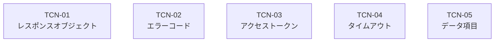

# テストアーキテクチャ（テストコンテナ）設計結果

- 対象: 住登外者宛名番号付番API テストアーキテクチャ（11_ のテスト条件46件を5コンテナへ帰属）。コンテナ名・スコープ項目・コンテナ対象はテストベース本文の実文言に限定し、根拠位置は 00_成果物生成手順.md 3.20 に記載する

## 1. テストスコープ

| 区分 | 項目 | 理由 |
| --- | --- | --- |
| 対象 | リクエストパラメータ | 「リクエストパラメータを元に住登外者宛名番号の付番依頼を行う。」(fuban-api_spec:30)が本APIの中心的な振る舞いであるため |
| 対象 | レスポンスオブジェクト | 「本APIが正常に終了した場合は、HTTPステータスコード200とJSON形式のレスポンスオブジェクトが返却される。」(fuban-api_spec:80)が正常終了の判定根拠であるため |
| 対象 | エラーコード | エラーコード一覧のE0001〜E0004(fuban-api_spec:242-245)が工程Aで確定した母集団に含まれるため |
| 対象 | アクセストークン | 「アクセストークンの検証を行う」(fuban-api_spec:63)が付番処理の前提であるため |
| 対象 | データ項目 | 項目定義書のデータ項目ID 031-1〜031-29(item-definition:12-58)のうち32件の母集団が工程Aで確定しているため |
| 対象 | タイムアウト | 「処理が30秒以上※経過した場合は、タイムアウトとなる。」(fuban-api_spec:83)が応答の切り分け条件であるため |
| 対象外 | 代表宛名フラグ | 工程A(01_ 2.3)で除外を宣言済みである。付番APIのリクエストパラメータ(fuban-api_spec:96-155)にもレスポンスオブジェクト(同:167-199)にも対応項目が存在せず、付番API経由では値を設定も確認もできないため対象外とする |
| 対象外 | 統一ID基盤 | 「※今後国で統一ID基盤の整備が検討されていることから、暫定措置として、以下の認証方式の実装も可能とする。」(fuban-api_spec:38)のとおり整備が検討段階であり、本API仕様に実装要件の記述が無いため対象外とする |

## 2. テストコンテナ一覧

| コンテナID | 階層 | 名称 | 責務 | テスト目的 | テストレベル | テストタイプ | 優先度クラス | 担当観点カテゴリ | 実行環境 | 帰属条件数 |
| --- | --- | --- | --- | --- | --- | --- | --- | --- | --- | --- |
| TCN-01 | 0 | レスポンスオブジェクト | 処理区分0 / 1 / 2 の各処理が成立し、「本APIが正常に終了した場合は、HTTPステータスコード200とJSON形式のレスポンスオブジェクトが返却される。」(fuban-api_spec:80)ことと、その result 配列の内容が仕様どおりであることを保証する。レスポンスオブジェクトの項目とデータ項目の対応も本コンテナが引き受ける | 付番APIが業務上の目的（住登外者宛名番号の付番・登録・業務ID更新）を達成したことをリリース判断者が確認できるようにする | システムテスト | 機能テスト, シナリオテスト | 必須実施 | TPC-01, TPC-05, TPC-09, TPC-18 | - | 9 |
| TCN-02 | 0 | エラーコード | 「送信したパラメータのチェックにてエラーとなった場合は、HTTPステータスコード400とJSON形式のレスポンスオブジェクトが返却される。」(fuban-api_spec:81)ことと、リクエストパラメータの検証結果として E0001〜E0004 のエラーコードとエラーメッセージが返却されることを保証する | 誤った入力を受理して住登外者宛名基本情報へ不正なデータが登録されないことを、仕様所管部門が確認できるようにする | 統合テスト | 機能テスト | 必須実施 | TPC-01, TPC-02, TPC-16 | - | 7 |
| TCN-03 | 0 | アクセストークン | 「アクセストークンの検証を行う」(fuban-api_spec:63)ことを前提に、「認証情報が取得できないまたはアクセストークンが未指定の場合は、HTTPステータスコード401とJSON形式のレスポンスオブジェクトが返却される。」(fuban-api_spec:82)ことと、要求元認証方式の構成差によらず同一の応答となることを保証する | 認証されない要求で付番処理が行われないことを、個人番号を扱う業務の責任者が確認できるようにする | システムテスト | 機能テスト, 移植性テスト | 必須実施 | TPC-08, TPC-10, TPC-15 | - | 5 |
| TCN-04 | 0 | タイムアウト | 「処理が30秒以上※経過した場合は、タイムアウトとなる。」(fuban-api_spec:83)、「サービスメンテナンス時も同様に原則HTTPステータスコード500番台のエラーが返却される。」(fuban-api_spec:84)、「上記以外の想定外エラーが発生した場合は、HTTPステータスコード503とJSON形式のレスポンスオブジェクトが返却される。」(fuban-api_spec:85)という異常時の応答と、「正常に付番処理が実行されなかった場合は再度付番依頼を実施することにより、新規付番された番号が返却される。」(fuban-api_spec:64)という回復手順を確認する | 確定値が存在しないタイムアウト時間について観測値を記録し、適切なタイムアウト時間の設定判断（fuban-api_spec:83）の材料を提供する | システムテスト | 性能テスト, 信頼性テスト | 条件付き実施 | TPC-07, TPC-11, TPC-12, TPC-13, TPC-14, TPC-17 | - | 8 |
| TCN-05 | 0 | データ項目 | 項目定義書のデータ項目（item-definition:12-58）と付番API仕様のリクエストパラメータ（fuban-api_spec:96-155）の桁数・データ型・コード値・データ出力条件が一致し、境界値と同値クラスが仕様どおりに扱われることを保証する | 2文書間で記述が食い違う項目（住所_町字の桁数など）を実測して洗い出し、仕様所管部門への照会材料を提供する | 統合テスト | 機能テスト | 必須実施 | TPC-03, TPC-04 | - | 17 |

## 3. コンテナ階層図

## 4. テスト条件のコンテナ帰属

| 条件ID | 条件文 | 帰属コンテナID | 帰属数 |
| --- | --- | --- | --- |
| TC-001 | - | TCN-01 | 1 |
| TC-002 | - | TCN-01 | 1 |
| TC-003 | - | TCN-01 | 1 |
| TC-004 | - | TCN-02 | 1 |
| TC-005 | - | TCN-02 | 1 |
| TC-006 | - | TCN-02 | 1 |
| TC-007 | - | TCN-02 | 1 |
| TC-008 | - | TCN-02 | 1 |
| TC-009 | - | TCN-05 | 1 |
| TC-010 | - | TCN-05 | 1 |
| TC-011 | - | TCN-05 | 1 |
| TC-012 | - | TCN-05 | 1 |
| TC-013 | - | TCN-05 | 1 |
| TC-014 | - | TCN-05 | 1 |
| TC-015 | - | TCN-05 | 1 |
| TC-016 | - | TCN-05 | 1 |
| TC-017 | - | TCN-05 | 1 |
| TC-018 | - | TCN-05 | 1 |
| TC-019 | - | TCN-05 | 1 |
| TC-020 | - | TCN-05 | 1 |
| TC-021 | - | TCN-05 | 1 |
| TC-022 | - | TCN-05 | 1 |
| TC-023 | - | TCN-05 | 1 |
| TC-024 | - | TCN-05 | 1 |
| TC-025 | - | TCN-01 | 1 |
| TC-026 | - | TCN-04 | 1 |
| TC-027 | - | TCN-03 | 1 |
| TC-028 | - | TCN-01 | 1 |
| TC-029 | - | TCN-03 | 1 |
| TC-030 | - | TCN-04 | 1 |
| TC-031 | - | TCN-04 | 1 |
| TC-032 | - | TCN-04 | 1 |
| TC-033 | - | TCN-04 | 1 |
| TC-034 | - | TCN-03 | 1 |
| TC-035 | - | TCN-03 | 1 |
| TC-036 | - | TCN-02 | 1 |
| TC-037 | - | TCN-04 | 1 |
| TC-038 | - | TCN-01 | 1 |
| TC-039 | - | TCN-02 | 1 |
| TC-040 | - | TCN-01 | 1 |
| TC-041 | - | TCN-01 | 1 |
| TC-042 | - | TCN-05 | 1 |
| TC-043 | - | TCN-04 | 1 |
| TC-044 | - | TCN-03 | 1 |
| TC-045 | - | TCN-04 | 1 |
| TC-046 | - | TCN-01 | 1 |

- 帰属率: 100.0%（分母: 入力テスト条件 46 件、分子: 既知コンテナへ1件以上帰属した条件 46 件）
- 未帰属(0件): なし
- 重複帰属(0件): なし

## 5. 分布

### 5.1 コンテナ×テストレベル

| テストレベル | コンテナ数 | コンテナID | 帰属条件数 | 構成比 |
| --- | --- | --- | --- | --- |
| システムテスト | 3 | TCN-01, TCN-03, TCN-04 | 22 | 47.8% |
| 統合テスト | 2 | TCN-02, TCN-05 | 24 | 52.2% |

- 構成比の分母は帰属済み条件数 46 件（入力テスト条件 46 件のうち未帰属 0 件は分母から除かず別掲している）。

### 5.2 コンテナ×テストタイプ

| テストタイプ | コンテナ数 | コンテナID | 帰属条件数 | 構成比 |
| --- | --- | --- | --- | --- |
| 機能テスト | 4 | TCN-01, TCN-02, TCN-03, TCN-05 | 38 | 82.6% |
| シナリオテスト | 1 | TCN-01 | 9 | 19.6% |
| 移植性テスト | 1 | TCN-03 | 5 | 10.9% |
| 性能テスト | 1 | TCN-04 | 8 | 17.4% |
| 信頼性テスト | 1 | TCN-04 | 8 | 17.4% |

- 構成比の分母は帰属済み条件数 46 件（入力テスト条件 46 件のうち未帰属 0 件は分母から除かず別掲している）。

### 5.3 優先度クラス

| 優先度クラス | コンテナ数 | コンテナID | 帰属条件数 | 構成比 |
| --- | --- | --- | --- | --- |
| 必須実施 | 4 | TCN-01, TCN-02, TCN-03, TCN-05 | 38 | 82.6% |
| 条件付き実施 | 1 | TCN-04 | 8 | 17.4% |
| 任意実施 | 0 | - | 0 | 0.0% |

- 構成比の分母は帰属済み条件数 46 件（入力テスト条件 46 件のうち未帰属 0 件は分母から除かず別掲している）。

## 6. コンテナ別テストサイズ・テストレベル分布

| コンテナID | ケース数 | small | medium | large | テストレベル分布 |
| --- | --- | --- | --- | --- | --- |
| TCN-01 | 9 | 0件 (0.0%) | 0件 (0.0%) | 9件 (100.0%) | システムテスト 9件 |
| TCN-02 | 7 | 0件 (0.0%) | 7件 (100.0%) | 0件 (0.0%) | 統合テスト 7件 |
| TCN-03 | 5 | 0件 (0.0%) | 0件 (0.0%) | 5件 (100.0%) | システムテスト 5件 |
| TCN-04 | 8 | 0件 (0.0%) | 0件 (0.0%) | 8件 (100.0%) | システムテスト 8件 |
| TCN-05 | 17 | 0件 (0.0%) | 17件 (100.0%) | 0件 (0.0%) | 統合テスト 17件 |

- テストサイズ構成比の分母は、そのコンテナのケースのうち外部依存または想定実行時間が申告され分類が成立したケース数である。

## 7. 条件→ケースのトレーサビリティ

| コンテナID | 条件ID | テストケースID | ケース数 |
| --- | --- | --- | --- |
| TCN-01 | TC-001 | TCS-001 | 1 |
| TCN-01 | TC-002 | TCS-002 | 1 |
| TCN-01 | TC-003 | TCS-003 | 1 |
| TCN-01 | TC-025 | TCS-025 | 1 |
| TCN-01 | TC-028 | TCS-028 | 1 |
| TCN-01 | TC-038 | TCS-038 | 1 |
| TCN-01 | TC-040 | TCS-040 | 1 |
| TCN-01 | TC-041 | TCS-041 | 1 |
| TCN-01 | TC-046 | TCS-046 | 1 |
| TCN-02 | TC-004 | TCS-004 | 1 |
| TCN-02 | TC-005 | TCS-005 | 1 |
| TCN-02 | TC-006 | TCS-006 | 1 |
| TCN-02 | TC-007 | TCS-007 | 1 |
| TCN-02 | TC-008 | TCS-008 | 1 |
| TCN-02 | TC-036 | TCS-036 | 1 |
| TCN-02 | TC-039 | TCS-039 | 1 |
| TCN-03 | TC-027 | TCS-027 | 1 |
| TCN-03 | TC-029 | TCS-029 | 1 |
| TCN-03 | TC-034 | TCS-034 | 1 |
| TCN-03 | TC-035 | TCS-035 | 1 |
| TCN-03 | TC-044 | TCS-044 | 1 |
| TCN-04 | TC-026 | TCS-026 | 1 |
| TCN-04 | TC-030 | TCS-030 | 1 |
| TCN-04 | TC-031 | TCS-031 | 1 |
| TCN-04 | TC-032 | TCS-032 | 1 |
| TCN-04 | TC-033 | TCS-033 | 1 |
| TCN-04 | TC-037 | TCS-037 | 1 |
| TCN-04 | TC-043 | TCS-043 | 1 |
| TCN-04 | TC-045 | TCS-045 | 1 |
| TCN-05 | TC-009 | TCS-009 | 1 |
| TCN-05 | TC-010 | TCS-010 | 1 |
| TCN-05 | TC-011 | TCS-011 | 1 |
| TCN-05 | TC-012 | TCS-012 | 1 |
| TCN-05 | TC-013 | TCS-013 | 1 |
| TCN-05 | TC-014 | TCS-014 | 1 |
| TCN-05 | TC-015 | TCS-015 | 1 |
| TCN-05 | TC-016 | TCS-016 | 1 |
| TCN-05 | TC-017 | TCS-017 | 1 |
| TCN-05 | TC-018 | TCS-018 | 1 |
| TCN-05 | TC-019 | TCS-019 | 1 |
| TCN-05 | TC-020 | TCS-020 | 1 |
| TCN-05 | TC-021 | TCS-021 | 1 |
| TCN-05 | TC-022 | TCS-022 | 1 |
| TCN-05 | TC-023 | TCS-023 | 1 |
| TCN-05 | TC-024 | TCS-024 | 1 |
| TCN-05 | TC-042 | TCS-042 | 1 |

- ケースが1件も無い帰属条件(0件): なし

## 8. 決定的検査

- 指摘なし

## 9. サマリ

- コンテナ数: 5 / 葉コンテナ数: 5 / テスト条件総数: 46 / 帰属済み条件数: 46 / 未帰属件数: 0 / 帰属率: 100.0%（分母: 入力テスト条件 46 件） / 重複帰属件数: 0 / 指摘: 0 件
- 判定区分・分割軸・責務定義項目・優先度クラスの定義は `testarch://container/design-principles` を参照すること。
- 本検査は渡されたコンテナ・テスト条件に対してのみ成立し、そもそも洗い出されていない観点の取りこぼしは検出できない。
- テストベース実在照合: 対象28件 / 未照合0件

## 10. 下流ツール引き渡しJSON

本節のJSONは上流の宣言をそのまま写したものではなく、本ツールが算出したコンテナ実体から組み立て、受け側ツールの算出ロジックへ通し直して突き合わせた結果である。判定区分は HPO-01〜HPO-05。

### 10.1 analyze_execution_order 入力(JSON)

- 本文未出力（emitHandoverPayload: true を指定すると analyze_execution_order 入力JSONの全文を出力する）
- 実行ノード 5 件 / アーキテクチャ母集団 5 件 / 生成JSON 605 文字
- 優先度クラス分布（ペイロード/5節）: must 4/4 / conditional 1/1 / optional 0/0
- 利用者が記入する項目: `dependsOn` / `durationHours` / `resources` / `slos` / `exitCriteria` / `monitoringCheckpoints` は実行計画側の判断のため利用者が記入する
- 利用者が記入する項目: `maxParallelism` / `dataItemIds` / `claimed*`（宣言値との照合用）も利用者が用意する
- analyze_execution_order 再計算: 未計画コンテナ 0 件 / 計画被覆率 100%（分母 5）
- analyze_execution_order 側の EOC-05(dependsOn 未宣言): 5 件 / ノード 5 件
- 突き合わせ結果: 一致（analyze_execution_order の算出ロジックで再計算した値が上流の算出結果と一致）
- [medium] HPO-05 nodes[].dependsOn: dependsOn 未宣言 5 件は受け側で EOC-05 になる。依存関係は利用者が記入すること（依存なしを主張するなら空配列 [] を渡すこと）。

### 10.2 audit_cross_matrix 入力(JSON)

- 本文未出力（emitHandoverPayload: true を指定すると audit_cross_matrix 入力JSONの全文を出力する）
- 軸 2 件（CONTAINER, TESTCONDITION） / コンテナ 5 件 / テスト条件 46 件 / リンク 46 件 / 生成JSON 13243 文字
- evidence 記入済みリンク 46 件 / 未記入 0 件
- 利用者が記入する項目: `declaredCoverage` / `exclusions` / `documents` は成果物側の宣言と根拠本文のため利用者が用意する
- 利用者が記入する項目: コンテナの responsibility が未記入の場合、link の `evidence` は機械生成できない
- 孤立したテスト条件: 受け側再計算 0 件 / 4節の未帰属条件 0 件
- 受け側の直積表: 軸ペア 1 件 / 空行 0 件 / 空列 0 件
- 突き合わせ結果: 一致（audit_cross_matrix の算出ロジックで再計算した値が上流の算出結果と一致）

## 11. テストベースとの実在照合

- なし
- 照合対象: ラベル 17件 / 引用 11件 / ID 0件 / 文書名 0件 / 未照合 0件（正規化後2文字未満で対象外 0件）
- 自由記述文は逐語照合せず、鍵括弧(「」『』“”"")で囲んだ引用文言のみを照合対象とする。括弧引用が無い自由記述は照合対象0件であり、合格を意味しない。

## 検査実行状況(実行された検査 / 検査不能な検査)

| 状態 | 検査 | 区分ID | 成立条件 | 実測値 |
| --- | --- | --- | --- | --- |
| 実行 | テストベースとの実在照合 | - | 原文投入あり | 投入文書2件・52696字 |

- 実行: 1区分 / 検査不能: 0区分
- 「検査不能」は指摘0件ではなく検査そのものが成立していないことを意味し、合格の根拠にならない。
- 本表は原文入力に依存する決定的検査のみを対象とする。構造引数のみに依存する検査（scope / containers / testConditions の構造検査と階層・帰属・分布の算出（TAC-01〜））は原文の投入状況に左右されないため、本表の対象外であり常に実行されている。

## 次に実行すべきツール

| 実行状態 | ツール名 | 提示理由 |
| --- | --- | --- |
| 未実施 | analyze_execution_order | 定義したコンテナの実行順序分析が未実施である |
| 未実施 | generate_test_cases | コンテナに配置するテストケースの生成が未実施である |
| 未実施 | audit_test_design_notations | 観点階層(NGT)とテストタイプ割り付け(ゆもつよマトリクス)の記法監査が未実施である |

- 未実施: 3件（うち実施済み申告だが証跡未照合: 0件） / 実施済み: 0件
- 未実施の後続ツールが残ったまま成果物を確定しないこと。この節は本ツールが静的に保持する後続表のみから生成しており、生成物の内容に依存する後続提示はない。
